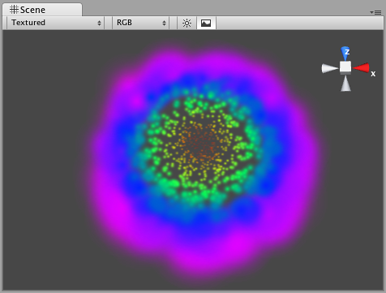

粒子动画器 (Particle Animator)（旧版）
==========================

__粒子动画器__随时间变化移动粒子，您可以使用它们为粒子系统应用风效、拖曳和颜色循环。

 

属性
----------

|**_属性：_** |**_功能：_** |
|:---|:---|
|__Does Animate Color__ |如果启用此属性，粒子将在生命周期中循环显示颜色。 |
|__Color Animation__ |5 种颜色的粒子轮动。所有粒子都要经历此循环；如果一些粒子的寿命比其他粒子短，它们的动画速度将更快。 |
|__World Rotation Axis__ |粒子旋转时所围绕的世界空间轴（可选）。使用此属性可营造高级魔法效果或给腐蚀性气泡增添动感。 |
|__Local Rotation Axis__ |粒子旋转时所围绕的局部空间轴（可选）。使用此属性可营造高级魔法效果或给腐蚀性气泡增添动感。 |
|__Size Grow__ |使用此属性可让粒子在其生命周期内增大。随着随机作用力将粒子散开，让粒子变大通常是很好的做法，这样粒子就不会崩裂。可使用此属性使烟雾上升、模拟风效等。 |
|__Rnd Force__ |每帧都会向粒子添加的随机作用力。使用此属性可使烟雾变得更有活力。 |
|__Force__ |每帧施加到粒子上的作用力（采用世界单位）。 |
|__Damping__ |粒子在每帧的减速程度。值为 1 表示没有阻尼，而更小的值表示减速。 |
|__Autodestruct__ |如果启用此属性，当所有粒子消失时，附加到粒子动画器的游戏对象将被销毁。 |

详细信息
-------

粒子动画器可让粒子系统实现动态变化。使用粒子动画器可更改粒子的颜色、施加作用力和旋转以及选择是否在完成发射时销毁它们。有关粒子系统的更多信息，请参阅[网格粒子发射器](class-MeshParticleEmitter.html)、[椭圆粒子发射器](class-EllipsoidParticleEmitter.html)和[粒子渲染器](class-ParticleRenderer.html)。

###颜色动画

如果希望粒子改变颜色或淡入/淡出，请为它们启用 __Animate Color__ 属性并指定循环的颜色。需要颜色动画的粒子系统将循环显示您选择的 5 种颜色。循环速度将取决于发射器的 __Energy__ 值。

如果您希望粒子淡入而不是立即显示，请将第一个或最后一个颜色的 Alpha 值设置为较低值。

###旋转轴 (Rotation Axes)

在 Local 或 World __Rotation Axes__ 中设置相应的值将使所有生成的粒子围绕指示的轴旋转（以__变换 (Transform)__ 的位置为中心）。在其中一个轴上输入的值越大，旋转速度越快。

在 Local Axes 中设置相应的值将使正在旋转的粒子在变换 (Transform) 的旋转改变时调整其旋转，从而匹配其局部轴。

在 World Axes 中设置相应的值将使粒子的旋转始终保持一致，无论变换 (Transform) 的旋转如何变化都是如此。

###作用力和阻尼

使用作用力可使粒子在作用力指定的方向上加速。

__阻尼 (Damping)__ 可用于减速或加速而不改变方向：

* 值为 1 表示不应用__阻尼__，粒子将不减速，也不加速。
* 值为 0 表示粒子将立即停止。
* 值为 2 表示粒子的速度将每秒增加一倍。

###销毁附加到粒子的游戏对象

通过启用 __AutoDestruct__ 属性即可销毁粒子系统和任何附加的__游戏对象__。例如，如果有一个油桶，则可以附加一个禁用 __Emit__ 且启用 __AutoDestruct__ 的粒子系统。碰撞时，启用粒子发射器。爆炸将发生，此过程结束后，粒子系统和油桶将被销毁并从场景中移除。

请注意，自动销毁仅在发出一些粒子后才会生效。启用 __AutoDestruct__ 的情况下，销毁对象的时间的准确规则如下：

* 如果已经发射了一些粒子，但现在它们全都已经处于死亡状态，_或_
* 如果[发射器](class-EllipsoidParticleEmitter.html)在某个时间点开启过 __Emit__，但现在 __Emit__ 为关闭状态。

提示
-----

* 使用 __Color Animation__ 可让粒子在其生命周期内淡入淡出，否则将产生十分糟糕的发射效果。
* 使用 __Rotation Axes__ 可创建漩涡状的旋涡运动。
