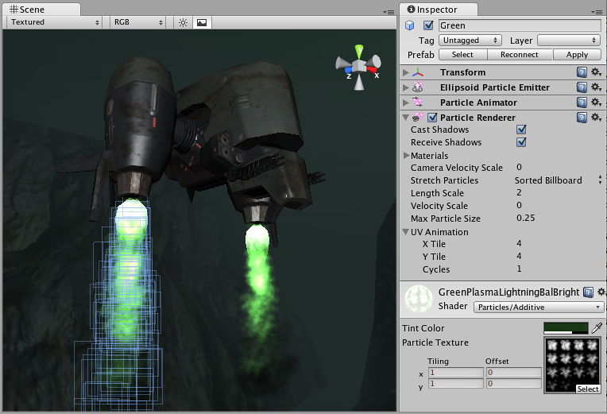

粒子渲染器 (Particle Renderer)（旧版）
==========================

__粒子渲染器__负责在屏幕上渲染__粒子系统__。

 

属性
----------

|**_属性：_** |**_功能：_** |
|:---|:---|
|__Cast Shadows__ |如果启用此属性，则允许网格投射阴影。|
|__Receive Shadows__ |如果启用此属性，则允许网格接受阴影。|
|__Motion Vectors__ |如果启用此属性，则线会将运动矢量渲染到摄像机运动矢量纹理中。请参阅脚本 API 参考文档中的 [Renderer.motionVectors](../ScriptReference/Renderer-motionVectors.html) 以了解更多信息。 |
|__Materials__ |引用显示在每个单独粒子位置的__材质__列表。 |
|__Light Probes__ |基于探针的光照插值模式。|
|__Reflection Probes__ |如果启用此属性，并且场景中存在反射探针，则会为此粒子渲染器拾取反射纹理，并将此纹理设置为内置的着色器 uniform 变量。|
|__Probe Anchor__ |如果定义了此属性（使用游戏对象），渲染器将使用此游戏对象的位置来查找插值光照探针。|
|__Camera Velocity Scale__ |根据[摄像机](class-Camera.html)移动而应用于粒子的拉伸量。 |
|__Stretch Particles__ |确定粒子的渲染方式： |
|&amp;#160;&amp;#160;&amp;#160;&amp;#160;&amp;#160;&amp;#160;&amp;#160;&amp;#160;__Billboard__ |粒子渲染为面向摄像机。 |
|&amp;#160;&amp;#160;&amp;#160;&amp;#160;&amp;#160;&amp;#160;&amp;#160;&amp;#160;__Stretched__ |粒子面向它们移动的方向。 |
|&amp;#160;&amp;#160;&amp;#160;&amp;#160;&amp;#160;&amp;#160;&amp;#160;&amp;#160;__SortedBillboard__ |粒子按深度排序。使用混合材质时选用此选项。 |
|&amp;#160;&amp;#160;&amp;#160;&amp;#160;&amp;#160;&amp;#160;&amp;#160;&amp;#160;__VerticalBillboard__ |所有粒子沿 X/Z 轴平齐排列。 |
|&amp;#160;&amp;#160;&amp;#160;&amp;#160;&amp;#160;&amp;#160;&amp;#160;&amp;#160;__HorizontalBillboard__ |所有粒子沿 X/Y 轴平齐排列。 |
|__Length Scale__ |如果 __Stretch Particles__ 设置为 __Stretched__，则此值确定粒子在其运动方向上的移动距离。 |
|__Velocity Scale__ |如果 __Stretch Particles__ 设置为 __Stretched__，则此值根据粒子的移动速度确定粒子拉伸的速率。 |
|__UV Animation__ |如果定义了 X 和/或 Y，则会生成粒子的 UV 坐标以用于区块动画纹理。请参阅下面的[动画纹理](#animatedtextures)。 |
|&amp;#160;&amp;#160;&amp;#160;&amp;#160;&amp;#160;&amp;#160;&amp;#160;&amp;#160;__X Tile__ |横跨 X 轴的帧数。 |
|&amp;#160;&amp;#160;&amp;#160;&amp;#160;&amp;#160;&amp;#160;&amp;#160;&amp;#160;__Y Tile__ |横跨 Y 轴的帧数。 |
|&amp;#160;&amp;#160;&amp;#160;&amp;#160;&amp;#160;&amp;#160;&amp;#160;&amp;#160;__Cycles__ |动画序列的循环次数。 |

详细信息
-------

任何粒子系统都需要粒子渲染器才能在屏幕上显示。

###选择材质

设置粒子渲染器时，使用适当的[材质](class-Material.html)和用于渲染材质两面的着色器非常重要。Unity 建议将粒子着色器与粒子渲染器结合使用；大多数情况下，只需将材质与其中一个内置粒子着色器一起使用即可。__Standard Assets__ &gt; __Particles__ &gt; __Sources__ 文件夹中提供了一些预先制作的材质供您使用。

创建新材质的过程很简单：

1.在 Unity 菜单栏中，选择 __Assets__ &gt; __Create__ &gt; __Material__。
1.在 Inspector 窗口中，导航到 __New Material__，然后单击 __Shader__ 下拉选单。选择 __Particles__ 组中的着色器之一（例如：__Particles__ &gt; __Multiply__）。
1.要分配纹理，请导航到 Inspector 窗口中包含文本 __None (Texture)__ 的灰色框，然后单击 __Select__ 按钮以启动包含可用纹理的弹出菜单。

请注意，不同的着色器使用纹理 Alpha 通道的方式略有不同，但大多数情况下，Alpha 通道中的黑色值使其不可见，而白色值则使其显示在屏幕上。

###扭曲粒子

默认情况下，粒子渲染为公告牌（即，简单的方形精灵）。这对于烟雾、爆炸和大多数其他粒子效果非常有用。请参阅[公告牌渲染器 (Billboard Renderer)](class-BillboardRenderer.html) 以了解更多信息。

可使粒子随速度拉伸。__Length Scale__ 和 __Velocity Scale__ 会影响拉伸粒子的长度。这对于火花、闪电或激光束等效果非常有用。

__Sorted Billboard__ 可用于使所有粒子按深度排序。有时这是必要的，主要是在使用 __Alpha 混合 (Alpha Blended)__ 粒子着色器时。此功能可能需要大量资源并影响性能；只有在渲染时能带来显著质量提升时才应使用。

 
###动画纹理

可使用动画区块纹理来渲染粒子系统。要使用此功能，请将纹理从一组图像中分离出来。当粒子经历自身的生命周期时，它们将循环显示图像。此功能适用于为粒子增添更多动态性，或制作小的旋转碎片。
