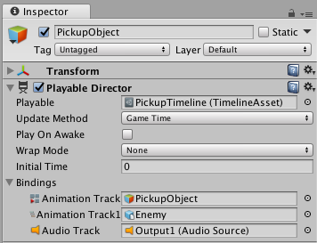

# Playable Director 组件

Playable Director 组件存储时间轴实例和时间轴资源之间的链接。Playable Director 组件控制时间轴实例的播放时间、时间轴实例更新其时钟的方式以及在时间轴实例完成播放后发生的操作。

Playable Director 组件还显示关联的时间轴资源（__Playable__ 属性）中的轨道列表（这些轨道用于动画化场景中的游戏对象）。时间轴资源和场景中的游戏对象之间的链接称为__绑定__或__轨道绑定__。请参阅[时间轴概述](TimelineOverview.html)部分，详细了解时间轴资源与时间轴实例之间的关系。

### Playable

使用 __Playable__ 属性可手动将时间轴资源与场景中的游戏对象相关联。在建立此关联时，要为所选时间轴资源创建一个时间轴实例。在创建时间轴实例后，可使用 Playable Director 组件中的其他属性来控制该实例，并选择时间轴资源要动画化场景中的哪些游戏对象。

### Update Method

使用 Update Method 可设置时间轴实例用于更新其时序的时钟源。Update Method 支持下列时钟源：

* __DSP__：选择此选项可进行样本精确音频计划。选择此选项后，时间轴实例将使用处理音频的同一时钟源。DSP 表示 Digital Signal Processing（数字信号处理）。

* __Game Time__：选择此选项可使用与游戏时钟相同的时钟源。该时钟源受[时间标度](TimeFrameManagement.html)的影响。

* __Unscaled Game Time__：选择此选项可使用与游戏时钟相同的时钟源，但不会受到时间标度的影响。

* __Manual__：选择此选项可不使用时钟源，而通过脚本来手动设置时钟时间。

### Play on Awake

是否在开始运行游戏时播放时间轴实例。默认情况下的设置是一旦场景开始回放，时间轴实例即开始。要禁用默认行为，请在 Playable Director 组件中禁用 Play on Awake 选项。

### Wrap Mode

时间轴实例结束回放时的行为。循环模式 (Wrap Mode) 还定义了 Timeline Editor 窗口处于 Play Range 模式时的行为。支持以下循环模式：

* __Hold__：回放一次时间轴实例并保持最后一帧直到回放中断。

* __Loop__：重复播放序列，直到回放中断。

* __None__：播放一次序列，然后将所有动画化属性重置为回放前保存的值。

### Initial Time

时间轴实例开始播放的时间（以秒为单位）。Initial Time 可添加从时间轴实例触发时间到回放实际开始时间之间的延迟（以秒为单位）。例如，如果启用 Play On Awake 而且 Initial Time 设置为五秒，则在 Unity 工具栏中添加 Play 按钮将启动播放模式并且时间轴实例在第五秒开始。

在处理长影片并希望预览时间轴实例的最后几秒时，这非常有用。

### Current Time

使用 Current Time 字段可根据 Timeline Editor 窗口中的时间轴实例查看时间进度。Current Time 字段与 Playhead Location 字段匹配。当 Timeline Editor 窗口隐藏时，Current Time 字段很有用。当处于时间轴播放模式时或者当 Unity 处于游戏模式时，Current Time 字段将显示在 Playable Director 组件中。

### Bindings

使用 __Bindings__ 区域可将场景中的游戏对象与关联的时间轴资源（__Playable__ 属性）中的轨道进行链接。将某个游戏对象链接到轨道时，该轨道将在场景中动画化该游戏对象。游戏对象与轨道之间的链接称为__绑定__或__轨道绑定__。

__Bindings__ 区域分为两列：

* 第一列中列出时间轴资源中的轨道。每个轨道通过一个图标和轨道类型来标识。

* 第二列中列出链接（或__绑定__）到每个轨道的游戏对象。

__Bindings__ 区域不会列出轨道组、轨道子组或者不动画化游戏对象的轨道。Timeline Editor 窗口在[轨道列表](TimelineTrackList.html)中显示同样的绑定。

---
* 2017-08-10  Page published with limited [editorial review](DocumentationEditorialReview.html)

