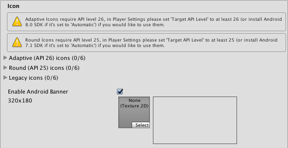
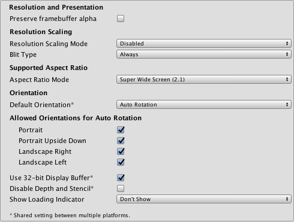
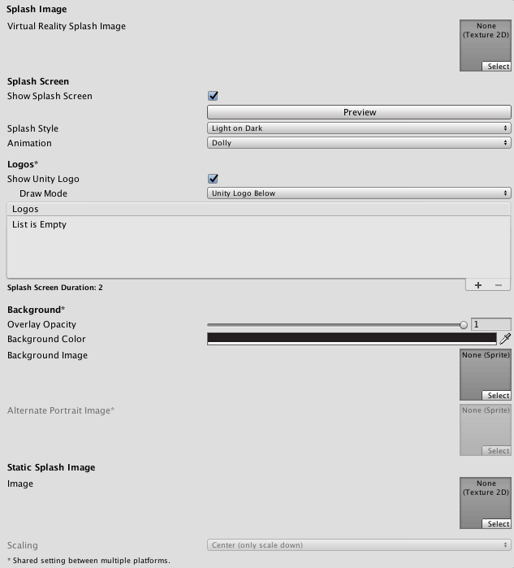
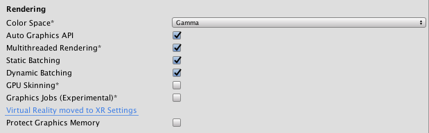
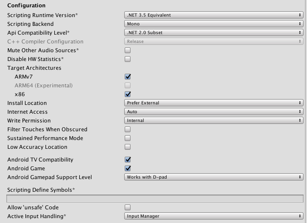
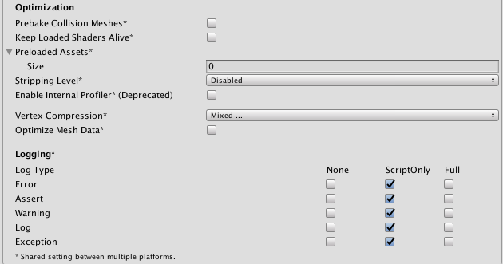
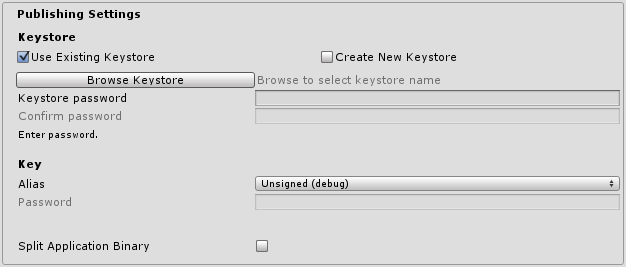
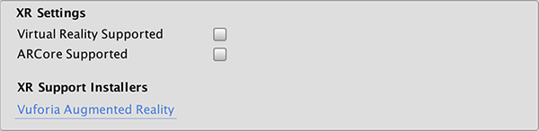

#Android Player Settings

This page details the __Player Settings__ specific to Android. For a description of the general Player Settings, see documentation on [PlayerSettings](class-PlayerSettings.html).

##Icon

 

|**_属性：_** |**_功能：_** |
|:---|:---|
|__Adaptive__ |Set up textures for the Android Adaptive icons in your app.|
|__Round__ |Set up textures for the Android Round icons in your app.|
|__Legacy__ |Set up textures for the Android Legacy icons in your app.|
|__Enable Android Banner__ |Enables a custom banner for Android TV builds. |

##Resolution And Presentation

 

|**_属性：_** |**_功能：_** |
|:---|:---|
|**Resolution and Presentation**||
|**Preserve framebuffer alpha**|Enable Unity to render on top of native Android UI. The camera's Clear Flags have to be set to Solid color with an alpha less than 1 for this to have any effect. (OpenGL ES only).|
|**Resolution Scaling**||
|**Resolution Scaling Mode**|This option can be used to render the scene on the target device at a resolution lower than screen resolution.|
|&nbsp;&nbsp;&nbsp;&nbsp;Disabled|Render at full screen resolution.|
|&nbsp;&nbsp;&nbsp;&nbsp;Fixed DPI|Render at resolution potentially lower than screen resolution.|
|**Target DPI**|When Resolution Scaling Mode is set to Fixed DPI, this setting determines how much lower the target rendering resolution is going to be. The scale is calculated as min(Target DPI * Factor / Screen DPI, 1). Factor is controlled by [Quality Settings](class-QualitySettings.html).|
|**Blit Type**|Controls whether a blit is used to present the final image to the screen.|
|&nbsp;&nbsp;&nbsp;&nbsp;Always| (Always blit) Make Unity render to an offscreen buffer and then copy to the system framebuffer. This is compatible with most devices, but is usually slower than __Never__ blitting.|
|&nbsp;&nbsp;&nbsp;&nbsp;Never| (Never blit) Make Unity render to the framebuffer provided by the OS. If a condition arises during application run time that causes this to fail, the application will print a one-time warning to the device log. __Never__ blitting is usually faster than __Always__ blitting, but it's not compatible with all devices.|
|&nbsp;&nbsp;&nbsp;&nbsp;Auto|Make Unity render to the framebuffer provided by the OS, if possible. If a condition is met that prevents your application from rendering to the system framebuffer, the application switches to offscreen rendering and issues a warning to the device console.|
|**Support Aspect Ratio** ||
|__Aspect Ratio Mode__ | The aspect ratio for the device. Choose from: __Legacy Wide Screen (1.86)__, __Super Wide Screen (2.1)__ and __Custom__. When you select __Custom__, an __Up To__ field appears. Use this to set a maximum screen width. |
|**方向** ||
|__Default Orientation__ | Set the application's screen orientation. |
|&nbsp;&nbsp;&nbsp;&nbsp;Portrait | Orient the screen so that the device's Home button is at the bottom. |
|&nbsp;&nbsp;&nbsp;&nbsp;Portrait Upside Down | Orient the screen so that the device's Home button is at the top. |
|&nbsp;&nbsp;&nbsp;&nbsp;Landscape Left | Orient the screen so that the device's Home button is on the right-hand side. |
|&nbsp;&nbsp;&nbsp;&nbsp;Landscape right | Orient the screen so that the device's Home button is on the left-hand side. |
|**Allowed Orientations for Auto Rotation**  (Only visible when __Default Orientation__ is set to __Auto Rotation__) ||
|__Portrait__ |Allow portrait orientation. |
|__Portrait Upside Down__ |Allow portrait upside-down orientation.|
|__Landscape Right__ |Allow landscape right orientation (home button is on the left side). |
|__Landscape Left__ |Allow landscape left orientation (home button is on the right side).|
|**Other** ||
|__Use 32-bit Display Buffer__ |Specifies if the Display Buffer should be created to hold 32-bit color values (16-bit by default). Use it if you see banding, or need alpha in your [post-processed effects](PostProcessingOverview.html), because they create [Render Textures](class-RenderTexture.html) in the same format as the Display Buffer.|
|__Disable Depth and Stencil__ |Tick this checkbox to disable the depth and stencil buffers.|
|__Show Loading Indicator__ |The type of loading progress indicator that should be shown. Options are __Don't Show__, __Large__, __Inversed Large__, __Small__ and __Inversed Small__. |

##Splash Image

 

|**_属性：_** |**_功能：_** |
|:---|:---|
|__Virtual Reality Splash Screen__|Specify the texture that should be used for the Android splash screen on a Virtual Reality application.|
|__Android Splash Screen__|Specify the texture that should be used for the Android splash screen. The standard size for the splash screen image is 320x480.|
|__Splash Scaling__ |Specify how the splash image is scaled to fit the device's screen. The options are **Center (only scale down)**, **Scale to Fit (letter-boxed)** and **Scale to Fill (cropped)**.|

See also [Unity Splash Screen](class-PlayerSettingsSplashScreen.html) settings.

##Other Settings

 

|**_属性：_** |**_功能：_** |
|:---|:---|
|**Rendering** ||
|__Color Space__ |The Color Space used for your application. See [Linear Lighting](LinearLighting.html) for more information. |
|__Auto Graphics API__ | Check this to make Unity auto-select a graphics API from the Open Graphics Library ([OpenGL](https://developer.android.com/guide/topics/graphics/opengl.html)). When checked, Unity will try  GLES3.1, and fall back to GLES3 or GLES2 if the device does not support GLES3.1. When unchecked, you can manually pick and reorder the graphics APIs. If only GLES3 is in the list, two additional checkboxes; __Require ES3.1__ and __Require ES3.1+AEP__ appear, allowing you to force the corresponding graphics API.    *Important*: GLES3/GLES3.1/AEP requirement is added to your Android manifest only if GLES2 is not in the list, *and* Minimum API Level is set to JellyBean (API level 18) or higher. In this case only, your application won’t show up on unsupported devices in Google Play Store.|
|__Multithreaded Rendering__ | Check this box to move graphics API calls from Unity’s main thread to a separate worker thread. This can help to improve performance in applications that have high CPU usage on the main thread.|
|__Static Batching__ |Check this box to use [Static batching](DrawCallBatching.html) on your build (enabled by default).|
|__Dynamic Batching__ |Check this box to use [Dynamic Batching](DrawCallBatching.html) on your build (enabled by default).|
|__GPU Skinning__ |Check this box to enable OpenGL ES 3 GPU skinning. To learn more about GPU skinning, see the [Wikipedia page on skeletal animation](https://en.wikipedia.org/wiki/Skeletal_animation).   Note that this property only supports VR apps, and only works if the Virtual Reality Supported checkbox is ticked.|
|__Graphics Jobs  (Experimental)__|Check this box to instruct Unity to offload graphics tasks (render loops) to worker threads running on other CPU cores. This is intended to reduce the time spent in [camera.render](../ScriptReference/Camera.Render.html) on the main thread. This feature is experimental. it may not deliver a performance improvement for your project, and may cause instabilities.   Graphics Jobs are currently only supported when using [Vulkan](https://www.khronos.org/vulkan/) and the checkbox has no effect when using [OpenGL](https://developer.android.com/guide/topics/graphics/opengl.html) ES.|
|__Virtual Reality Supported__ |Enable this if your application is a virtual reality application, then add the required VR SDKs to the list.|
|__Protect Graphics Memory__ |Check this box to force the graphics buffer to be displayed only through a hardware-protected path. Works only on devices which support it.|

|**Identification** ||
|:---|:---|
|__Package Name__ |The unique application ID, used to uniquely identify your app on the device and in Google Play Store. (Shared between iOS and Android.)|
|__Version__ |Specifies the build version number of the bundle, which identifies an iteration (released or unreleased) of the bundle. The version is specified in the common format of a string containing numbers separated by dots (eg, 4.3.2). (Shared between iOS and Android.)|
|__Bundle Version Code__ |An internal version number. This number is used only to determine whether one version is more recent than another, with higher numbers indicating more recent versions. This is not the version number shown to users; that number is set by the `versionName` attribute. The value must be set as an integer, such as “100”. You can define it however you want, as long as each successive version has a higher number.   For example, it could be a build number. Or you could translate a version number in “x.y” format to an integer by encoding the “x” and “y” separately in the lower and upper 16 bits. Or you could simply increase the number by one each time a new version is released.|
|__Minimum API Level__|Minimum Android version (API level) required to run the application.|
|__Target API Level__|Target Android version (API level) against which to compile the application.|

|**Configuration** ||
|:---|:---|
|__Scripting Runtime Version__ |选择要在项目中使用的 .NET 运行时。有关更多详细信息，请参阅 Microsoft 的 [.NET 文档](https://docs.microsoft.com/en-us/dotnet/)。|
|&nbsp;&nbsp;&nbsp;&nbsp; .NET 3.5 Equivalent|一个实现 .NET 3.5 API 的 .NET 运行时。这是默认脚本运行时。|
|&nbsp;&nbsp;&nbsp;&nbsp; .NET 4.x Equivalent|一个实现 .NET 4 API 的 .NET 运行时。此 API 比 .NET 3.5 更新，因此提供对更多 API 的访问、与更多外部库兼容并支持 C# 6。|
|__Scripting Backend__ |Select your scripting backend. There are two options: IL2CPP or Mono2x. The default is Mono2x.|
|&nbsp;&nbsp;&nbsp;&nbsp;IL2CPP |Choose this to set ILC2PP as your scripting backend. See Unity documentation on [IL2CPP](IL2CPP.html) for more information.|
|&nbsp;&nbsp;&nbsp;&nbsp;Mono2x |Choose this to set Mono2x as your scripting backend. This is the default option. See [Mono’s documentation](http://www.mono-project.com/docs/) for more information.|
|__API Compatibility Level__|Specifies active .NET API profile. See below.  .Net 2.0:NET 2.0 libraries. Maximum .NET compatibility, biggest file sizes   .Net 2.0 Subset: Subset of full .NET compatibility, smaller file sizes |
|__Mute Other Audio Sources)__|Stops or allows audio from other applications to play in the background while your Unity application is running. Enable this and your Unity application stops audio from background applications, disable this and audio from background applications continue to play alongside your Unity application.|
|__Disable HW Statistics__|By default, Unity Android applications send anonymous HW statistics to Unity. This provides you with aggregated information to help you make decisions as a developer. Find these statistics at [http://stats.unity3d.com/](http://stats.unity3d.com/.). Check this option to stop Unity sending these statistics.|
|__Target Architectures__ |Allows the application to run on the specified CPUs.|
|__Install Location__ |Specifies application install location on the device (for detailed information, refer to [Android Developer documentation on install locations](http://developer.android.com/guide/appendix/install-location.html).|
|&nbsp;&nbsp;&nbsp;&nbsp;Automatic |Let the operating system decide. User will be able to move the app back and forth.|
|&nbsp;&nbsp;&nbsp;&nbsp;Prefer External |Install the application to external storage (SD card) if possible. The operating system does not guarantee it; if not possible, the app will be installed to internal memory.|
|&nbsp;&nbsp;&nbsp;&nbsp;Force Internal |Force the application to be installed to internal memory. The user will be unable to move the app to external storage.|
|__Internet Access__ |When set to __Require__, this adds the networking (`INTERNET`) permission to the [Android manifest](android-manifest.html), even if you are not using any networking APIs. This is enabled by default for development builds.|
|__Write Access__ |When set to __External(SDCard)__ , enables write access to the external storage such as the SD card and add a corresponding permission to the Android manifest. Enabled by default for development builds.|
|__Sustained Performance Mode__|Set a predictable and consistent level of device performance over longer periods of time, without thermal throttling. Overall, performance might be lower when this setting is enabled. Based on the  [Android Sustained Performance API] (https://developer.android.com/about/versions/nougat/android-7.0.html#sustained_performance_api). |
|__Android TV Compatibility__ |Check this box to mark the application as Android TV compatible.|
|__Android Game__ |Android TV - Check this box to mark the output package (APK) will as a game rather than a regular application.|
|__Android Gamepad Support Level__ |Android TV - This option allows you to define the level of support your application offers for a gamepad. The options are **Works with D-Pad**, **Supports Gamepad** and **Requires Gamepad**.|
|__Scripting Define Symbols__|自定义的编译标志（请参阅[平台相关的编译](PlatformDependentCompilation.html)页面以了解详细信息）。|

|**Optimization** ||
|:---|:---|
|__Prebake Collision Meshes__|Should collision data be added to meshes at build time?|
|__Keep Loaded Shaders Alive__|Check this box to prevent shaders from being unloaded.|
|__Preload Shaders__|Should shaders be loaded when the application starts up? |
|__Preloaded Assets__|An array of assets to be loaded when the application starts up. |
|__Stripping Level__ |Options to strip out scripting features to reduce the output package (APK) size (This setting is shared between iOS and Android platforms, and is available with the Mono scripting backend only.)|
|&nbsp;&nbsp;&nbsp;&nbsp;Disabled |No reduction is done.|
|&nbsp;&nbsp;&nbsp;&nbsp;Strip Assemblies |Level 1 size reduction.|
|&nbsp;&nbsp;&nbsp;&nbsp;Strip ByteCode (iOS only) |Level 2 size reduction (includes reductions from Level 1).|
|&nbsp;&nbsp;&nbsp;&nbsp;Use micro mscorlib |Level 3 size reduction (includes reductions from Levels 1 and 2).|
|__Strip Engine Code__ |Enable code stripping. (This setting is only available with the [IL2CPP](https://docs.unity3d.com/Manual/IL2CPP.html) scripting backend.)|
|__Enable Internal profiler__|Check this box if you want to get the profiler data from your device in the Android SDK’s [adblogcat](https://developer.android.com/studio/command-line/logcat.html) output while testing your projects (only available in development builds).|
|__Vertex Compression__|Select which vertex channels should be compressed. Compression can save memory and bandwidth but precision will be lower.|
|__Optimize Mesh Data__|从网格中删除应用于网格的材质不需要的所有数据（切线、法线、颜色、UV）。|
|**Logging** | Enable different logging types (see the [StackTraceLogType](../ScriptReference/StackTraceLogType.html) page for details). |

###API Compatibility Level

You can choose your Mono API compatibility level for all targets. Sometimes a 3rd party .NET DLL  uses the APIs that are not included into the .NET compatibility level you would like to use. In order to investigate such cases, get a reflection tool like ILSpy on Windows, and check the dependencies of the DLLs.

##Publishing Settings

 

|**_属性：_** |**_功能：_** |
|:---|:---|
|**[Keystore](https://developer.android.com/training/articles/keystore.html)** ||
|__Use Existing Keystore / Create New Keystore__|Use this to choose whether to create a new Keystore or use an existing one. You can use the **Browse Keystore** button to select a Keystore from the filesystem. |
|__Keystore password__ |Create a password for the Keystore.|
|__Confirm password__ |Enter the same password you did in __Keystore password__ (only enabled if the Create New Keystore option is selected).|
|**Key** ||
|__Alias__ |Key alias. |
|__Password__ |Password for key alias. |
|__Split Application Binary__|Enable this option to split your output package into main (APK) and expansion (OBB) packages. This is required to publish applications larger than 100 MBytes to Goolge Play Store.|

Note that for security reasons, Unity does not save the __Keystore__ password or the __Key__ password. Also, note that the signing must be done from Unity’s [Playersettings](https://docs.unity3d.com/Manual/class-PlayerSettings.html), [jarsigner](http://docs.oracle.com/javase/7/docs/technotes/tools/windows/jarsigner.html) does not work. The unsigned debug keystore is located by default at ~/.android/debug.keystore on MacOS and %USERPROFILE%\.android\debug.keystore on Windows.

##XR settings

 

|**_属性：_** |**_功能：_** |
|:---|:---|
|**XR Settings** ||
|__Virtual Reality Supported__|为 Unity Editor 和游戏版本启用本机 VR 支持。|
|__ARCore__|Enable use of Google’s [ARCore](https://developers.google.com/ar/discover/) platform.|
|**XR Support Installers** ||
|__Vuforia Augmented Reality Supported__ | 启用 [Vuforia 软件开发工具包](vuforia-sdk-overview.html)。必须拥有 Vuforia 软件许可证，并在启用该属性之前同意该许可证的条款。|

##详细信息

###Bundle Identifier

The __Bundle Identifier__ string is the unique name of your application when published to Google Play Store and installed on the device. The basic structure of the identifier is __com.CompanyName.GameName__, and can be chosen arbitrarily. In Unity this field is shared with the iOS Player Settings for convenience.

###Stripping Level

Most games don't use all the functionality of the DLLs included by default. With this option, you can strip out unused parts to reduce the size of the output package (APK).

----
* 2018-06-06 Page amended with limited [editorial review](DocumentationEditorialReview.html)

* 5.5 版中的更新功能
* __Sustained Performance Mode__ added in 2017.3
* 在 2018.1 版中添加了 .NET 4.x 运行时
* Android __Multiple APK__ features added in 2018.2
