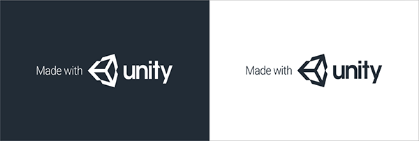
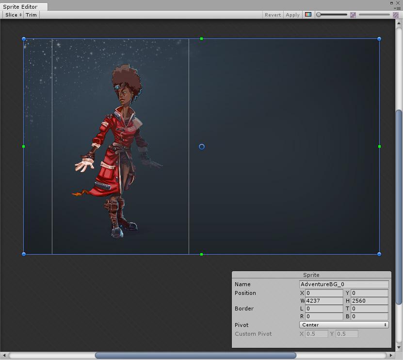

# 启动画面 (Splash Screen)

Unity Editor 允许为项目配置启动画面。能在多大程度上自定义 Unity 启动画面取决于持有的 Unity 许可证；根据所持有的许可证，可以完全禁用 Unity 启动画面，禁用 Unity 徽标，添加自己的徽标以及其他选项。

还可以使用 Unity [UI 系统](UISystem.html)制作自己的介绍性画面或动画，以便在第一个[场景](CreatingScenes.html)中介绍项目。这些可以作为 Unity 启动画面的补充或替代，具体取决于所持有的许可证。

Unity 启动画面在所有平台上都是一致的。它会迅速显示，在显示的同时，第一个场景在后台异步加载。这与您自己的介绍性画面或动画有所不同，您自己的画面或动画可能需要一段时间才能出现；这是因为 Unity 必须首先加载整个引擎和第一个场景，然后才会显示它们。

##许可证限制

Unity Pro 和 Plus 版许可证对 Unity 启动画面的自定义没有限制。

Unity Personal 版许可证具有以下限制：

* 无法禁用 Unity 启动画面。
* 无法禁用 Unity 徽标。
* 不透明度级别可以设置为最小值 0.5。

## Unity 启动画面设置

要访问 Unity 启动画面设置，请选择 __Edit__ > __Project Settings__ > __Player__。在 Inspector 窗口中，导航到 __Splash Image__ > __Splash Screen__。

|**属性** | **功能**|
|:---|:---|
|__Show Splash Screen__ | 勾选 __Show Splash Screen__ 复选框可在游戏开始时启用启动画面。在 Unity Personal 版中，无法禁用此选项；系统会始终勾选此复选框。 |
|__Preview__ | 使用 __Preview__ 按钮可在 Game 视图中查看启动画面的预览。预览反映了 Game 视图的分辨率和宽高比。使用多个 Game 视图可同时预览多种不同的分辨率和宽高比。这对于模拟启动画面在多个不同设备上的外观特别有用。  请参阅下面的图 A 中的示例。|
|__Splash Style__|__Splash Style__ 控制 Unity 品牌的风格。有两个可用选项：Light on Dark 或 Dark on White。请参阅下面的_图 B_ 以了解这些设置。|
|__Animation__|启动画面有 3 种可能的动画模式，用于定义启动画面在屏幕上的显示和消失方式。
|&nbsp;&nbsp;&nbsp;&nbsp;Static| 启动画面没有动画。 |
|&nbsp;&nbsp;&nbsp;&nbsp;Dolly| 徽标和背景可以变焦以创建视觉推拉变焦效果。 |
|&nbsp;&nbsp;&nbsp;&nbsp;Custom| 配置背景和徽标变焦以实现修改后的推拉变焦效果。 |
|Show Unity logo|勾选 __Show Unity Logo__ 复选框可启用 Unity 联合品牌。在 Unity Personal 版中，无法禁用此选项；系统会始终勾选此复选框。|
|__Draw Mode__| __Draw Mode__ 控制 Unity 联合品牌的显示方式（如果启用了 Unity 联合品牌）。|
|&nbsp;&nbsp;&nbsp;&nbsp;Unity Logo Below| 在显示的所有徽标下方绘制 Unity 联合品牌徽标。 |
|&nbsp;&nbsp;&nbsp;&nbsp;All Sequential| 将 Unity 联合品牌徽标作为徽标插入到 __Logos__ 列表中。 |
|__Logos__ |这是可在启动画面持续时间内要绘制的可自定义徽标列表。请参阅下面_图 C_ 中的徽标列表。  使用加号 (+) 和减号 (-) 按钮添加和删除徽标，并通过拖放操作对列表中的徽标重新排序。每个徽标必须是精灵资源。要更改徽标的宽高比，请使用 [Sprite Editor](http://spriteeditor) 更改精灵的尺寸，并将 __Sprite Mode__ 设置为 __Multiple__。  精灵资源的__徽标持续时间 (Logo Duration)__ 是徽标显示的时间长度。此设置最少为 2 秒，最多为 10 秒。  如果 Logos 列表中的条目未分配徽标精灵资源，则在该条目的持续时间内不会显示任何徽标。可以使用此属性来创建徽标之间的延迟。  启动画面的整个持续时间是所有徽标的时间总和加上 0.5 秒的淡出时间。如果第一个场景未准备好播放，这一时间可能会更长，在这种情况下，启动画面仅显示背景图像或颜色，然后在第一个场景准备好播放时淡出。|
|__Overlay Opacity__|调整 __Overlay Opacity__ 的强度来使徽标突出显示；这会影响背景颜色和/或图像颜色（基于 __Splash Style__）。 将 __Overlay Opacity__ 设置为较小的数字可减轻此效果，而将其设置为 0 可完全禁用此效果。例如，如果启动画面样式为 __Light on Dark__，并且使用白色背景，那么当 __Overlay Opacity__ 设置为 1 时背景变为灰色，__Overlay Opacity__ 设置为 0 时背景变为白色。  在 Unity Personal 版中，此选项的最小值为 0.5。|
|__Background Color__|使用此选项可在未设置背景图像时设置背景颜色。请注意，实际背景颜色可能会受到 __Overlay Opacity__ 属性的影响（请参阅上面的部分），并且可能与指定的颜色不匹配。 |
|__Background Image__|使用此属性可设置背景精灵图像，而不是使用颜色背景。Unity 会调整背景图像来使其填满屏幕；图像将均匀缩放，直至适应屏幕的宽度和高度。这意味着图像的某些部分可能会以一定宽高比延伸到屏幕边缘之外。要调整背景图像对宽高比的响应，请在 Sprite Editor 中更改精灵的 __Position__ 值。  使用 __Alternate Portrait Image__ 可设置纵向宽高比的图像（例如，纵向模式下的移动设备）。如果没有指定 __Alternate Portrait Image__ 精灵，那么 Unity Editor 会将指定为 __Background Image__ 的精灵用于纵向和横向模式。  在 Sprite Editor 中调整精灵的 __Position__ 和尺寸，从而控制启动画面上背景图像的宽高比和位置。在下面的_图 D_ 中，相同的图像用于横向和纵向布局；但是，纵向位置已经过调整。|

