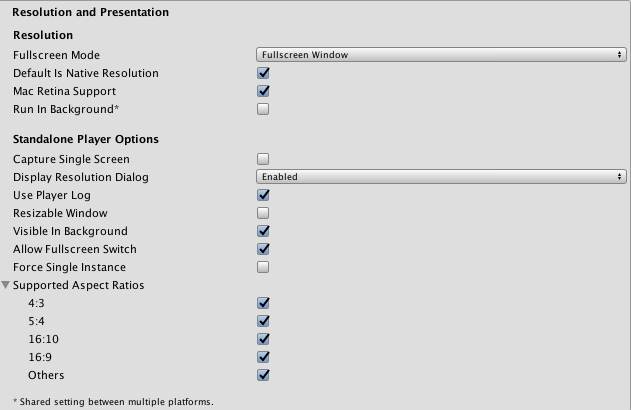
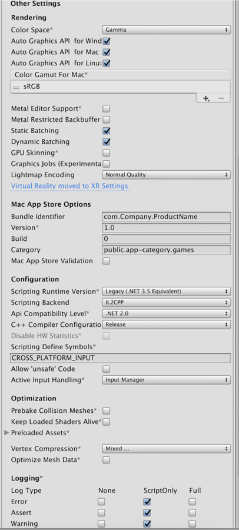
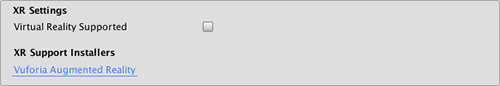
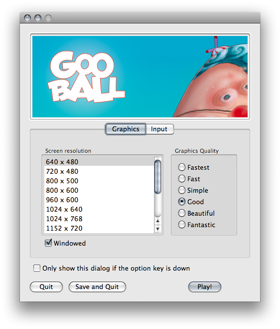

#独立平台播放器设置 (Standalone Player Settings)

本页面将详细介绍独立平台（Mac OSX、Windows 和 Linux）特有的__播放器设置 (Player Settings)__。可在[此处](class-PlayerSettings.html)找到常规 Player Settings 的说明。

##Resolution And Presentation

 

|**_Property:_** ||**_Function:_** |
|:---|:---|
|__Resolution__ |||
|__Fullscreen Mode__ ||Choose the full-screen mode. This defines the default window mode at startup. |
||__Fullscreen Window__ |The Fullscreen Window mode sets your app window to the full-screen native resolution of the display. Unity renders app content at the resolution set by script (or by user selection when the built application launches), but scales it to fill the window. When scaling, Unity adds black bars to the rendered output to match the aspect ratio chosen in the Player Settings, so that the content isn't stretched. This process is called [letterboxing](https://en.wikipedia.org/wiki/Letterboxing_(filming)). |
||__Exclusive Fullscreen__ |__Exclusive Fullscreen__ mode sets your app to maintain sole full-screen use of a display. Unlike __Fullscreen Window__, this mode changes the OS resolution of the display to match the app’s chosen resolution. __Exclusive Fullscreen__ is only supported on Windows; on other platforms, the setting falls back to __Fullscreen Window__. 
||__Maximized Window__ |__Maximized Window__ mode sets the app window to the operating system’s definition of “maximized”. On macOS, this means a full-screen window with an auto-hidden menu bar and dock. __Maximized Window__ is only supported on macOS; on other platforms, the setting falls back to __Fullscreen Window__. |
||__Windowed__ | Windowed mode sets your app to a standard, non-full-screen, movable window, the size of which is dependent on the app resolution. In Windowed mode, the window is resizable by default. To disable this, disable the Player Settings __Resizable Window__ setting. |
|__Default Is Native Resolution__ ||Check this box to make the game use the default resolution used on the target machine.|
|__Default Screen Width__ ||Default width of the game screen in pixels.|
|__Default Screen Height__ ||Default height of the game screen in pixels.|
|__Mac Retina Support__ || Check this box to enable support for high DPI (Retina) screens on a Mac. Unity enables this by default. This enhances Projects on a Retina display, but it is somewhat resource-intensive when active.|
|__Run in background__ ||Check this box to make the game keep running (rather than pausing) if the app loses focus. |
|__Standalone Player Options__|||
|__Capture Single Screen__ ||Check this box to ensure standalone games in fullscreen mode do not darken the secondary monitor in multi-monitor setups. This is not supported on Mac OS X.|
|__Display Resolution Dialog__ ||Choose whether the game should start with a dialog to let the user choose the screen resolution. The options are __Disabled__, __Enabled__ and __Hidden by Default__ (i.e. the option only appears if the alt key is held down at startup). |
|__Use Player Log__ ||Check this box to write a log file with debugging information. If you plan to submit your application to the Mac App Store, leave this option un-ticked. Ticked is the default. |
|__Resizable Window__ ||Check this box to allow the user to resize the standalone player window. |
|__Visible in Background__ ||Check this box to show the application in the background if Fullscreen Windowed mode is used (in Windows).|
|__Allow Fullscreen Switch__ ||Check this box to allow default OS full-screen key presses to toggle between full-screen and windowed modes.|
|__Force Single Instance__ ||Check this box to restrict standalone players to a single concurrent running instance.|
|__Supported Aspect Ratios__ ||Choose the aspect ratios that appear in the Resolution Dialog at startup (as long as they are supported by the user's monitor). |

##Icon

 

|**_属性：_** |**_功能：_** |
|:---|:---|
|__Override for Standalone__ |选中此框可指定用于独立平台游戏的自定义图标。应上传不同大小的图标来填充此复选框下方的每个方块。|

##Splash Image

 

|**_属性：_** |**_功能：_** |
|:---|:---|
|__Config Dialog Banner__ |添加要在 __Display Resolution Dialog__ 中显示的自定义启动画面。|
|__Show Unity Splash Screen__ |加载游戏时显示“Made with Unity”启动画面。|

##Other Settings

 

|**_属性：_** |**_功能：_** |
|:---|:---|
|__Rendering__ ||
|__Color Space__|选择应该用于渲染的颜色空间。提供的选项为 __Gamma__ 和 __Linear__。请参阅 Unity 手册的[线性渲染](LinearLighting.html)页面以了解这两者之间的区别。|
|__Auto Graphics API for Windows__|选中此框可在运行游戏的 Windows 计算机上使用最佳图形 API。取消选中此框可添加和删除支持的图形 API。 |
|__Auto Graphics API for Mac__|选中此框可在运行游戏的 Mac 上使用最佳图形 API。取消选中此框可添加和删除支持的图形 API。 |
|__Auto Graphics API for Linux__|选中此框可在运行游戏的 Linux 计算机上使用最佳图形 API。取消选中此框可添加和删除支持的图形 API。 |
|__Metal Editor Support (Experimental)__ | 让 Unity Editor 使用 Metal API 并开启更快的着色器迭代以定位 Metal API。|
|__Metal Restricted Backbuffer Use__ | 允许在非默认设备方向上提高性能。此属性会在后缓冲区上设置 frameBufferOnly 标志，因此会阻止从后缓冲区的回读，但可实现一定程度的驱动程序优化。|
|__Static Batching__ |选中此框可使用静态批处理。|
|__Dynamic Batching__ |选中此框可使用动态批处理（默认情况下激活此选项）。 |
|__GPU Skinning__ |选中此框可启用 DX11/ES3 GPU 蒙皮。 |
|__Graphics Jobs (Experimental)__ |选中此框可指示 Unity 将图形任务（渲染循环）卸载到在其他 CPU 核心上运行的工作线程。此功能旨在减少主线程上 `Camera.Render` 所花费的时间，该时间通常成为瓶颈。**请注意，此功能是实验性的功能**，可能无法为项目带来性能提升，并可能引入新的崩溃。 |
|__Lightmap Encoding__ |影响光照贴图的编码方案和压缩格式。选项包括 Normal Quality 和 High Quality。|
|__Mac App Store Options__|请参阅[将应用程序提交到 Mac App Store](HOWTO-PortToAppleMacStore.html)。|
|__Configuration__||
|__Scripting Runtime Version__ |选择要在项目中使用的 .NET 运行时。有关更多详细信息，请参阅 Microsoft 的 [.NET 文档](https://docs.microsoft.com/en-us/dotnet/)。|
|&nbsp;&nbsp;&nbsp;&nbsp; .NET 3.5 Equivalent|一个实现 .NET 3.5 API 的 .NET 运行时。这是默认脚本运行时。|
|&nbsp;&nbsp;&nbsp;&nbsp; .NET 4.x Equivalent|一个实现 .NET 4 API 的 .NET 运行时。此 API 比 .NET 3.5 更新，因此提供对更多 API 的访问、与更多外部库兼容并支持 C# 6。|
|__Scripting Backend__ |__Mono2x__ 是独立平台上唯一支持的脚本后端。 |
|__API Compatibility Level__ |API 兼容性级别有两个选项：__.Net 2.0__ 或 __.Net 2.0 Subset__。|
|__Disable HW Statistics__ |选中此框可指示应用程序不要将有关硬件的信息发送到 Unity（请参阅 [Unity 硬件统计信息 (Unity Hardware Statistics)](http://hwstats.unity3d.com/) 页面以了解更多详细信息）。|
|__Scripting Define Symbols__|使用此属性可设置自定义的编译标志（请参阅[平台相关的编译](PlatformDependentCompilation.html)页面以了解更多详细信息）。|
|__Allow 'unsafe' Code__| 允许在预定义的程序集（例如，*Assembly-CSharp.dll*）中编译[“不安全”的 C# 代码](https://docs.microsoft.com/en-us/dotnet/csharp/language-reference/keywords/unsafe)。对于程序集定义文件 (*.asmdef*)，请单击其中一个 *.asmdef* 文件，并在出现的 Inspector 窗口中启用该选项。|
|__Optimization__||
|&amp;#160;&amp;#160;&amp;#160;&amp;#160;&amp;#160;&amp;#160;&amp;#160;&amp;#160;__.Net 2.0__ |.Net 2.0 库。最高的 .net 兼容性，最大的文件大小。|
|&amp;#160;&amp;#160;&amp;#160;&amp;#160;&amp;#160;&amp;#160;&amp;#160;&amp;#160;__.Net 2.0 Subset__ |完整 .net 兼容性的子集，最小的文件大小。|
|__Prebake Collision Meshes__|选中此框可在构建时将碰撞数据添加到网格。 |
|__Preload Shaders__|选中此框可在播放器启动时加载着色器。 |
|__Preloaded Assets__|设置播放器启动时要加载的一组资源。
|__Vertex Compression__|可为每个通道设置顶点压缩。例如，可选择为除位置和光照贴图 UV 之外的所有内容启用压缩。每个导入对象的整个网格压缩集将覆盖对象的顶点压缩（如果已设置），而其他所有内容将遵循此处设置的顶点压缩选项/通道。 |
|__Optimize Mesh Data__|选中此框可从网格中删除应用于网格的材质不需要的所有数据（例如切线、法线、颜色、UV）。|

###API Compatibility Level

可为所有目标选择 mono API 兼容性级别。有时，第三方 .net dll 将使用您想要使用的 .net 兼容性级别之外的内容。为了解在这种情况下可能发生的问题以及如何以最佳方案修复问题，请安装适用于 Windows 的“Reflector”。

1.将相关 API 兼容性级别的 .net 程序集拖到 Reflector 中。这些程序集位于 __Frameworks/Mono/lib/mono/YOURSUBSET/__
1.拖入第三方程序集。
1.右键单击第三方程序集并选择“Analyze”。
1.在分析报告中，检查“Depends on”部分。在此部分将以红色突出显示第三方程序集所依赖的但在您选择的 .net 兼容性级别中不可用的任何内容。

##XR Settings

 

|**_属性：_** |**_功能：_** |
|:---|:---|
|**XR Settings** ||
|__Virtual Reality Supported__|为 Unity Editor 和游戏版本启用本机 VR 支持。|
|**XR Support Installers** ||
|__Vuforia Augmented Reality__ | 启用 [Vuforia 软件开发工具包](vuforia-sdk-overview.html)。必须拥有 Vuforia 软件许可证，并在启用该属性之前同意该许可证的条款。|

##详细信息

###自定义分辨率对话框

可选择将自定义横幅图像添加到独立平台播放器中的屏幕分辨率对话框中。最大图像大小为 432 x 163 像素。图像不会放大适应屏幕选择器，而是会自动居中并裁剪。

###发布到 Mac App Store

__Use Player Log__ 属性允许将调试信息写入日志文件。这对于调查游戏问题很有用。但是，在为 Apple 的 Mac App Store 发布游戏时，需要禁用此功能，因为如果启用此功能，Apple 可能会拒绝您提交。有关日志文件的更多信息，请参阅 Unity 手册[日志文件](LogFiles.html)页面。

__Use Mac App Store Validation__ 属性可启用 Mac App Store 的收据验证。如果启用此属性，则只有当游戏包含来自 Mac App Store 的有效收据时才会运行。将游戏提交给 Apple 以便在 App Store 上发布时，应使用此功能。这样可以防止用户不在购买游戏的计算机上而在另一台计算机上运行游戏。请注意，此功能不实现任何强大的复制保护。特别需要说明的是，针对一个 Unity 游戏的任何潜在破解都将对所有其他 Unity 内容有效。因此，建议使用 Unity 的插件功能在此基础上实现您自己的收据验证代码。但是，由于 Apple 要求在显示屏幕设置对话框之前的最初阶段进行插件验证，因此您仍应启用此检查，否则 Apple 可能会拒绝您的提交。

---
*  2018-03-20  Page amended with limited [editorial review](DocumentationEditorialReview.html)
 
*  2017-09-04 > 在 [2017.2](https://docs.unity3d.com/2017.2/Documentation/Manual/30_search.html?q=newin20172) 版中添加了 MacOS Retina Support 复选框 NewIn20171 
* 在 Unity [2018.1](https://docs.unity3d.com/2018.1/Documentation/Manual/30_search.html?q=newin20181) 中添加了 Allow 'unsafe' Code 复选框 NewIn20181
* 在 2018.1 版中添加了 .NET 4.x 运行时

