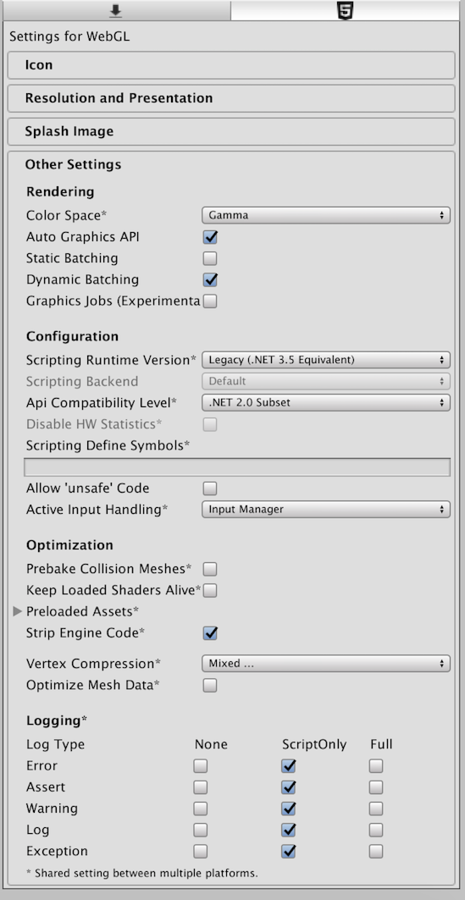
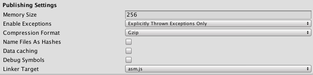

#WebGL Player Settings

本页面将详细介绍 WebGL 特有的__播放器设置 (Player Settings)__。可在[此处](class-PlayerSettings.html)找到常规 Player Settings 的说明。

##Other settings

 

|**_属性：_** |**_功能：_** |
|:---|:---|
|**Rendering** ||
|__Rendering Path__ |为游戏启用的[渲染路径](RenderingPaths.html)。 |
|__Auto Graphics API__ |如果要手动选择使用的图形 API，请取消选中此项。选中此项后，Unity 包含 WebGL2.0，并以 WebGL1.0 作为不支持 WebGL2.0 的浏览器的后备选项。取消选中后，可手动选择和重新排序图形 API。 |
|__Static Batching__ |选中此框可启用静态批处理。 |
|__Dynamic Batching__ |选中此框可启用动态批处理。 |
|**Configuration** ||
|__Scripting Runtime Version__ |选择要在项目中使用的 .NET 运行时。有关更多详细信息，请参阅 Microsoft 的 [.NET 文档](https://docs.microsoft.com/en-us/dotnet/)。|
|&nbsp;&nbsp;&nbsp;&nbsp; .NET 3.5 Equivalent|一个实现 .NET 3.5 API 的 .NET 运行时。这是默认脚本运行时。|
|&nbsp;&nbsp;&nbsp;&nbsp; .NET 4.x Equivalent|一个实现 .NET 4 API 的 .NET 运行时。此 API 比 .NET 3.5 更新，因此提供对更多 API 的访问、与更多外部库兼容并支持 C# 6。|
|__Scripting Backend__| Scripting backend 显示为灰色，因为 WebGL 上只有一个脚本后端。 |
|__Disable HW Statistics__ |取消选中此框时，应用程序会将有关硬件的信息发送到 Unity（请参阅[硬件统计信息](http://hwstats.unity3d.com/)页面以了解更多详细信息）。|
|__Scripting Define Symbols__|自定义的编译标志（请参阅[平台相关的编译](PlatformDependentCompilation.html)页面以了解详细信息）。|
|__Allow 'unsafe' Code__| 允许在预定义的程序集（例如，*Assembly-CSharp.dll*）中编译[“不安全”的 C# 代码](https://docs.microsoft.com/en-us/dotnet/csharp/language-reference/keywords/unsafe)。对于程序集定义文件 (*.asmdef*)，请单击其中一个 *.asmdef* 文件，并在出现的 Inspector 窗口中启用该选项。|
|**Optimization** ||
|__Api Compatibility Level__ |指定激活的 .NET API 配置文件。请参阅下文。|
|&amp;#160;&amp;#160;&amp;#160;&amp;#160;&amp;#160;&amp;#160;&amp;#160;&amp;#160;__.Net 2.0__ |.Net 2.0 库。最高的 .net 兼容性，最大的文件大小|
|&amp;#160;&amp;#160;&amp;#160;&amp;#160;&amp;#160;&amp;#160;&amp;#160;&amp;#160;__.Net 2.0 Subset__ |完整 .net 兼容性的子集，最小的文件大小|
|__Prebake Collision Meshes__ |启用构建期间的碰撞网格烘焙。 |
|__Preload Shaders__ |启用着色器预加载。 |
|__Preload Assets__ |启用资源预加载。指定要预加载的资源的大小。|
|__Strip Engine Code__ |为 WebGL 启用代码剥离。 |
|__Vertex Compression__ | |
|__Optimize Mesh Data__|从网格中删除应用于网格的材质不需要的所有数据（切线、法线、颜色、UV）。|

###API compatibility level

可为所有目标选择 mono API 兼容性级别。有时，第三方 .net dll 将使用您想要使用的 .net 兼容性级别之外的内容。为了解在这种情况下可能发生的问题以及如何以最佳方案修复问题，请在 Windows 上安装“Reflector”。

1.将相关 API 兼容性级别的 .net 程序集拖到 Reflector 中。这些程序集位于 Frameworks/Mono/lib/mono/YOURSUBSET/
1.同样拖入第三方程序集。
1.右键单击第三方程序集并选择 __Analyze__。
1.在分析报告中，检查 __Depends on__ 部分。在此部分将以红色突出显示第三方程序集所依赖的但在您选择的 .net 兼容性级别中不可用的任何内容。

##Publishing settings

 

|**_属性：_** |**_功能：_** |
|:---|:---|
|__Memory Size__ |设置 WebGL 运行时可用的内存（以 MB 为单位）。应小心选择此值：如果值太低，您将看到内存不足错误，因为加载的内容和场景将在可用内存中装不下。但是，如果请求太多内存，某些浏览器/平台组合可能无法提供此数量，因此无法加载播放器。请参阅[此处](webgl-memory.html)以了解详情。 |
|__Enable Exceptions__|启用异常支持，允许指定在运行时如何处理意外的代码行为（通常视为错误）。提供了四个选项：None、Explicitly Thrown Exceptions Only、Full Without Stacktrace 和 Full With Stacktrace。有关详细信息，请参阅[构建和运行 WebGL 项目](webgl-building.html)页面。 |
|__Compression Format__|发布构建文件压缩格式：gzip、brotli 或 none。请注意，此选项不会影响开发版本。 |
|__Name Files As Hashes__|使用未压缩文件内容的 MD5 哈希作为构建中每个文件的文件名。|
|__Data caching__|启用此选项可自动将内容资源数据缓存在用户计算机上，这样就不必在后续运行中重新下载（除非内容已更改）。缓存是使用浏览器提供的 IndexedDB API 实现的。有些浏览器可能会对此实施限制，例如要求用户进行授权才能缓存超过特定大小的数据。|
|__Debug Symbols__|发生错误时保留调试符号并执行堆栈跟踪的恢复。对于发布版本，所有调试信息都存储在单独的文件中；发生错误时将根据需要从服务器下载该文件。开发版本始终具有嵌入在主模块中的恢复支持，因此不受此选项的影响。|
|__Linker Target__|指定要生成的构建类型。__asm.js__ 在浏览器中得到广泛支持，而 __WebAssembly__ 是一种新的高效 Web 格式。选择 __Both__ 会生成 WebAssembly 和 asm.js 两种格式。然后，在运行时，如果浏览器支持 WebAssembly，则使用 WebAssembly，否则将回退到 asm.js。|

有关 WebGL 发布设置的更多信息，请参阅 [WebGL 构建和运行](webgl-building.html)页面。

---

* 2018-03-20  Page amended with no [editorial review](DocumentationEditorialReview.html)

* 在 [2017.3](https://docs.unity3d.com/2017.3/Documentation/Manual/30_search.html?q=newin20171) 版中更新了发布设置 NewIn20173
* 在 Unity 2018.1 中添加了 Allow 'unsafe' code 复选框
* 在 2018.1 版中添加了 .NET 4.x 运行时
