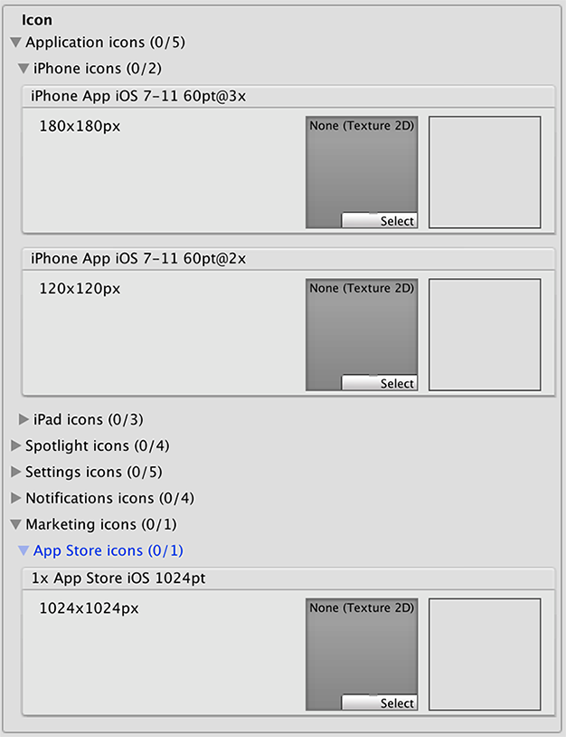
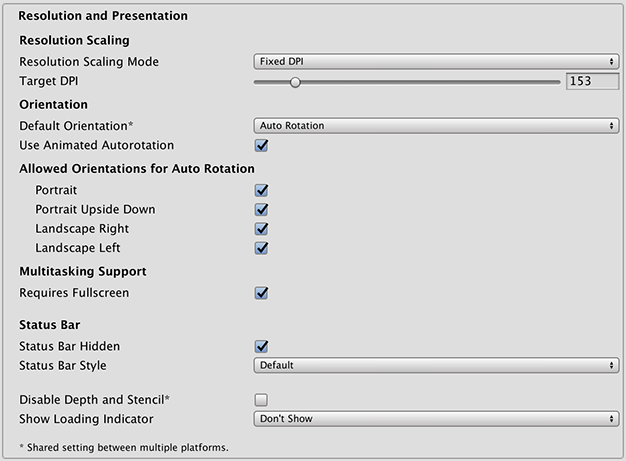
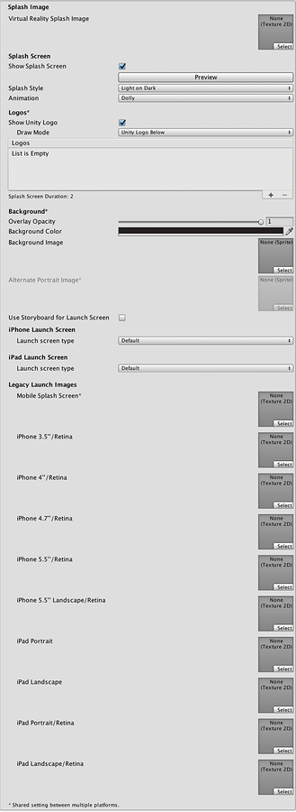
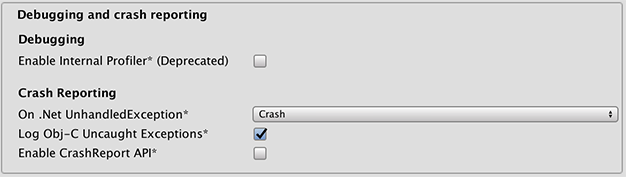
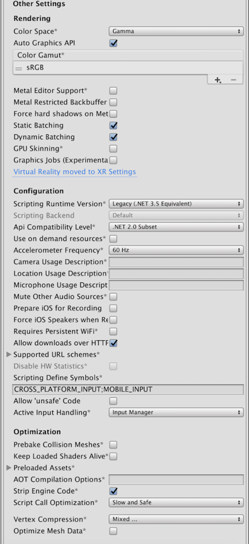

#iOS Player Settings

This page details the __Player Settings__ specific to iOS. A description of the general Player Settings can be found [here](class-PlayerSettings.html).

Note that Unity iOS requires iOS 7.0 or higher. Unity does not support iOS 6.0 or earlier versions.

##Icon

 

**Note**: If any icon textures are omitted, the icon texture with the nearest size is scaled accordingly (preference is given to larger resolution textures).

|**_属性：_** |**_功能：_** |
|:---|:---|
|__Application icons__ |Assign the custom icon that you would like to appear on your app for each iOS device. |
|__Spotlight icons__ |Assign the custom icon that you would like to appear in the Spotlight search results for your game for each iOS device.|
|__Settings icons__ |Assign the custom icon that you would like to appear on the phone’s main Settings page for each iOS device.|
|__Notification icons__ |Assign the custom icon that you would like to appear when sending notifications from your game for each iOS device.|
|__Marketing icons__ |Assign the custom icon that you would like to appear for your game in the App Store for each iOS device.|

##Resolution and Presentation

 

|**_属性：_** |**_功能：_** |
|:---|:---|
|__Resolution Scaling__ ||
|__Resolution Scaling Mode__ |Set the scaling to be equal to or below the native screen resolution:  __FixedDPI__ allows you to scale the device’s screen resolution below its native resolution and show the __Target DPI__ property. Use this to optimize performance and battery life or target a specific DPI setting.  __Disabled__ ensures that scaling is not applied and the game renders to its native screen resolution. |
|__Target DPI__ |Set the target DPI of the game screen. The game screen is downscaled to match this setting if the device's native screen DPI is higher than this value. This option only appears when the __Resolution Scaling Mode__ is set to __Fixed DPI__.|
|__Orientation__ ||
|__Default Orientation__  This setting is shared between iOS and Android devices |The game's screen orientation. The options are:  __Portrait__ (home button at the bottom),  __Portrait Upside Down__ (home button at the top),  __Landscape Left__ (home button on the right side),  __Landscape Right__ (home button on the left side), and  __Auto Rotation__ (screen orientation changes with device orientation)|
|__Use Animated Autorotation__ |Check this box if you want orientation changes to animate the screen rotation rather than just switch. This is only visible when __Default Orientation__ is set to __Auto Rotation__.|
|__Allowed Orientations for Auto Rotation__ (only visible when __Default Orientation__ is set to __Auto Rotation__.)||
|__Portrait__ |Allow portrait orientation. |
|__Portrait Upside Down__ |Allow portrait upside-down orientation.|
|__Landscape Right__ |Allow landscape right orientation (home button on the **left** side). |
|__Landscape Left__ |Allow landscape left orientation (home button is on the **right** side).|
|**Multitasking Support** ||
|__Requires Fullscreen__ |Check this box if your game requires fullscreen.|
|**Status Bar** ||
|__Status Bar Hidden__ |Check this box to hide the the status bar when the application launches.|
|__Status Bar Style__ |Define the style of the status bar when the application launches. The options are __Default__, __Black Translucent__ and __Black Opaque__. |
|__Disable Depth and Stencil__ |Check this box to disable the depth and stencil buffers. |
|__Show Loading Indicator__|Select how the loading indicator be displayed. The options are __Don't Show__, __White Large__, __White__, and __Gray__. |

##Splash Image

 

There are two ways to implement splash images on iOS: __Launch Images__ and __Launch Screens__.

###Launch Images
__Launch Images__ are static splash screen images that occupy the entire screen. 

__Launch Images__ are defined in an Asset catalog (Images.xcassets/LaunchImage). Always add a __Launch Screen__ for each supported size and orientation combination.

Only iPhone 6+ supports landscape orientation; other iPhones can only use portrait. Launch Images are selected in the following order:

 * The specific __Launch Image__ override, if the texture is set
 * Default Unity splash screen launch image, which is a solid blue-black color

You need to set all __Launch Images__ for your build.

###Launch Screens
A __Launch Screen__ is an XIB file from which iOS creates a splash screen dynamically on the device.

__Launch Screens__ have a limitation: it is not possible to display different content depending on iPad device orientation. All iPhones support landscape __Launch Screens__; however, due to a bug in iOS, __Landscape Left__ is shown instead of __Landscape Right__ on certain iOS versions. 

**Note**: For advice on cross-platform Splash Image properties, see [Splash Screen settings](class-PlayerSettingsSplashScreen.html).

|**_属性：_** |**_功能：_** |
|:---|:---|
|__Virtual Reality Splash Image__|Specify the texture that should be used for the iOS splash screen on a Virtual Reality application. |
|__Use Storyboard for Launch__|Enable this option to show the __Custom Storyboard__ button. Click the button to select a storyboard to show when your game starts up on the device. For your storyboard to appear here, you firstly need to create the storyboard in Xcode and copy it to your Project.|
|__Legacy Launch Images__ ||
|__Mobile Splash Screen__|Specifies texture which should be used for iOS Splash Screen. Standard Splash Screen size is 320x480.(This is shared between Android and iOS.)|
|__iPhone 3.5\"/Retina__|Specifies texture which should be used for iOS 3.5\" Retina Splash Screen. Splash Screen size is 640x960.|
|__iPhone 4\"/Retina__|Specifies texture which should be used for iOS 4\" Retina Splash Screen. Splash Screen size is 640x1136.|
|__iPhone 4.7\"/Retina__|Specifies texture which should be used for iOS 4.7\" Retina Splash Screen. Splash Screen size is 750x1334.|
|__iPhone 5.5\"/Retina__|Specifies texture which should be used for iOS 5.5\" Retina Splash Screen. Splash Screen size is 1242x2208.|
|__iPhone 5.5\" Landscape/Retina__|Specifies texture which should be used for iOS 5.5\" Landscape/Retina Splash Screen. Splash Screen size is 2208x1242.|
|__iPhone X\Retina__|Specifies texture which should be used for iPhone X Retina Splash Screen. Splash Screen size is 1125x2436.|
|__iPhone X Landscape\Retina__|Specifies texture which should be used for iPhone X Landscape/Retina Splash Screen. Splash Screen size is 2436x1125.|
|__iPad Portrait__|Specifies texture which should be used as iPad Portrait orientation Splash Screen. Standard Splash Screen size is 768x1024.|
|__iPad Landscape__|Specifies texture which should be used as iPad Landscape orientation Splash Screen. Standard Splash Screen size is 1024x768.|
|__iPad Portrait/Retina__|Specifies texture which should be used as the iPad Retina Portrait orientation Splash Screen. Standard Splash Screen size is 1536x2048.|
|__iPad Landscape/Retina__|Specifies texture which should be used as the iPad Retina Landscape orientation Splash Screen. Standard Splash Screen size is 2048x1536.|
|__Launch Screen type__|Allows you to select between the **launch screen** types|
| - None|The behavior is as if only launch images are used.|
| - Default|A launch screen that is very much like a launch image. One image is selected for portrait and landscape. The selection order: iPhone 6+ launch images, shared mobile launch image, default Unity launch image for iPhone 6+. The images are displayed using aspect-fill mode.|
| - Image with background, relative size|A center-aligned image is shown, with the rest of area filled with solid color. The image size is user-specified percentage of the screen size, computed in the smaller dimension (vertical on landscape, horizontal in portrait orientations). User also specifies background color and images for portrait and landscape orientations. Image selection order: the user-specified image, shared mobile launch image, default Unity launch image for iPhone 6+. The images are displayed using aspect-fill mode.|
| - Image with background, constant size|Same as relative size option except that the size of the image is defined by user-specified number of points.|
| - Custom Xib|An user-specified XIB file from any location.|

In Unity Personal Edition the [Unity Splash Screen](class-PlayerSettingsSplashScreen.html) displays as soon as engine initializes, in addition to your chosen splash screen.

##Debugging and crash reporting

|**_属性：_** |**_功能：_** |
|:---|:---|
|__Enable Internal Profiler (Deprecated)__|Enables an internal profiler which collects performance data of the application and prints a report to the console. The report contains the number of milliseconds that it took for each Unity subsystem to execute on each frame. The data is averaged across 30 frames.|
|__On .Net UnhandledException__|The action taken on .NET unhandled exception. The options are __Crash__ (the application crashes hardly and forces iOS to generate a crash report that can be submitted to iTunes by app users and inspected by developers), __Silent Exit__ (the application exits gracefully).|
|__Log ObjC uncaught exceptions__|Enables a custom Objective-C Uncaught Exception handler, which will print exception information to console.|
|__Enable Crash Report API__|Enables a custom crash reporter to capture crashes. Crash logs will be available to scripts via CrashReport API.|

##Other Settings

 

|**_属性：_** |**_功能：_** |
|:---|:---|
|**Rendering** ||
|__Color Space__ |Make Unity use __Gamma__ color space or __Linear__ color space for rendering. For more information, see [linear rendering documentation](LinearLighting.html). __Linear__ color space is only supported on Metal graphics API.|
|__Auto Graphics API__ | Allows you to select which graphics API is used. When checked, Unity will include Metal, and GLES2 as a fallback for devices where Metal is not supported. When unchecked, you can manually pick and reorder the graphics APIs. Manually picking just one API will adjust your app's info.plist which will result in appropriate app store restrictions.|
|__Graphics APIs__ | Set the graphics APIs to use for rendering. Click the + icon to add an API and the - icon to remove an API. When a device supports more than one Graphics API, Unity uses the first item in the ordered list. Click and drag an API in the list to change the order. This will only appear when __Auto Graphics API__ is unchecked.|
|__Color Gamut__ | Set the color gamut to use for rendering. When targeting recent iOS devices with wide color gamut displays, use __DisplayP3__ to utilize full display capabilities. Use __Metal Editor Support__ as a fallback for older devices.|
|__Metal Editor Support__ | Makes the Unity Editor use the Metal API and unlocks faster shader iteration for targeting the Metal API. __Metal API Validation__ can help catch graphics-related errors early, although it might decrease performance. For more information, see [Validating Metal API](Metal.html#MetalAPIValidation).|
|__Force hard shadows on Metal__ | Forces Unity to use point sampling for shadows on Metal. This reduces shadow quality, which should give better performance.|
|__Metal Restricted Backbuffer Use__ | 允许在非默认设备方向上提高性能。此属性会在后缓冲区上设置 frameBufferOnly 标志，因此会阻止从后缓冲区的回读，但可实现一定程度的驱动程序优化。|
|__Multithreaded Rendering__ |Enable multithreaded rendering. This is only supported on Metal.|
|__Static Batching__ |Set this to use Static batching on your build (enabled by default). |
|__Dynamic Batching__ |Set this to use Dynamic Batching on your build. |
|__GPU Skinning__ |Should DX11/ES3 GPU skinning be enabled? |
|**Identification** ||
|__Bundle Identifier__ |The string used in your provisioning certificate from your Apple Developer Network account. (This is shared between iOS and Android.) |
|__Bundle Version__ |Specifies the build version number of the bundle, which identifies an iteration (released or unreleased) of the bundle. The version is specified in the common format of a string containing numbers separated by dots (eg, 4.3.2). |
|__Build__ |The build number can be entered here to allow you to keep track of the number of builds that have been made. |
|__Signing Team ID__ |Set this property with your Apple Developer Team ID. You can find this on the Apple Developer website under [Account &gt; Membership](https://developer.apple.com/account/#/membership/). This sets the Team ID for the generated Xcode project, allowing developers to use the Build and Run functionality. An Apple Developer Team ID must be set here for automatic signing of your app. For more information, see [Creating Your Team Provisioning Profile](https://help.apple.com/xcode/mac/current/#/dev60b6fbbc7).|
|__Automatically Sign__ |Enable this to allow Xcode to automatically sign your build.|
|__iOS Provisioning Profile__ |Specify an Apple provisioning profile to allow your game to run on all your iOS devices and use app services. Click the __Browse__ button to select a downloaded provisioning profile file. The __Profile ID__ is the internal ID of the provisioning profile set in the Xcode project, for example: `1234abcd-12ab-12ab-12ab-1234abcd1234`. This appears automatically when you select a provisioning profile file, or you can enter it manually.  Note: This property only appears when __Automatically Sign__ is unchecked.|
|**Configuration** |
|__Scripting Runtime Version__ |选择要在项目中使用的 .NET 运行时。有关更多详细信息，请参阅 Microsoft 的 [.NET 文档](https://docs.microsoft.com/en-us/dotnet/)。|
|&nbsp;&nbsp;&nbsp;&nbsp; .NET 3.5 Equivalent|一个实现 .NET 3.5 API 的 .NET 运行时。这是默认脚本运行时。|
|&nbsp;&nbsp;&nbsp;&nbsp; .NET 4.x Equivalent|一个实现 .NET 4 API 的 .NET 运行时。此 API 比 .NET 3.5 更新，因此提供对更多 API 的访问、与更多外部库兼容并支持 C# 6。|
|__Scripting Backend__ |Allows you to select between IL2CPP and Mono scripting backends. The default is IL2CPP, and in most normal situations there should be no reason to switch to the older Mono backend. Unless you are running into bugs specifically relating to IL2CPP, you should not select Mono. **Mono builds are no longer accepted in the App store and Mono is not supported by iOS 11 and above.**|
|__Api Compatibility Level__ |Specifies active .NET API profile. See below:|
| - .Net 2.0 |.Net 2.0 库。最高的 .net 兼容性，最大的文件大小。|
| - .Net 2.0 Subset |完整 .net 兼容性的子集，最小的文件大小。|
|__C++ Compiler Configuration__ |Choose whether to compile your IL2CPP generated code in Debug or Release mode:|
| - Debug |Use __Debug__ mode for debugging because it turns off all optimizations. This makes the code quicker to build but slower to run.|
| - Release |Use __Release__ mode for testing and delivery to users because it enables optimizations. This makes the compiled code run faster and the binary size smaller, but it takes longer to compile.|
|__Use on Demand Resource__ |When enabled, allows you to use on-demand resources.|
|__Accelerometer Frequency__|How often is the accelerometer sampled? The options are **Disabled** (i.e. no samples are taken), **15Hz**, **30Hz**, **60Hz** and **100Hz**. |
|__Camera Usage Description__ |Allows you to enter the reason for accessing the camera on the iOS device.|
|__Location Usage Description__ |Allows you to enter the reason for accessing the location of the iOS device.|
|__Microphone Usage Description__ |Allows you to enter the reason for accessing the microphone on the iOS device.|
|__Mute Other Audio Sources__|Enable this if you want your Unity application to stop audio from applications running in the background. Disable this if you want audio from background applications to continue playing alongside your Unity application.|
|__Prepare iOS for Recording__|When selected, the microphone recording APIs are initialised. This makes recording latency lower, though on iPhones it re-routes audio output via earphones only.|
|__Force iOS Speakers when Recording__|Make the phone output through the internal speakers, even when headphones are plugged in and recording.|
|__Requires Persistent WiFi__ |Specifies whether the application requires a Wi-Fi connection. iOS maintains the active Wi-Fi connection while the application is running.|
|__Allow downloads over HTTP (nonsecure)__|When this option is enabled it will allow you to download content over HTTP. Default and recommended is HTTPS.|
|__Supported URL schemes__|A list of [supported URL schemes](https://developer.apple.com/library/ios/documentation/iPhone/Conceptual/iPhoneOSProgrammingGuide/Inter-AppCommunication/Inter-AppCommunication.html#/apple_ref/doc/uid/TP40007072-CH6-SW1). |
|__Disable HW Statistics__|By default, Unity iOS apps send anonymous HW statistics to Unity so we can provide you with aggregated information to help you make decisions as a developer. These stats can be found at [http://stats.unity3d.com/](http://stats.unity3d.com/). Checking this option disables the sending of these statistics for your app.|
|__Target Device__ |Which devices are targeted by the game? The options are **iPhone Only**, **iPad Only** and **iPhone + iPad**. |
|__Target SDK__ |Which SDK is targeted by the game? The options are **iPhone Only**, **Device SDK** and **Simulator SDK**. |
|__Target minimum iOS Version__ |Defines the minimum version of iOS that the game will work.|
|__Enable ProMotion Support__ |Enable high frequency refresh rates (120 Hz) on ProMotion displays. Enabling this setting might affect battery life.|
|__Requires ARKit support__ |Restricts the app to iPhone 6s/iOS 11 or newer devices when publishing to the App Store.|
|__Defer system gestures on edges__ |Users must swipe twice on the selected edges to enact system gesture.|
|__Hide home button on iPhone X__ |Hide the home button on iPhone X devices when the app is running.|
|__Render Extra Frame on Pause__ |Issue an additional frame after the frame when the app is paused. This allows your app to show graphics that indicate the paused state when the app is going into the background.|
|__Behaviour in Background__ |Specifies what the application should do when the user presses the home button.|
| - Suspend |This is the standard behaviour; the app is suspended, but not quit.|
| - Exit |Instead of suspending, the app will quit when the home button is pressed.|
| - Custom |You can implement your own behaviour with background processing. [See an example here](https://bitbucket.org/Unity-Technologies/iosnativecodesamples/src/ae6a0a2c02363d35f954d244a6eec91c0e0bf194/NativeIntegration/BackgroundTasks/BackgroundFetch/?at=5.0-dev). |
|__Architecture__|Allows you to select which architecture to target. Universal is recommended default. Some apps that are shipping on high-end devices only might consider selecting the Arm64-only option. Armv7 is for consistency purposes.|
| - Universal | The recommended option. Supports both architectures. |
| - Armv7 | Support only the older Armv7 architecture. |
| - Arm64 | Support only the newer Arm64 architecture. |
| - x86_64 | Only architecture available for __Simulator SDK__. Supports the x86_64 architecture. |
|__Scripting Define Symbols__|自定义的编译标志（请参阅[平台相关的编译](PlatformDependentCompilation.html)页面以了解详细信息）。|
|__Allow 'unsafe' Code__| 允许在预定义的程序集（例如，*Assembly-CSharp.dll*）中编译[“不安全”的 C# 代码](https://docs.microsoft.com/en-us/dotnet/csharp/language-reference/keywords/unsafe)。对于程序集定义文件 (*.asmdef*)，请单击其中一个 *.asmdef* 文件，并在出现的 Inspector 窗口中启用该选项。|
|__Active Input Handling__ |Choose to handle input using the [Input Manager](class-InputManager.html), the __Input System (Preview)__, or __Both__. If you change this setting, you must restart Unity for the change to take effect.|
|**Optimization** ||
|__Prebake Collision Meshes__|Should collision data be added to meshes at build time? |
|__Keep Loaded Shaders Alive__|Retains shaders in memory for faster access when the player starts the game up. |
|__Preloaded Assets__|An array of assets to be loaded when the player starts up. |
|__AOT compilation options__ |Additional AOT compiler options.|
|__Strip Engine Code__ |Enable code stripping. (This setting is only available with the IL2CPP scripting backend.)|
|__Script Call Optimization__ |Optionally disable exception handling for a speed boost at runtime. See [iOS Optimization](iphone-iOS-Optimization.html) for details.|
| - Slow and Safe |Full exception handling will occur (with some performance impact on the device when using the Mono scripting backend). |
| - Fast but no Exceptions |No data provided for exceptions on the device (the game will run faster when using the Mono scripting backend). |
|__Vertex Compression__|Select which vertex channels should be compressed. Compression can save memory and bandwidth but precision will be lower.|
|__Optimize Mesh Data__|从网格中删除应用于网格的材质不需要的所有数据（切线、法线、颜色、UV）。|

**Note:** Be sure to select the correct SDK - if you select _Device_, say, but then target the Simulator in Xcode then the build will fail with a lot of error messages.

###API Compatibility Level

You can choose your Mono API compatibility level for all targets. Sometimes a 3rd party .net dll will use things that are outside of the .NET compatibility level that you would like to use. To understand what is going on in such cases, and how to best fix it, get "Reflector" on Windows. 

1. Drag the .NET assemblies for the api compatilibity level in question into reflector. You can find these in Frameworks/Mono/lib/mono/YOURSUBSET/
1. Also drag in your 3rd party assembly.
1. Right click your 3rd party assembly, and select "Analyze".
1. In the analysis report, inspect the "Depends on" section. Anything that the 3rd party assembly depends on, but is not available in the .NET compatibility level of your choice will be highlighted in red there.

###Bundle Identifier

The __Bundle Identifier__ string must match the provisioning profile of the game you are building. The basic structure of the identifier is __com.CompanyName.GameName__. This structure may vary internationally based on where you live, so always default to the string provided to you by Apple for your Developer Account. Your GameName is set up in your provisioning certificates, that are manageable from the Apple iPhone Developer Center website. Please refer to the [Apple iPhone Developer Center website](http://developer.apple.com/iphone/) for more information on how this is performed.

###Stripping level

Most games don't use all necessary dlls. With the __Strip Engine Code__ option enabled, you can strip out unused parts to reduce the size of the built player on iOS devices. If your game is using classes that would normally be stripped out by the option you currently have selected, you'll be presented with a Debug message when you make a build.

###Script call optimization

A good development practice on iOS is to never rely on exception handling (either internally or through the use of try/catch blocks). When using the default __Slow and Safe__ option, any exceptions that occur on the device will be caught and a stack trace will be provided. When using the __Fast but no Exceptions__ option, any exceptions that occur will crash the game, and no stack trace will be provided. In addition, the __AppDomain.UnhandledException__ event will be raised to allow project-specific code access to the exception information. 

With the Mono scripting backend, the game will run faster since the processor is not diverting power to handle exceptions. There is no performance benefit with the __Fast but no Exceptions__ option when using the IL2CPP scripting backend. When releasing your game to the world, it's best to publish with the __Fast but no Exceptions__ option.

##XR settings

 

|**_属性：_** |**_功能：_** |
|:---|:---|
|**XR Settings** ||
|__Virtual Reality Supported__|为 Unity Editor 和游戏版本启用本机 VR 支持。|
|__Vuforia Augmented Reality Supported__ | 启用 [Vuforia 软件开发工具包](vuforia-sdk-overview.html)。必须拥有 Vuforia 软件许可证，并在启用该属性之前同意该许可证的条款。|

##增量构建

The C++ code generated by the IL2CPP scripting backend can be updated incrementally, allowing incremental C++ build systems to compile only the changes source files. This can significantly lower iteration times with the IL2CPP scripting backend.

To use incremental builds, choose the “Append” option after selecting “Build” from the “Build Settings” dialog. The “Replace” option will perform a clean build.

---

* 2018-06-28  Page amended with [editorial review](DocumentationEditorialReview.html)

* Mute Other Audio Sources added in 5.5

* iOS Player Settings documentation updated in Unity 2018.1

* Allow 'unsafe' Code checkbox added in Unity 2018.1

* 在 2018.1 版中添加了 .NET 4.x 运行时
