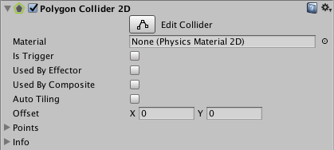

#2D 多边形碰撞体 (Polygon Collider 2D)

__2D 多边形碰撞体__组件是用于 2D 物理的碰撞体。碰撞体的形状由线段组成的自由形状边缘定义，因此可对其进行高精度调整以适应精灵图形的形状。请注意，此碰撞体的边缘必须完全包围一个区域（与类似的 [2D 边界碰撞体 (Edge Collider 2D)](class-EdgeCollider2D.html) 不同）。

 

|**_属性_** |**_功能_** |
|:---|:---|
|__Material__ |一种物理材质，可用于确定碰撞的属性（例如摩擦和弹性）。 |
|__Is Trigger__ |如果希望此碰撞体作为触发器运行，请勾选此框。 |
|__Used by Effector__ |附加的效应器是否使用该碰撞体。 |
| __Used by Composite__ | 如果希望此碰撞体由附加的 [2D 复合碰撞体 (Composite Collider 2D)](class-CompositeCollider2D.html) 使用，请勾选此复选框。  启用 __Used by Composite__ 时，其他属性会从 2D 多边形碰撞体组件中消失，因为这些属性现在由附加的 2D 复合碰撞体控制。从 2D 盒型碰撞体消失的属性为 __Material__、__Is Trigger__、__Used By Effector__ 和 __Edge Radius__。 |
|__Used by Collider__ | 如果希望 2D 盒型碰撞体由附加的 [2D 复合碰撞体](../ScriptReference/CompositeCollider2D.html)组件使用，请选中此框。 |
|__Auto Tiling__ | 如果将精灵渲染器组件的 __Draw Mode__ 设置为 __Tiled__，请勾选此复选框。这样可以自动更新 2D 碰撞体的形状，意味着精灵的尺寸变化时，会自动重新调整形状。如果没有启用 __Auto Tiling__，即使精灵的尺寸变化，2D 碰撞体也会保持相同的形状和大小。 |
|__Offset__ |碰撞体几何形状的局部偏移。 |
|__Points__ |有关生成碰撞体的复杂性的不可编辑信息。 |

##详细信息

允许手动编辑该碰撞体，但让 Unity 自动确定形状通常更方便。若要进行此操作，可将精灵资源从 Project 视图拖到 Inspector 中的 2D 多边形碰撞体组件。

可以按 Inspector 中的 __Edit Collider__ 按钮来编辑多边形的形状。再按 __Edit Collider__ 按钮即可退出碰撞体编辑模式。在编辑模式下，可在鼠标悬停在现有顶点上时进行拖动来移动该顶点。如果鼠标位于边缘上时按住 Shift 进行拖动，则会在鼠标位置创建新顶点。在单击顶点时按住 Ctrl/Cmd 键，可将顶点删除。

请注意，可以在编辑碰撞体时隐藏 2D 移动辅助图标的轮廓；只需单击 Inspector 中的精灵渲染器 (Sprite Renderer) 组件上的折叠箭头，从而折叠该组件。
