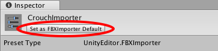
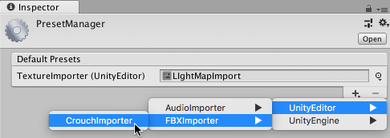

# Preset Manager

使用[预设](Presets.html)可以指定新组件和资源的默认属性。无法设定设置管理器 (Settings Managers) 的默认属性。

将组件添加到游戏对象或者将新资源添加到项目时，Unity 使用默认的预设来设置新项的属性。默认预设会覆盖 Unity 出厂默认设置。

使用 [__Inspector__](UsingTheInspector.html) 窗口的组件上下文菜单中的 __Reset__ 命令时，Unity 也会使用默认预设。

向场景添加新游戏对象时，对于[变换组件](class-Transform.html)，Unity 不会使用默认预设中的位置。在这种情况下，默认位置是 [__Scene__](UsingTheSceneView.html) 视图的中间位置。使用 __Reset__ 命令可以应用该位置以及变换组件的默认预设中的旋转和缩放。

## 指定要用于默认设置的预设

可以使用 __Inspector__ 窗口、__Preset Manager__ 或通过拖放操作指定要用于默认设置的预设。

要使用 __Inspector__ 窗口指定默认设置，请执行以下操作：

1.在 __Project__ 窗口中选择一个预设。

2.在 __Inspector__ 窗口中，单击 __Set as Preset__。
 

 
要使用 __Preset Manager__ 窗口指定默认设置，请执行以下操作：

1.如果项目中还没有用于默认设置的预设，请[创建一个](Presets.html)。

2.通过选择 __Edit > Project Settings > Preset Manager__ 来打开 Preset Manager。

3.单击 __+__ 并选择要与默认预设一起使用的项。 所选项的默认预设将显示在 __Preset Manager__ 列表中。

将某个预设从 __Project__ 窗口中拖放到 __Preset Manager__ 可以添加新的默认预设或更改现有的默认预设。

## 更改和删除默认预设

使用 __Preset Manager__ 可以更改默认预设。还可以将某个预设从 __Project__ 窗口中拖放到 __Preset Manager__ 来更改现有默认预设。

有两种方法可以删除默认预设：使用 __Preset Manager__ 或使用 [__Inspector__](UsingTheInspector.html) 窗口。

要在 __Preset Manager__ 中更改默认预设，请执行以下操作：

1.通过选择 __Edit > Project Settings > Preset Manager__ 来打开 Preset Manager。

2.单击对象类型的默认预设旁边的下拉菜单来选择预设。 选定的预设将成为新的默认预设。

要在 __Inspector__ 中删除默认预设，请执行以下操作：

1.在 Project 窗口中选择一个预设。

2.在 Inspector 窗口中，单击 __Remove From__。

要在 __Preset Manager__ 中删除默认预设，请执行以下操作：

1.通过选择 __Edit > Project Settings > Preset Manager__ 来打开 Preset Manager。

2.从默认预设的列表中选择要删除的默认预设。

3.单击 __-__ 来删除选定的默认预设。

 2017-03-27  Page published with limited [editorial review](DocumentationEditorialReview.html)

[2018.1](https://docs.unity3d.com/2018.1/Documentation/Manual/30_search.html?q=newin20181) 中的新功能 NewIn20181
