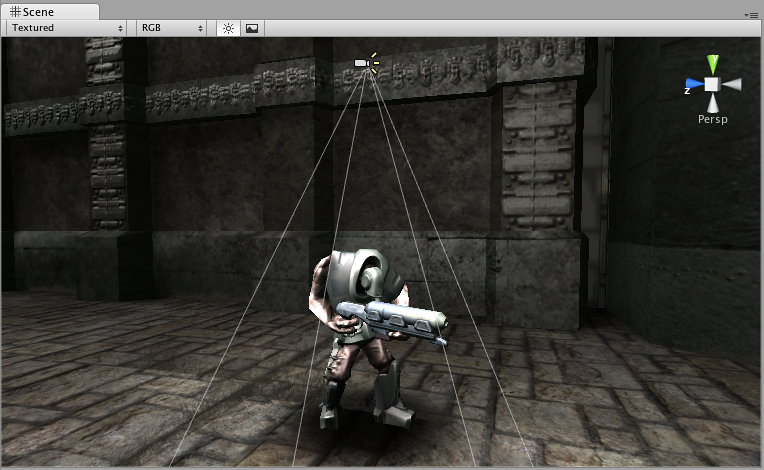

投影器 (Projector)
=========

__投影器__允许您将__材质__投影到与其视锥体相交的所有对象上。材质必须使用特殊类型的着色器才能使投影效果有效；有关如何使用提供的 Projector/Light 和 Projector/Multiply 着色器的示例，请参阅 Unity 标准资源中的投影器预制件。

 

属性
----------

|**_属性：_** |**_功能：_** |
|:---|:---|
|__Near Clip Plane__ |近裁剪面前面的对象不会接收到投射。 |
|__Far Clip Plane__ |超出此距离的对象不会受到影响。 |
|__Field Of View__ |以度为单位的视野。仅在投影器不采用正交视图 (Ortho Graphic) 时使用。 |
|__Aspect Ratio__ |投影器的宽高比 (Aspect Ratio)。此属性可用于调整投影器的高度和宽度。 |
|__Is Ortho Graphic__ |如果启用此属性，则投影器将采用正交视图 (Ortho Graphic) 而不是透视图。 |
|__Ortho Graphic Size__ |投影的正交视图大小。仅在启用 Is Ortho Graphic 复选框时才使用此属性。 |
|__Material__ |将投射到对象上的材质。 |
|__Ignore Layers__ |位于 Ignore Layers 之一上的对象将不会受到影响。默认情况下，Ignore Layers 为 None，因此与投影器视锥体相交的所有几何体都将受到影响。 |

详细信息
-------

使用投影器可以：

1.创建阴影。
1.使用另一台[摄像机](class-Camera.html)在三脚架上制作一台真实世界的投影器，从而使用__渲染纹理__拍摄世界其他地方。
1.创建弹痕。
1.创建时髦的光照效果。

如果要创建简单的阴影效果，只需将 __StandardAssets &gt; Blob-Shadow &gt; Blob shadow projector__ __预制件__拖到场景中即可。您可以修改材质以使用不同的模糊阴影纹理。

**注意：**创建投影器时，请务必将投影器纹理材质的包裹模式设置为 _clamp_。否则，会看到投影器的纹理重复，进而无法达到角色上所需的阴影效果。
提示
-----

* 如果将投影器模糊阴影用于正确遮蔽环境，可创建非常令人印象深刻的类似《细胞分裂》的光照效果。
* 当投影器的材质中未使用__衰减 (Falloff)__ 纹理时，可能同时向前和向后投影，从而产生“双投影”。要解决此问题，请使用具有黑色最左侧像素列的纯 Alpha 衰减纹理。
