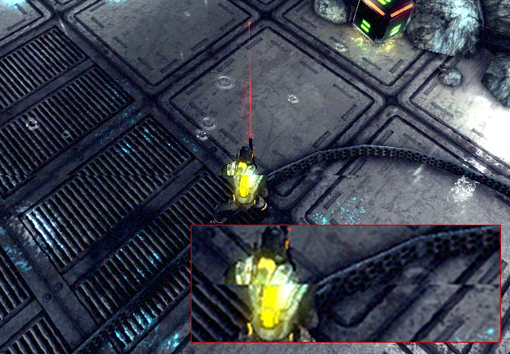
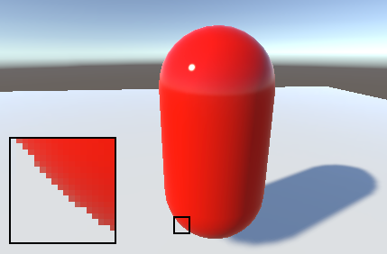

#Quality Settings

Unity 允许设置其尝试渲染的图形质量级别。一般来说，高质量是以帧率为代价的，因此最好不要在移动设备或旧硬件上以最高质量为目标，因为它会对游戏运行产生不利影响。__Quality Settings__ Inspector（菜单：__Edit &gt; Project Settings &gt; Quality__）用于在所选设备的编辑器中选择质量级别。它分为两个主要区域 - 在顶部有以下矩阵：

 

Unity 允许为给定的质量选项组合指定名称，以便于参考。在矩阵的行中可以选择每个质量级别适用于哪些不同平台。矩阵底部的默认行本身不是质量级别，而是设置用于每个平台的默认质量级别（列中的绿色复选框表示当前为该平台选择的级别）。Unity 预先启用了六个质量级别，但您可以使用矩阵下方的按钮添加自己的级别。可以使用垃圾桶图标（最右侧的列）删除不需要的质量级别。

可以单击质量级别的名称来选择该质量级别以便进行编辑，此操作可以在位于设置矩阵下面的面板中完成：

 

对于质量级别可选择的质量选项如下：

|**_属性：_** |**_功能：_** |
|:---|:---|
|__Name__|用于指代此质量级别的名称|

## Rendering

|**_属性：_** |**_功能：_** |
|:---|:---|
|__Pixel Light Count__|使用前向渲染时的最大像素光照数。|
|__Texture Quality__|选择是以最大分辨率还是以更小的分辨率显示纹理（较低的分辨率具有较低的处理开销）。选项包括 **Full Res**、**Half Res**、**Quarter Res** 和 **Eighth Res**。|
|__Anisotropic Textures__|是否启用以及如何使用各向异性纹理。选项包括 __Disabled__、__Per Texture__ 和 __Forced On__（即始终启用）。 |
|__AntiAliasing__|设置要使用的抗锯齿级别。选项包括 **2x**、**4x** 和 **8x** 多重采样。|
|__Soft Particles__|是否应为粒子使用软混合？|
|__Realtime Reflection Probes__|是否应在游戏过程中更新[反射探针](class-ReflectionProbe.html)？|
|__Resolution Scaling Fixed DPI Factor__|Downscales the device's screen resolution below its native resolution. For more details, see the platform-specific Player Settings pages, such as [Android Player Settings](class-PlayerSettingsAndroid.html) and [iOS Player Settings](class-PlayerSettingsiOS.html).|

## Shadows

|**_属性：_** |**_功能：_** |
|:---|:---|
|__Shadows__|确定应使用的阴影类型。可用选项包括 __Hard and Soft Shadows__、__Hard Shadows Only__ 和 __Disable Shadows__。 |
|__Shadow resolution__|可以按多种不同分辨率渲染阴影：**Low**、**Medium**、**High** 和 **Very High**。分辨率越高，处理开销越大。|
|__Shadow Projection__|投射方向光的阴影时有两种不同方法。**Close Fit** 可以渲染出更高分辨率的阴影，但如果摄像机移动，它们有时会略微抖动。**Stable Fit** 渲染较低分辨率的阴影，但它们不会因摄像机移动而抖动。|
|__Shadow Cascades__|阴影级联的数量可以设置为零个、两个或四个。级联数量越高，提供的质量越高，但代价是处理开销增大（有关更多详细信息，请参阅[方向光阴影](DirLightShadows.html)）。|
|__Shadow Distance__|摄像机可以看到阴影的最大距离。超出此距离的阴影将不会被渲染。|
| __Shadowmask Mode__ | 使用[阴影遮罩](LightMode-Mixed-ShadowmaskMode.html)混合光照模式时设置阴影遮罩行为。应使用 Lighting 窗口（菜单：__Window__ > __Lighting__ > __Settings__）在场景中进行此设置。 |
| &nbsp;&nbsp;&nbsp;&nbsp;Distance Shadowmask | Unity 对于 __Shadow Distance__ 范围内的值使用实时阴影，超过此距离则使用烘焙阴影。 |
| &nbsp;&nbsp;&nbsp;&nbsp;Shadowmask | 投射阴影的静态游戏对象总是投射烘焙阴影。 |
|__Shadow Near Plane Offset__|对阴影近平面进行偏移处理来解决大三角形由于阴影平坠而扭曲的问题。|

## Other

|**_属性_：** |**_功能：_** |
|:---|:---|
|__Blend Weights__|在动画期间可以影响给定顶点的骨骼数量。可用选项包括一个、两个或四个骨骼。|
|__VSync Count__|渲染可以与显示设备的刷新率同步来避免“撕裂”瑕疵（见下文）。可以选择与每个垂直空白 (VBlank) 同步、每隔一个垂直空白同步或根本不同步。|
|__LOD Bias__|根据对象在屏幕上的大小选择 LOD 级别。当大小在两个 LOD 级别之间时，可以偏向于两个可用模型中细节级别更低或更高者。此属性设置为 0 到 +无穷大之间的值。设置为 0 到 1 之间时，表示倾向于更少细节。超过 1 的设置表示倾向于更多细节。例如，将 LOD Bias 设置为 2 并使其在 50％ 距离处变化，LOD 实际上仅基于 25％ 变化。 |
|__Maximum LOD Level__|游戏使用的最高 LOD。有关更多信息，请参阅下面的注意事项。|
|__Particle Raycast Budget__|用于模拟粒子系统碰撞的最大射线投射数（质量设置为 __Medium__ 或 __Low__）。请参阅[粒子系统碰撞模块](class-ParticleSystem.html)。|
|__Async Upload Time Slice__|将缓冲的纹理上传到 GPU 时花费的 CPU 时间量（以毫秒/帧为单位）。请参阅[异步纹理上传](AsyncTextureUpload.html)。|
|__Async Upload Buffer Size__|异步上传缓冲区的大小（以 MB 为单位）。请参阅[异步纹理上传](AsyncTextureUpload.html)。|

## MaximumLOD 级别

在构建中不会使用 LOD 低于 MaximumLOD 级别的模型，而是将其忽略（这样可以节省存储和内存空间）。Unity 将使用与目标平台质量设置相关联的所有 MaximumLOD 值中的最小 LOD 值。如果包含 LOD 级别，则该 LODGroup 中的模型将包含在构建中，并始终在运行时为该 LODGroup 加载，无论使用何种质量设置。例如，如果在任何质量设置中使用 LOD 级别 0，则所有 LOD 级别都将包含在构建中，并且所有引用的模型都将在运行时加载。

## 撕裂

显示设备上的图片不会持续更新，而是定期更新，很大程度上就像 Unity 中的帧更新一样。但是，Unity 的更新不一定与显示器的更新同步，因此 Unity 有可能在显示器仍在渲染前一帧时发出新的帧。这将导致在屏幕上发生帧变化的位置处产生称为“撕裂”的视觉瑕疵。

可以将 Unity 设置为仅在显示设备未更新的时间段（即所谓的“垂直空白”）切换帧。Quality Settings 上的 VSync 选项将帧开关与设备的垂直空白同步，还可以选择与每隔一个垂直空白同步。如果游戏需要多个设备更新来完成帧的渲染，后者可能会很有用。

### 抗锯齿

抗锯齿可改善多边形边缘的外观，使它们不会产生“锯齿现象”，而是在屏幕上获得平滑的显示效果。但是，它会导致显卡的性能成本升高并使用更多的视频内存（尽管没有 CPU 成本）。抗锯齿的程度决定了多边形边缘的平滑程度（以及消耗的视频内存量）。

但是，内置的硬件抗锯齿不适用于[延迟着色](RenderTech-DeferredShading.html)和 [HDR](HDR.html) 渲染；对于这些情况，需要使用[抗锯齿图像效果](PostProcessing-Antialiasing.html)。

### 软粒子

软粒子在与其他场景几何体的交叉处附近淡出。这种视觉效果将大幅提升，但计算成本更高（更复杂的像素着色器），并且仅适用于支持[深度纹理](SL-DepthTextures.html)的平台。此外，必须使用[延迟着色](RenderTech-DeferredShading.html)或[旧版延迟光照](RenderTech-DeferredLighting.html)渲染路径，或使摄像机从脚本渲染[深度纹理](SL-CameraDepthTexture.html)。

---

* 2017-09-18  Page amended with limited [editorial review](DocumentationEditorialReview.html)

* 在 [2017.1](https://docs.unity3d.com/2017.1/Documentation/Manual/30_search.html?q=newin20171) 版中添加了 __Shadowmask Mode__ NewIn20171

