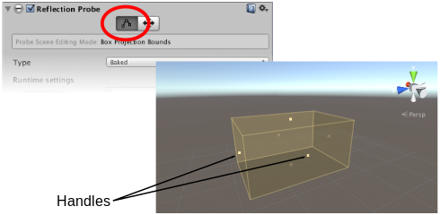
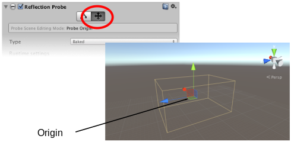

#反射探针

__反射探针__非常像一个捕捉周围各个方向的球形视图的摄像机。然后，捕捉的图像将存储为[立方体贴图](class-Cubemap.html)，可供具有反射材质的对象使用。可在给定场景中使用多个反射探针，并可将对象设置为使用由最近探针生成的立方体贴图。带来的结果是对象上的反射可根据环境发生令人信服的变化。

##属性

 

|**_属性：_** |**_功能：_** |
|:---|:---|
|__Type__ |选择该探针是用于 __Baked__、__Custom__ 还是 __Realtime__ 设置？ |
|__Dynamic Objects__ | （仅适用于 __Custom__ 类型）强制将未标记为 __Static__ 的对象烘焙到反射中。|
|__Cubemap__ | （仅适用于 __Custom__ 类型）设置探针的自定义[立方体贴图](class-Cubemap.html)。|
|__Refresh Mode__ | （仅适用于 __Realtime__ 类型）选择探针在运行时是否以及如何刷新。_On Awake_ 选项仅在探针首次激活时渲染一次探针。_Every Frame_ 在每次更新帧时都会渲染探针，可选择使用 __Time Slicing__ 属性（见下文）。__Via Scripting__ 选项根据用户脚本命令而不是通过自动更新来刷新探针。 |
|__Time Slicing__ |  （仅适用于 __Realtime__ 类型）探针应如何随时间推移分发其更新？选项包括 __All Faces At Once__（将更新分散到 9 帧）、__Individual Faces__（将更新分散到 14 帧）和 __No Time Slicing__（全部在一帧内进行更新）。请参阅下面的内容了解更多详细信息。 |
|**Runtime settings**||
|__Importance__ |该探针与其邻居相比的“重要性”程度。值越高表示重要性越高；在对象位于两个或更多探针范围内的情况下，重要性更高的探针优先于重要性更低的探针。该设置还会影响[此处](UsingReflectionProbes.html)所述的**混合**。 |
|__Intensity__ |在此探针的着色器中应用于纹理的强度修改器。 |
|__Box Projection__ |选中此框可为反射 UV 贴图启用投影。 |
|__Box Size__ |在其中将反射应用于游戏对象的盒体的大小。该值不受游戏对象的变换的影响。也由 __Box Projection__ 使用。 |
|__Box Offset__ |在其中将反射应用于游戏对象的盒体的中心。该值是相对于游戏对象位置的值。也由 __Box Projection__ 使用。 |
|**Cubemap capture settings**||
|__Resolution__ |捕获的反射图像的分辨率。 |
|__HDR__ |是否应为立方体贴图启用高动态范围 (HDR) 渲染？此属性还决定了探针数据是以 [OpenEXR](http://www.openexr.com/) 还是 PNG 格式保存。 |
|__Shadow Distance__ |渲染探针时绘制阴影的距离。 |
|__Clear Flags__ |指定如何填充立方体贴图的空背景区域。提供的选项为 __Skybox__ 和 __Solid Color__。 |
|__Background__ |反射立方体贴图在渲染之前使用的背景颜色。 |
|__Culling Mask__ |允许在反射中包含或排除指定层上的对象。请参阅[层](Layers.html)页面上有关摄像机剔除遮罩的部分。 |
|__Use Occlusion Culling__ |烘焙探针时是否应使用遮挡剔除？ |
|__Clipping Planes__ |探针的“摄像机”的近裁剪面和远裁剪面。 |

##详细信息

__Reflection Probe__ Inspector 窗口顶部有两个按钮，用于直接在场景中编辑 __Size__ 和 __Probe Origin__ 属性。选择最左边的按钮 (__Size__) 后，探针的效果区域将在场景中显示为黄色盒体形状，并带有控制柄用于调整盒体的大小。

 

另一个按钮 (__Origin__) 允许您相对于盒体拖动探针的原点。请注意，原点控制柄类似于[变换](class-Transform.html)位置控制柄，但这两个位置不同。此外，探针盒体无法进行旋转和缩放操作。

 

探针的 __Type__ 属性可确定如何创建和更新反射数据：

* __烘焙 (Baked)__ 探针可存储 Editor 中烘焙的静态反射立方体贴图。
* __自定义 (Custom)__ 探针可存储通过烘焙生成的或由用户手动设置的静态立方体贴图。
* __实时 (Realtime)__ 探针在运行时更新立方体贴图，因此可对场景中的动态对象做出反应。

要使用反射立方体贴图，对象必须在其[网格渲染器 (Mesh Renderer)](class-MeshRenderer.html) 上启用 __Reflection Probes__ 选项，并且还必须使用支持反射探针的着色器。当对象在探针的 __Size__ 和 __Probe Origin__ 属性设置的体积内通过时，探针的立方体贴图将应用于对象。

此外还可使用特定对象的[网格渲染器](class-MeshRenderer.html)上的设置来手动设置要用于该对象的反射探针。要执行此操作，请选择网格渲染器的 __Reflection Probes__ 属性的选项之一（__Simple__、__Blend Probes__ 或 __Blend Probes and Skybox__），然后将所选探针拖动到其 __Anchor Override__ 属性上。

有关原理和用法的更多详细信息，请参阅手册中的[反射探针](ReflectionProbes.html)部分。
