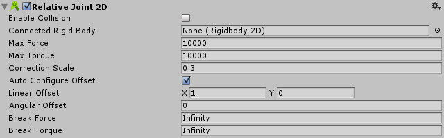

2D 相对关节 (Relative Joint 2D)
=================

该关节组件允许由刚体物理组件控制的两个游戏对象基于彼此的位置来保持相对位置。使用此关节可按照您所决定的位置和角度保持两个对象之间的相互偏移。

请参阅下文的*详细信息*进一步了解 __RelativeJoint2D__ 和 __FixedJoint2D__ 之间的区别。

 

|**_属性：_** |**_功能：_** |
|:---|:---|
|__Enable Collision__ |连接的两个对象能否相互碰撞？选中此复选框表示“能”。|
|__Connected Rigid Body__ |在此处指定该关节连接到的另一个对象。如果将此属性保留为 __None__，则该关节的另一端将固定在空间中的某个点。选择字段右侧的圆圈可查看要连接到的对象的列表。|
|__Max Force__ | 设置连接对象之间的线性（直线）偏移；较高的值（最大值为 1,000）表示使用较大力来保持此偏移。 |
|__Max Torque__ | 设置连接对象之间的角度（旋转）移动；较高的值（最大值为 1,000）表示使用较大力来保持此偏移。 |
|__Correction Scale__ | 调整关节来确保其行为符合要求。（增加 Max Force 或 Max Torque 可能会影响行为，使关节无法到达目标，这种情况下请使用此设置来进行更正。）默认设置 (0.3) 通常比较合适，但也可能需要在 0 和 1 之间进行调整。  |
|__Auto Configure Offset__ | 选中此框可以自动设置和维持连接对象之间的距离和角度。（选择此选项意味着无需手动输入 __Linear Offset__ 和 __Angular Offset__。）   |
|__Linear Offset__ |输入局部空间坐标来指定和维持连接对象之间的距离。|
|__Angular Offset__ |输入局部空间坐标来指定和维持连接对象之间的角度。|
|__Break Force__ |指定破坏并进而删除关节所需的作用力水平。__Infinity__ 表示关节牢不可破。 |
|__Break Torque__ |指定破坏并进而删除关节所需的扭矩水平。__Infinity__ 表示关节牢不可破。 |

##详细信息
（另请参阅 [2D 关节](Joints2D.html)中的*详情和提示*以了解所有 2D 关节的有用背景信息。）

此关节的目的是保持两点之间的相对线性距离和角度距离（偏移）。这两个点可以是两个 __2D 刚体__组件，或一个 __2D 刚体__组件和世界中的一个固定位置。（将 __Connected Rigidbody__ 设置为 None，即可连接到世界中的固定位置）。

此关节对两个连接刚体对象施加线性力和角力（扭力）。此关节使用的模拟电机已预配置十分强大的功率，因此具有很高的 __Max Force__ 和 __Max Torque__ 限值。可通过降低这些值来降低电机功率，或将电机完全关闭。

此关节同时有两个约束：

* 保持两个刚体对象之间的指定线性偏移。
* 保持两个刚体对象之间的起始角度偏移。

**例如：**

使用此关节可以构建具有以下要求的物理对象：

* 彼此保持一定距离，就像这些对象无法彼此远离或靠近一样。（可设定这些对象彼此分开的距离。此距离可实时改变。）
* 仅以特定角度相对于彼此旋转。（可设定该角度。）

在有些使用场合下可能需要灵活的连接，例如在空间射击游戏中，玩家身后有额外的排炮。这种情况下可以使用相对关节，使排炮在玩家身后稍微滞后，但让排炮随玩家一起旋转时没有滞后。

在有些使用场合下可能需要可配置的力，例如在游戏中使用可配置的力让摄像机追踪玩家。

##固定关节与相对关节

__FixedJoint2D__ 是一种弹簧式关节。__RelativeJoint2D__ 是具有最大力和/或扭矩的电机型关节。

*固定关节使用弹簧来保持相对线性偏移和角度偏移，而相对关节则使用电机。可配置关节的弹簧或电机。
* 固定关节使用锚点（此关节派生自脚本 __AnchoredJoint2D__）：在锚点之间保持相对的线性偏移和角度偏移。相对关节没有锚点（此关节直接派生自脚本 __Joint2D__）。
* 相对关节可以实时修改相对的线性偏移和角度偏移：固定关节则不能进行此类修改。

