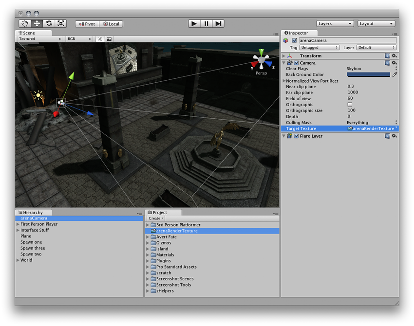

渲染纹理
==============

__渲染纹理__是在运行时创建和更新的特殊类型的__纹理__。要使用渲染纹理，首先要创建一个新的渲染纹理，并指定一个[摄像机](class-Camera.html)以渲染到其中。然后，即可像使用常规纹理一样在__材质__中使用渲染纹理。Unity 标准资源中的[水 (Water)](HOWTO-Water.html) 预制件便是实际使用渲染纹理进行实时反射和折射的一个示例。

属性
----------

渲染纹理检视面板 (Render Texture __Inspector__) 与大多数检视面板不同，但与[纹理检视面板 (Texture Inspector)](class-TextureImporter.html) 非常相似。

渲染纹理检视面板可实时显示渲染纹理的当前内容，对于使用渲染纹理的效果而言，此面板是非常有用的调试工具。

|**_属性：_** |**_功能：_** |
|:---|:---|
|__Size__ |渲染纹理的大小（以像素为单位）。请注意，选择的大小值必须是 2 的幂。 |
|__Anti-Aliasing__ |要应用的抗锯齿量。None、两个、四个或八个样本。|
|__Depth Buffer__ |深度缓冲区的类型。None、16 位或 24 位。 |
|__Wrap Mode__ |选择纹理平铺时的行为方式： |
|&amp;#160;&amp;#160;&amp;#160;&amp;#160;&amp;#160;&amp;#160;&amp;#160;&amp;#160;__Repeat__ |纹理重复（平铺）自身 |
|&amp;#160;&amp;#160;&amp;#160;&amp;#160;&amp;#160;&amp;#160;&amp;#160;&amp;#160;__Clamp__ |纹理的边缘被拉伸 |
|__Filter Mode__ |选择纹理在通过 3D 变换拉伸时如何进行过滤： |
|&amp;#160;&amp;#160;&amp;#160;&amp;#160;&amp;#160;&amp;#160;&amp;#160;&amp;#160;__No Filtering__ |纹理在靠近时变为块状 |
|&amp;#160;&amp;#160;&amp;#160;&amp;#160;&amp;#160;&amp;#160;&amp;#160;&amp;#160;__Bilinear__ |纹理在靠近时变得模糊 |
|&amp;#160;&amp;#160;&amp;#160;&amp;#160;&amp;#160;&amp;#160;&amp;#160;&amp;#160;__Trilinear__ |与 Bilinear 类似，但纹理也在不同的 Mip 级别之间模糊 |
|__Aniso Level__ |以大角度查看纹理时提高纹理质量。适用于地板和地面纹理 |

示例
-------

在游戏中制作现场竞技场摄像机的快速方法：

1.使用 __Assets &gt; Create &gt; Render Texture__ 创建新的渲染纹理资源。
1.使用 __GameObject &gt; Camera__ 创建新的摄像机。
1.将渲染纹理分配给新摄像机的 __Target Texture__。
1.创建一个宽、高、薄的盒体
1.将渲染纹理拖动到其上以创建使用渲染纹理的材质。
1.进入播放模式，观察盒体的纹理是否会根据新摄像机的输出情况实时更新。

---

* 2017-09-19  Page amended with limited [editorial review](DocumentationEditorialReview.html)

* 在 Unity 4.6 中更改了 GameObject 菜单
