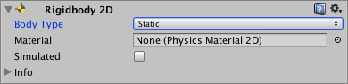

# 2D 刚体

2D 刚体组件将对象置于物理引擎的控制之下。标准[刚体](http://docs.unity3d.com/Manual/class-Rigidbody.html)组件中的许多熟悉概念都延续到了 2D 刚体；不同之处在于，在 2D 中，对象只能在 XY 平面中移动，并且只能在垂直于该平面的轴上旋转。

 以了解更多信息。](../uploads/Main/Rigidbody2D.png)

## 2D 刚体工作原理

通常，Unity Editor 的变换组件定义游戏对象（及其子游戏对象）在场景中的定位、旋转和缩放方式。更改变换组件将更新其他组件，这样可以更新渲染对象的位置或碰撞体所在位置之类的属性。2D 物理引擎能够移动碰撞体并使这些碰撞体彼此交互，因此物理引擎需要一种方法将碰撞体的此移动状态传回变换组件。此移动以及与碰撞体的连接便是 2D 刚体组件的用途。

2D 刚体组件会覆盖变换组件，并将其更新为 2D 刚体定义的位置/旋转。请注意，虽然仍然可以通过自行修改变换组件来覆盖 2D 刚体（因为 Unity 会公开所有组件上的所有属性），但是这样会导致各种问题，例如游戏对象相互穿过或嵌入等问题以及不可预测的移动。

添加到同一游戏对象或子游戏对象的任何 2D 碰撞体组件都隐式附加到该 2D 刚体。2D 碰撞体附加到 2D 刚体时，两者一起移动。严禁使用变换组件或任何碰撞体偏移来直接移动 2D 碰撞体；而应移动 2D 刚体。这样将提供最佳性能并确保正确的碰撞检测。连接到同一 2D 刚体的多个 2D 碰撞体不会相互碰撞。这意味着可以创建一组碰撞体来有效充当单一复合碰撞体，使所有碰撞体都与 2D 刚体同步移动和旋转。

设计场景时，可自由使用默认的 2D 刚体并开始附加碰撞体。这些碰撞体可让连接到不同 2D 刚体的所有其他碰撞体相互碰撞。

###提示

添加 __2D 刚体__后可基于脚本 API 施力，从而让精灵以逼真的方式移动。相应的碰撞体组件也附加到精灵游戏对象时，该组件会受到与其他移动游戏对象的碰撞的影响。通过使用物理系统可以简化许多常见的游戏机制，并以最少编码实现逼真行为。

 
## Body Type

2D 刚体组件在顶部有一个显示为 __Body Type__ 的设置。在此设置中选择的选项会影响组件上可用的其他设置。

 

__Body Type__ 有三个选项；每个选项定义一种常见和固定的行为。附加到 2D 刚体的 2D 碰撞体将继承 2D 刚体的 __Body Type__。这三个选项是：

* __Dynamic__
* __Kinematic__
* __Static__

所选的选项将定义：

* 移动（位置和旋转）行为
* 碰撞体相互作用

请注意，尽管经常将 2D 刚体表述为相互碰撞，但实际上发生碰撞的是每个刚体所连接的 2D 碰撞体。如果没有碰撞体，2D 刚体不能相互碰撞。

改变 2D 刚体的 Body Type 可能是一个复杂的过程。Body Type 发生变化时，各种与质量相关的内部属性都将立即重新计算，并且在游戏对象的下一个 [FixedUpdate](../ScriptReference/MonoBehaviour.FixedUpdate.html) 期间需要重新估算连接到 2D 刚体的 2D 碰撞体的所有现有触点。根据触点数量以及连接到刚体的 2D 碰撞体数量，更改 Body Type 可能会导致性能变化。

### Body Type：Dynamic

 

__Dynamic__ 类型的 2D 刚体设计为在模拟条件下移动。这种刚体类型具有可用的全套属性（例如有限质量和阻力），并受重力和作用力的影响。Dynamic 刚体类型将与每个其他刚体类型碰撞，是最具互动性的刚体类型。这是需要移动的对象的最常见刚体类型，因此是 2D 刚体的默认刚体类型。此外，由于具有动态性并与周围所有对象互动，因此也是性能成本最高的刚体类型。选择此刚体类型时，所有 2D 刚体属性均可用。

请勿使用变换组件来设置 __Dynamic__ 类型的 2D 刚体的位置或旋转。模拟系统会根据 __Dynamic__ 2D 刚体的速度对该刚体重新定位；可以通过脚本施加于刚体的力来直接更改此值，也可以通过碰撞和重力来间接更改此值。

|**属性：** |**功能：** |
|:---|:---|
| __Body Type__ |设置 2D 刚体的组件设置，从而可操纵移动（位置和旋转）行为和 2D 碰撞体交互。 选项为：__Dynamic__、__Kinematic__、__Static__ |
| __Material__ |使用此属性可为连接到特定父 2D 刚体的所有 2D 碰撞体指定公共材质。 **注意：**2D 碰撞体使用自己的 Material 属性（如果已设置）。如果此处或在 2D 碰撞体中未指定材质，则默认选项为 __None (Physics Material 2D)__。这种情况下使用可在 [Physics 2D Settings](class-Physics2DManager.html) 窗口中设置的默认材质。 2D 碰撞体使用以下优先级顺序来确定要使用的 __Material__ 设置： 1. 在 2D 碰撞体上指定的 2D 物理材质。 2.在附加的 2D 刚体上指定的 2D 物理材质。 在 [Physics 2D Settings](class-Physics2DManager.html) 中指定的 2D 物理材质默认材质。 **提示：**使用此设置确保附加到同一 __Static__ Body Type 2D 刚体的所有 2D 碰撞体都可使用同一材质。 |
| __Simulated__ |如果希望 2D 刚体以及所有附加的 2D 碰撞体和 2D 关节在运行时与物理模拟系统交互，请启用 __Simulated__（选中复选框）。如果禁用此功能（取消选中复选框），这些组件不会与模拟系统进行交互。请参阅下面的 [2D 刚体属性：Simulated](#SimulatedProperty) 以了解更多详细信息。默认情况下会选中此框。 |
| __Use Auto Mass__ |如果希望 2D 刚体从其 2D 碰撞体中自动检测游戏对象的质量，请选中此框。 |
| __Mass__ |定义 2D 刚体的质量。如果已选中 Use Auto Mass，此属性将显示灰色。 |
| __Linear Drag__ |一种会影响位置移动的阻力系数。 |
| __Angular Drag__ |一种会影响旋转移动的阻力系数。 |
| __Gravity Scale__ |定义游戏对象受重力影响的程度。 |
| __Collision Detection__ |定义如何检测 2D 碰撞体之间的碰撞。 |
|&amp;#160;&amp;#160;&amp;#160;&amp;#160;&amp;#160;&amp;#160;&amp;#160;&amp;#160;Discrete | 将 __Collision Detection__ 设置为 __Discrete__ 时，具有 2D 刚体和 2D 碰撞体的游戏对象在物理更新期间可以重叠或穿过彼此（如果移动得足够快）。仅会在新位置生成碰撞触点。|
|&amp;#160;&amp;#160;&amp;#160;&amp;#160;&amp;#160;&amp;#160;&amp;#160;&amp;#160;Continuous | __Collision Detection__ 设置为 __Continuous__ 时，具有 2D 刚体和 2D 碰撞体的游戏对象在更新期间不会穿过彼此。相反，Unity 会计算 2D 碰撞体的第一个影响点，并将游戏对象移动到该点。请注意，此设置比 __Discrete__ 耗费更多 CPU 时间。 |
| __Sleeping Mode__ |定义游戏对象如何在处于静止状态时“睡眠”以节省处理器时间。 |
|&amp;#160;&amp;#160;&amp;#160;&amp;#160;&amp;#160;&amp;#160;&amp;#160;&amp;#160;Never Sleep |禁用睡眠（应尽可能避免此设置，否则会影响系统资源）。 |
|&amp;#160;&amp;#160;&amp;#160;&amp;#160;&amp;#160;&amp;#160;&amp;#160;&amp;#160;Start Awake |游戏对象最初处于唤醒状态。 |
|&amp;#160;&amp;#160;&amp;#160;&amp;#160;&amp;#160;&amp;#160;&amp;#160;&amp;#160;Start Asleep |游戏对象最初处于睡眠状态，但可以被碰撞唤醒。 |
| __Interpolate__ |定义如何在物理更新间隔之间插入游戏对象的移动（运动趋于颠簸状态时很有用）。 |
|&amp;#160;&amp;#160;&amp;#160;&amp;#160;&amp;#160;&amp;#160;&amp;#160;&amp;#160;None |不应用移动平滑。 |
|&amp;#160;&amp;#160;&amp;#160;&amp;#160;&amp;#160;&amp;#160;&amp;#160;&amp;#160;Interpolate |根据游戏对象在先前帧中的位置来平滑移动。 |
|&amp;#160;&amp;#160;&amp;#160;&amp;#160;&amp;#160;&amp;#160;&amp;#160;&amp;#160;Extrapolate |根据游戏对象在下一帧中的估计位置来平滑移动。 |
| __Constraints__ |定义对 2D 刚体运动的任何限制。 |
| __Freeze Position__ |选择性停止 2D 刚体沿世界 X 和 Y 轴的移动。 |
| __Freeze Rotation__ |选择性停止 2D 刚体围绕 Z 轴的旋转。 |

### Body Type：Kinematic

 

__Kinematic__ 类型的 2D 刚体设计为在模拟条件下移动，但是仅在非常明确的用户控制下进行。虽然 __Dynamic__ 2D 刚体受重力和作用力的影响，但 __Kinematic__ 2D 刚体并不会受此影响。因此，Kinematic 2D 刚体的速度很快，与 __Dynamic__ 2D 刚体相比，对系统资源的需求更低。__Kinematic__ 2D 刚体按设计应通过 [Rigidbody2D.MovePosition](http://docs.unity3d.com/ScriptReference/Rigidbody2D.MovePosition.html) 或 [Rigidbody2D.MoveRotation](http://docs.unity3d.com/ScriptReference/Rigidbody2D.MoveRotation.html) 进行显式重定位。应使用物理查询来检测碰撞，并通过脚本确定 2D 刚体应该移动的位置和方式。

__Kinematic__ 2D 刚体仍然通过速度移动，但是此速度不受作用力和重力的影响。__Kinematic__ 2D 刚体不会与其他 __Kinematic__ 2D 刚体和 __Static__ 2D 刚体碰撞，只会与 __Dynamic__ 2D 刚体碰撞。与 __Static__ 2D 刚体（见下文）相似，__Kinematic__ 2D 刚体在碰撞期间的行为类似于不可移动的对象（就像具有无限质量）。选择此刚体类型时，与质量相关的属性将不可用。

|**属性：** |**功能：** |
|:---|:---|
| __Body Type__ |设置 2D 刚体的组件设置，从而可操纵移动（位置和旋转）行为和 2D 碰撞体交互。 选项为：__Dynamic__、__Kinematic__、__Static__ |
| __Material__ |使用此属性可为连接到特定父 2D 刚体的所有 2D 碰撞体指定公共材质。 **注意：**2D 碰撞体使用自己的 Material 属性（如果已设置）。如果此处或在 2D 碰撞体中未指定材质，则默认选项为 __None (Physics Material 2D)__。这种情况下使用可在 [Physics 2D Settings](class-Physics2DManager.html) 窗口中设置的默认材质。 2D 碰撞体使用以下优先级顺序来确定要使用的 __Material__ 设置： 1. 在 2D 碰撞体上指定的 2D 物理材质。 2.在附加的 2D 刚体上指定的 2D 物理材质。 在 [Physics 2D Settings](class-Physics2DManager.html) 中指定的 2D 物理材质默认材质。 **提示：**使用此设置确保附加到同一 __Static__ Body Type 2D 刚体的所有 2D 碰撞体都可使用同一材质。 |
| __Simulated__ |如果希望 2D 刚体以及所有附加的 2D 碰撞体和 2D 关节在运行时与物理模拟系统交互，请启用 __Simulated__（选中复选框）。如果禁用此功能（取消选中复选框），这些组件不会与模拟系统进行交互。请参阅下面的 [2D 刚体属性：Simulated](#SimulatedProperty) 以了解更多详细信息。默认情况下会选中此框。 |
| __Use Full Kinematic Contacts__ |如果希望 __Kinematic__ 2D 刚体与所有 2D 刚体类型碰撞，请启用此设置（选中复选框）。这种情况下类似于 __Dynamic__ 2D 刚体，不同之处在于 __Kinematic__ 2D 刚体在接触另一 2D 刚体组件时不会被物理引擎移动，而会充当一个具有无限质量的不可移动对象。禁用 __Use Full Kinematic Contacts__ 时，__Kinematic__ 2D 刚体只会与 __Dynamic__ 2D 刚体碰撞。请参阅下面的 [2D 刚体属性：Use Full Kinematic Contacts](#UseFullKinematicContactsProperty) 以了解更多详细信息。默认情况下会取消选中此框。|
| __Collision Detection__ |定义如何检测 2D 碰撞体之间的碰撞。 |
|&amp;#160;&amp;#160;&amp;#160;&amp;#160;&amp;#160;&amp;#160;&amp;#160;&amp;#160;Discrete | 将 __Collision Detection__ 设置为 __Discrete__ 时，具有 2D 刚体和 2D 碰撞体的游戏对象在物理更新期间可以重叠或穿过彼此（如果移动得足够快）。仅会在新位置生成碰撞触点。|
|&amp;#160;&amp;#160;&amp;#160;&amp;#160;&amp;#160;&amp;#160;&amp;#160;&amp;#160;Continuous | __Collision Detection__ 设置为 __Continuous__ 时，具有 2D 刚体和 2D 碰撞体的游戏对象在更新期间不会穿过彼此。相反，Unity 会计算 2D 碰撞体的第一个影响点，并将游戏对象移动到该点。请注意，此设置比 __Discrete__ 耗费更多 CPU 时间。 |
| __Sleeping Mode__ |定义游戏对象如何在处于静止状态时“睡眠”以节省处理器时间。 |
|&amp;#160;&amp;#160;&amp;#160;&amp;#160;&amp;#160;&amp;#160;&amp;#160;&amp;#160;Never Sleep |禁用睡眠（应尽可能避免此设置，否则会影响系统资源）。 |
|&amp;#160;&amp;#160;&amp;#160;&amp;#160;&amp;#160;&amp;#160;&amp;#160;&amp;#160;Start Awake |游戏对象最初处于唤醒状态。 |
|&amp;#160;&amp;#160;&amp;#160;&amp;#160;&amp;#160;&amp;#160;&amp;#160;&amp;#160;Start Asleep |游戏对象最初处于睡眠状态，但可以被碰撞唤醒。 |
| __Interpolate__ |定义如何在物理更新间隔之间插入游戏对象的移动（运动趋于颠簸状态时很有用）。 |
|&amp;#160;&amp;#160;&amp;#160;&amp;#160;&amp;#160;&amp;#160;&amp;#160;&amp;#160;None |不应用移动平滑。 |
|&amp;#160;&amp;#160;&amp;#160;&amp;#160;&amp;#160;&amp;#160;&amp;#160;&amp;#160;Interpolate |根据游戏对象在先前帧中的位置来平滑移动。 |
|&amp;#160;&amp;#160;&amp;#160;&amp;#160;&amp;#160;&amp;#160;&amp;#160;&amp;#160;Extrapolate |根据游戏对象在下一帧中的估计位置来平滑移动。 |
| __Constraints__ |定义对 2D 刚体运动的任何限制。 |
|&amp;#160;&amp;#160;&amp;#160;&amp;#160;&amp;#160;&amp;#160;&amp;#160;&amp;#160;Freeze Position |选择性停止 2D 刚体沿世界 x 和 y 轴的移动。 |
|&amp;#160;&amp;#160;&amp;#160;&amp;#160;&amp;#160;&amp;#160;&amp;#160;&amp;#160;Freeze Rotation |选择性停止 2D 刚体围绕世界 z 轴的旋转。 |

### Body Type：Static

 

__Static__ 2D 刚体设计为在模拟条件下完全不动；如果任何对象与 __Static__ 2D 刚体碰撞，此类型刚体的行为类似于不可移动的对象（就像具有无限质量）。此刚体类型也是使用资源最少的刚体类型。__Static__ 刚体只能与 __Dynamic__ 2D 刚体碰撞。不支持两个 __Static__ 2D 刚体进行碰撞，因为这种刚体不是为了移动而设计的。

此刚体类型只有极其有限的属性集。

|**属性：** |**功能：** |
|:---|:---|
| __Body Type__ |设置 2D 刚体的组件设置，从而可操纵移动（位置和旋转）行为和 2D 碰撞体交互。 选项为：__Dynamic__、__Kinematic__、__Static__ |
| __Material__ |使用此属性可为连接到特定父 2D 刚体的所有 2D 碰撞体指定公共材质。 **注意：**2D 碰撞体使用自己的 Material 属性（如果已设置）。如果此处或在 2D 碰撞体中未指定材质，则默认选项为 __None (Physics Material 2D)__。这种情况下使用可在 [Physics 2D Settings](class-Physics2DManager.html) 窗口中设置的默认材质。 2D 碰撞体使用以下优先级顺序来确定要使用的 __Material__ 设置： 1. 在 2D 碰撞体上指定的 2D 物理材质。 2.在附加的 2D 刚体上指定的 2D 物理材质。 在 [Physics 2D Settings](class-Physics2DManager.html) 中指定的 2D 物理材质默认材质。 **提示：**使用此设置确保附加到同一 __Static__ Body Type 2D 刚体的所有 2D 碰撞体都可使用同一材质。 |
| __Simulated__ |如果希望 2D 刚体以及所有附加的 2D 碰撞体和 2D 关节在运行时与物理模拟系统交互，请启用 __Simulated__（选中复选框）。如果禁用此功能（取消选中复选框），这些组件不会与模拟系统进行交互。请参阅下面的 [2D 刚体属性：Simulated](#SimulatedProperty) 以了解更多详细信息。默认情况下会选中此框。 |

可通过两种方法将 2D 刚体标记为 __Static__：

1.对于具有 2D 碰撞体组件的游戏对象，不附加任何 2D 刚体组件。所有此类 2D 碰撞体在内部均视为已附加到单个隐藏的 __Static__ 2D 刚体组件。

2.对于需要附加 2D 刚体的游戏对象，将此 2D 刚体设置为 __Static__。

方法 1 是创建 __Static__ 2D 碰撞体的快速方法。创建大量 __Static__ 2D 碰撞体时，不为具有 2D 碰撞体的每个游戏对象添加 2D 刚体是比较容易实现的。

方法 2 用于提高性能。如果需要在运行时移动或重新配置 __Static__ 2D 碰撞体，该碰撞体具有自己的 2D 刚体时完成这些操作会更快。如果需要在运行时移动或重新配置一组 2D 碰撞体，则将这些碰撞体全部设为一个标记为 __Static__ 的父 2D 刚体的子代会比单独移动每个游戏对象更快。

**注意：**如上所述，__Static__ 2D 刚体设计为不移动，因此不会考虑相交的两个 __Static__ 2D 刚体对象之间的碰撞。然而，如果 __Static__ 2D 刚体和 __Kinematic__ 2D 刚体的其中一个 2D 碰撞体设置为触发器，两者就会交互作用。此外，还有一个功能可改变 __Kinematic__ 刚体的交互对象（请参阅下文的 [Use Full Kinematic Contacts](#UseFullKinematicContactsProperty)）。

## 2D 刚体属性

 
### Simulated

使用 __Simulated__ 属性可停止（取消选中）和启动（检查）2D 刚体以及任何附加的 2D 碰撞体和 2D 关节与 2D 物理模拟系统之间的交互。与启用或禁用单个 2D 碰撞体和 2D 关节组件相比，对此属性进行更改将在内存和处理器方面具有更高的效率。

选中 __Simulated__ 框时，出现以下情况：

* 2D 刚体通过模拟系统进行移动（施加重力和物理作用力）
* 所有附加的 2D 碰撞体都会继续产生新的触点并不断重新估算触点
* 所有附加的 2D 关节都经过模拟并约束附加的 2D 刚体
* 2D 刚体、2D 碰撞体和 2D 关节的所有内部物理对象都保留在内存中

取消选中 __Simulated__ 框时，出现以下情况：

* 2D 刚体不通过模拟系统进行移动（不施加重力和物理作用力）
* 2D 刚体不会产生新触点，并会销毁所有附加的 2D 碰撞体触点
* 所有附加的 2D 关节都不会经过模拟，也不会约束任何附加的 2D 刚体
* 2D 刚体、2D 碰撞体和 2D 关节的所有内部物理对象都留在内存中

####为什么取消选中 Simulated 比单个组件控制更高效？

在 2D 物理模拟中，2D 刚体组件会控制附加的 2D 碰撞体组件的位置和旋转，并允许 2D 关节组件将这些位置和旋转用作锚点。2D 碰撞体会随着附加的 2D 刚体的移动而移动。然后，2D 碰撞体会计算与附加到其他 2D 刚体的其他 2D 碰撞体的触点。2D 关节还会约束 2D 刚体的位置和旋转。所有这些操作都会耗费模拟时间。

可通过单独启用和禁用组件来停止和启动 2D 物理模拟的各个元素。在 2D 碰撞体和 2D 关节组件上都可以执行此操作。但是，启用和禁用物理模拟的各个元素会带来内存使用和处理器处理成本。禁用模拟元素时，2D 物理引擎不会生成需要模拟的基于物理的任何内部对象。启用模拟元素时，2D 物理引擎会生成需要模拟的基于物理的内部对象。启用和禁用 2D 物理模拟组件意味着必须创建和销毁内部游戏对象和基于物理的内部组件；禁用模拟比禁用单个组件更容易、更高效。

注意：取消选中 2D 刚体的 __Simulated__ 选项时，附加的所有 2D 碰撞体都会有效“隐形”，即：无法被任何物理查询（例如 [Physics.Raycast](scriptref:Physics.Raycast.html)）检测到。

 
### Use Full Kinematic Contacts

如果希望 __Kinematic__ 2D 刚体与所有 2D 刚体类型碰撞，请启用此设置（选中复选框）。这种情况下类似于 __Dynamic__ 2D 刚体，不同之处在于 __Kinematic__ 2D 刚体在接触另一 2D 刚体时不会被物理引擎移动，而会充当一个具有无限质量的不可移动对象。

禁用（取消选中）此设置时，__Kinematic__ 2D 刚体仅与 __Dynamic__ 2D 刚体碰撞，不会与其他 __Kinematic__ 2D 刚体或 __Static__ 2D 刚体碰撞（请注意触发碰撞体是此规则的例外情况）。这意味着不会发生碰撞脚本回调（[OnCollisionEnter](scriptRef:Collider2D.OnCollisionEnter2D.html)、[OnCollisionStay](scriptRef:Collider2D.OnCollisionStay2D.html)、[OnCollisionExit](scriptRef:Collider2D.OnCollisionExit2D.html)）。

使用物理查询（例如 [Physics.Raycast](scriptref:Physics.Raycast.html)）来检测 2D 刚体应该移动的位置和方式时，以及需要多个 __Kinematic__ 2D 刚体相互交互时，这可能会很不方便。启用 __Use Full Kinematic Contacts__ 即可让 __Kinematic__ 2D 刚体组件以此方式交互。

__Use Full Kinematic Contacts__ 允许显式控制 __Kinematic__ 2D 刚体的位置和旋转，但是仍然允许完全碰撞回调。在需要显式控制所有 2D 刚体的设置中，使用 __Kinematic__ 2D 刚体来代替 __Dynamic__ 2D 刚体可保留对完全碰撞回调的支持。

