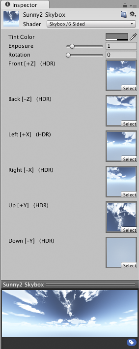
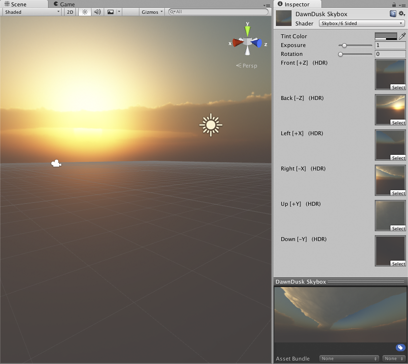

天空盒 (Skybox)
======

__天空盒__是整个场景的封装器，可显示几何体之外的世界。

 

属性
----------

|**_属性：_** |**_功能：_** |
|:---|:---|
|__Tint Color__ |着色颜色|
|__Exposure__ |调整天空盒的亮度。|
|__Rotation__ |更改天空盒围绕正 y 轴的旋转。|
|__Front 等__ |用于存储天空盒的立方体每个面的纹理。请注意，将这些纹理置于正确的字段中非常重要。|

详细信息
-------

天空盒围绕整个场景渲染，以给人一种远处地平线有复杂风景的印象。在内部，天空盒在所有不透明对象之后渲染；用于渲染天空盒的网格可以是具有六个纹理的盒体，也可以是曲面细分的球体。

要实现天空盒，必须创建天空盒材质。然后，使用 Window > Lighting 菜单项，并在 Scene 选项卡上将您的天空盒材质指定为 Skybox，即可将天空盒添加到场景中。

如果要覆盖默认的天空盒，将天空盒__组件__添加到摄像机非常有用。例如，如果您有一款分屏游戏使用两个摄像机，您可能希望第二个摄像机使用不同的天空盒。要将 Skybox 组件添加到摄像机，请通过单击突出显示该摄像机，然后选择 __Component &gt; Rendering &gt; Skybox__。

如果要创建新的天空盒，请[参考此指南](HOWTO-UseSkybox.html)。

 

提示
-----

* 如果将一个天空盒分配给摄像机，请确保将该摄像机的 __Clear mode__ 设置为 Skybox。
* 将雾效颜色与天空盒的颜色相匹配是一种不错的做法。可在 Lighting 窗口中设置雾效颜色。
