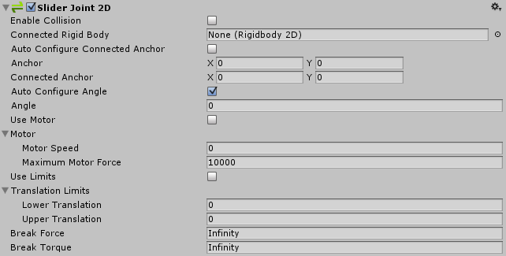

2D 滑动关节 (Slider Joint 2D)
================

此关节允许由刚体物理组件控制的游戏对象沿着空间中的一条线滑动（例如滑门）。对象可以沿着线自由移动以响应碰撞或作用力，或者对象也可以通过电动力移动，并施加限制以使其位置保持在线的某个部分之内。

 

|**_属性：_** |**_功能：_** |
|:---|:---|
|__Enable Collision__ |连接的两个对象能否相互碰撞？选中此复选框表示“能”。|
|__Connected Rigid Body__ |在此处指定该关节连接到的另一个对象。如果将此属性保留为 __None__，此关节的另一端将固定到空间中由 __Connected Anchor__ 设置所定义的点。选择字段右侧的圆圈可查看要连接到的对象的列表。|
|__Auto Configure Connected Anchor__ | 选中此框可为该关节连接到的另一个对象自动设置锚点位置。（选中此框将无需填写 __Connected Anchor__ 字段。） |    

|__Anchor__ |The place (in terms of X, Y co-ordinates on the __RigidBody__) where the end point of the joint connects to *this* object. |
|__Connected Anchor__ |The place (in terms of X, Y co-ordinates on the __RigidBody__) where the end point of the joint connects to *the other* object. |
|__Auto Configure Angle__ | Check this box to automtically detect the angle between the two objects and set it as the angle that the joint keeps between the two objects. (By selecting this, you don't need to manually specify the angle.) |
|__Angle__ |Enter the the angle that the joint keeps between the two objects. |
|__Use Motor__ |Use the sliding motor? Check the box for yes.|

|__Motor__ |  |
|__Motor Speed__ |Target motor speed (m/sec). |
|__Maximum Motor Force__ |The maximum force the motor can apply while attempting to reach the target speed. |
|__Use Limits__ |Should there be limits to the linear (straight line) force? Check the box for yes. |
|__Translation Limits__ |  |
|__Lower Translation__ |The minimum distance the  object can be from the connected anchor point. |
|__Upper Translation__ |The maximum distance the  object can be from the connected anchor point. |
|__Break Force__ |Specify the linear (straight line) force level needed to break and so delete the joint. __Infinity__ means it is unbreakable. |
|__Break Torque__ |Specify the torque (rotation) level needed to break and so delete the joint. __Infinity__ means it is unbreakable. |

详细信息
-------
（另请参阅 [2D 关节](Joints2D.html)中的*详情和提示*以了解所有 2D 关节的有用背景信息。）

使用此关节使对象滑动！此关节的目的是在可延伸到无穷远的一条可配置线上保持两点的位置。这两个点可以是两个 __2D 刚体__组件，或一个 __2D 刚体__组件和世界中的一个固定位置。（将 __Connected Rigidbody__ 设置为 None，即可连接到世界中的固定位置）。

此关节对两个连接刚体对象施加线性力，使这些对象保持在这条线上。此关节还有一个模拟的线性电机可施加线性力，从而沿着这条线移动刚体对象。电机可以关闭或开启。虽然这条线无限长，但可以使用 __Translation Limits__ 选项来仅指定要使用的一段线。

此关节同时有三个约束。所有约束均为可选约束：

* 与两个刚体对象上两个锚点之间的一条指定线保持相对线性距离。
* 沿着指定线在两个刚体对象上的两个锚点之间保持线速度。（速度受限于最大力。）
* 沿着指定线在两个点之间保持线性距离。

**例如：**

使用此关节构建的物理对象就好像是这些对象在一条线上连接在一起一样。例如：

* 一个可以上下移动的平台。有物体落在平台上时，平台会向下移动，但是绝不能侧向移动。可使用此关节来确保平台的向上或向下移动绝不会超出特定限值。使用电机可将平台上移。

