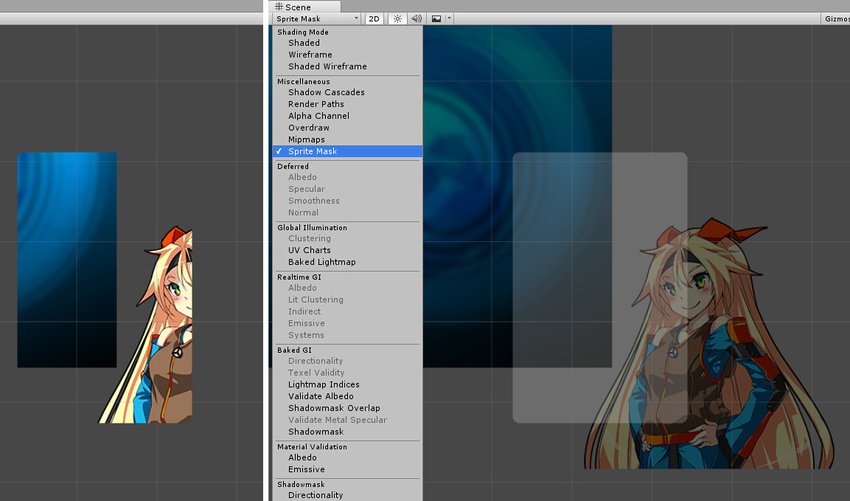
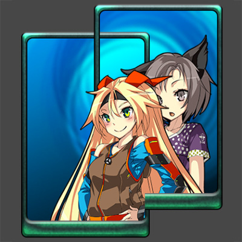
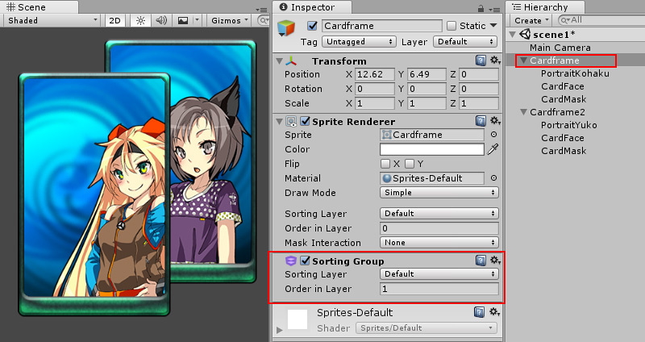
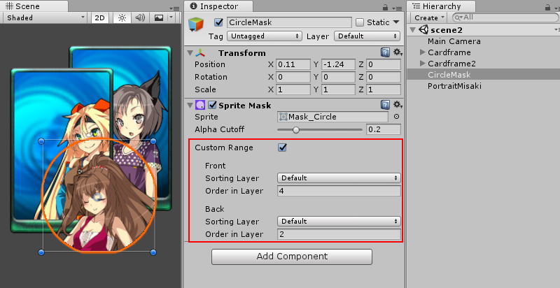
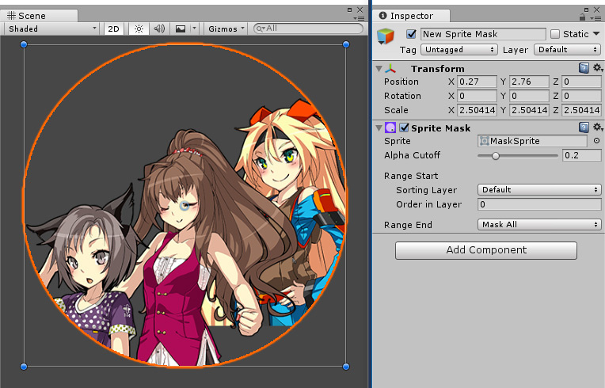

# 精灵遮罩

精灵遮罩用于隐藏或显示精灵或精灵组的各个部分。精灵遮罩仅影响使用精灵渲染器 (Sprite Renderer) 组件的对象。

### 创建精灵遮罩

要创建精灵遮罩，请从主菜单选择：GameObject > 2D Object > Sprite Mask。

### 属性

 

| 属性| 功能 |
|:---|:---| 
| Sprite| 要用作遮罩的精灵。|
| Alpha Cutoff| 如果 Alpha 包含透明区域和不透明区域之间的混合，则可以手动确定所显示区域的分界点。通过调整 Alpha Cutoff 滑动条即可更改此分界点。|
| __Range Start__ | Range Start 是遮罩开始遮蔽时所在的排序图层 (Sorting Layer)。|
| Sorting Layer| 遮罩的排序图层。|
| Order in Layer| 排序图层中的顺序。|
| __Range End__ |  |
| Mask All| 默认情况下，此遮罩将影响其后（更低排序顺序）的所有排序图层。|
| Custom| Range End 可以设置为自定义 Sorting Layer 和 Order in Layer。|

### 使用精灵遮罩

精灵遮罩游戏对象本身将在场景中不可见，只有与精灵产生的交互才可见。要查看场景中的精灵遮罩，请选择 Scene 菜单中的 Sprite Mask 选项。

精灵遮罩始终有效。受精灵遮罩影响的精灵需要在 Sprite Renderer 中设置 Mask Interaction。

默认情况下，精灵遮罩会影响场景中将 Mask Interaction 设置为 Visible 或 Not Visible Under Mask 的所有精灵。我们通常希望遮罩仅影响特定精灵或一组精灵。

确保遮罩与特定精灵交互的一种方法是使用排序组 (Sorting Group) 组件。

控制遮罩效果的另一种方法是使用精灵遮罩的自定义范围 (Custom Range) 设置。

Range Start 和 Range End 可以基于精灵的 Sorting Layer 或 Order in Layer 来选择性遮蔽精灵。

 

   

----

* 2017-05-26 Page published with no [editorial review](DocumentationEditorialReview.html)

 
* Unity [2017.1](../Manual/30_search.html?q=newin20171) 中的新功能 NewIn20171

