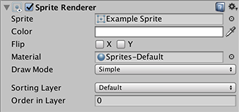

精灵渲染器 (Sprite Renderer)
---------------

__精灵渲染器 (Sprite Renderer)__ 组件允许您将图像显示为__精灵__，以便在 2D 和 3D 场景中均可使用。

可通过 Components 菜单 (__Component > Rendering > Sprite Renderer__) 将精灵渲染器添加到游戏对象，或者也可直接创建已附加精灵渲染器的游戏对象（菜单：__GameObject &gt; 2D Object &gt; Sprite__）。

 

|**_属性：_** |**_功能：_** |
|:---|:---|
|__Sprite__ |要渲染的精灵对象。可使用[纹理导入器 (Texture Importer)](class-TextureImporter.html) 上的 Sprite 设置从纹理生成精灵对象。 |
|__Color__ |渲染的网格的顶点颜色。 |
|__Flip__ |在 X 或 Y 平面中翻转精灵。 |
|__Material__ |用于渲染精灵的材质。 |
| __Draw Mode__ | 从 Draw Mode 下拉框中选择一个选项，用于定义在更改精灵尺寸时如何缩放精灵。  |
|&nbsp;&nbsp;&nbsp;&nbsp;Simple| 这是默认的精灵渲染器行为。当图像尺寸发生变化时，图像朝所有方向缩放。 |
|&nbsp;&nbsp;&nbsp;&nbsp;Sliced| 如果您打算对图像应用 9 切片，并希望这些部分拉伸，请使用 Sliced 选项。在 Sliced 模式下，角点的大小保持不变，精灵的顶部和底部水平拉伸，精灵的两侧垂直拉伸，精灵的中心水平和垂直拉伸，从而适应精灵的大小。请参阅有关 [9 切片精灵](9SliceSprites.html)的文档以了解更多信息。 |
|&nbsp;&nbsp;&nbsp;&nbsp;Size| 使用此选项可更改精灵的水平和垂直大小。如果您想让 9 切片有效，则必须使用此选项来更改精灵的大小；默认的变换组件仅应用默认比例。  |
|&nbsp;&nbsp;&nbsp;&nbsp;Tiled| 如果您打算对图像应用 9 切片，并希望这些部分重复，请使用 Tiled 选项。在 Tiled 模式下，精灵保持相同的大小，不会缩放。取而代之的行为是，精灵的顶部和底部水平重复，精灵的两侧垂直重复，精灵的中心以平铺形式重复，从而适应精灵的大小。请参阅有关 [9 切片精灵](9SliceSprites.html)的文档以了解更多信息。 |
|&nbsp;&nbsp;&nbsp;&nbsp;&nbsp;&nbsp;&nbsp;&nbsp;Size| 使用此选项可更改精灵的水平和垂直大小。如果您想让 9 切片有效，则必须使用此选项来更改精灵的大小；默认的变换组件仅应用默认比例。  |
|&nbsp;&nbsp;&nbsp;&nbsp;Tile Mode| 当 Draw Mode 设置为 Tiled 时，使用 Tile Mode 属性可控制当精灵的尺寸发生变化时各部分的重复方式。 |
|&nbsp;&nbsp;&nbsp;&nbsp;&nbsp;&nbsp;&nbsp;&nbsp;Continuous| 默认情况下，Tile Mode 设置为 Continuous。当精灵的大小改变时，重复部分在精灵中均匀重复。 |
|&nbsp;&nbsp;&nbsp;&nbsp;&nbsp;&nbsp;&nbsp;&nbsp;Adaptive| 当 Tile Mode 设置为 Adaptive 时，重复部分仅在精灵的尺寸达到 Stretch Value 时才进行重复。   |
|&nbsp;&nbsp;&nbsp;&nbsp;Stretch Value| 使用 Stretch Value 滑动条可设置介于 0 和 1 之间的值。请注意，1 表示图像调整为原始尺寸两倍，因此如果 Stretch Value 设置为 1，则当图像拉伸到原始尺寸的两倍时，该部分将会重复。 |
|__Sorting Layer__ |此[层](Layers.html)用于在渲染期间定义该精灵的覆盖优先级。 |
|__Order In Layer__ |该精灵在其层中的覆盖优先级。较小数字的精灵先渲染，后续数字的精灵覆盖先前数字的精灵。 |

##详细信息

在 3D 图形中，对象的外观将根据光照和查看位置而变化。相比之下，在 2D 图形中，图像仅显示在屏幕上，除了基本的位置、缩放和旋转之外没有任何变换。精灵的位置由 2D 坐标给出，因此在渲染时没有“深度”或与摄像机的距离之类的概念。

但是，通过某种方式确定不同精灵的覆盖优先级（即，当精灵交叉重叠时哪些精灵会遮挡其他精灵）仍然非常重要。例如，在驾驶类游戏中，应当看到汽车越过路面上的扁平物。Unity 使用__排序图层__的概念，允许您将精灵划分为多个组来确定覆盖优先级。排序图层顺序较低的精灵将被排序图层顺序较高的精灵覆盖。

有时，同一排序图层中的两个或更多个对象也可重叠（例如，横向卷轴游戏中的两个玩家角色）。可使用 _Order In Layer_ 属性向同一层中的精灵应用一致的优先级。与排序图层一样，优先级规则是较小数字的精灵先渲染，并可由后续渲染的较大数字的精灵遮挡。请参阅[图层管理器页面](class-TagManager.html)以了解有关编辑排序图层的详细信息。如果不使用排序图层，则可使用基于深度的标准排序方式。

###渲染

精灵渲染器使用 _Sprite_ 属性中提供的纹理，但会使用着色器和 _Material_ 属性中的其他属性（这实际上是在幕后使用 [MaterialPropertyBlock](../ScriptReference/MaterialPropertyBlock.html) 完成的）。这意味着，可使用相同的材质来渲染不同的精灵，而无需担心在材质上指定了哪种纹理。

精灵在网格上渲染，该网格会使用每个顶点的位置、颜色和 UV，但没有法线矢量。如果材质需要法线矢量，可使用顶点着色器计算它们（请参阅[表面着色器示例](SL-SurfaceShaderExamples.html)页面以了解更多详细信息）。

用于精灵的默认着色器为：

* **Sprites/Default** - 一个简单的 Alpha 混合着色器，它不与场景中的光源相互作用。

* **Sprites/Diffuse** - 一个简单的 Alpha 混合表面着色器，它_会_与光源相互作用。这会生成一个面向正面的法线矢量 (0,0,-1)。

###翻转

虽然可以通过设置负的 ``transform.scale`` 来翻转精灵，但这样做也会产生副作用，即也会翻转游戏对象并翻转碰撞体，这可能对性能有很大影响，或者并不是所需要的效果。

精灵渲染器翻转功能提供了一个不会影响任何其他组件或游戏对象的轻量级替代方案。它只是在 x 或 y 轴上翻转渲染的精灵而不会翻转任何其他对象。
