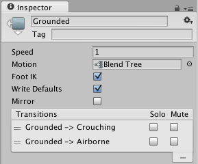

动画状态
================

__动画状态__是__动画状态机__的基本组成模块。每个状态包含一个单独动画序列（或[混合树](class-BlendTree.html)）；此序列将在角色处于该状态时播放。游戏中的事件触发状态转换时，角色将处于新状态，随后会替换其动画序列。

在 __Animator Controller__ 中选择某个状态时，Inspector 中将显示该状态的属性：

 

|**_属性：_** |**_功能：_** |
|:---|:---|
|__Speed__ |动画的默认速度|
|__Motion__ |分配给此状态的动画剪辑|
|__Foot IK__ |此状态下是否遵循 Foot IK。适用于人形动画。 |
|__Write Defaults__ |AnimatorStates 是否为其运动执行未动画化的属性写回默认值。 |
|__Mirror__ |是否为状态生成镜像。这仅适用于人形动画。 |
|__Transitions__|源自此状态的过渡的列表|

以棕色显示的默认状态是状态机首次激活时所处的状态。必要时，可通过右键单击另一状态并从上下文菜单选择 __Set As Default__ 来更改默认状态。每个过渡上的 _Solo_ 和 _Mute_ 复选框用于控制__动画预览__的行为，请参阅[本页面](AnimationSoloMute.html)以了解更多详细信息。

可通过右键单击 __Animator Controller 窗口__中的空白区域并从上下文菜单选择 __Create State &gt; Empty__ 来添加新状态。或者，也可将动画拖到 Animator Controller 窗口中，从而创建包含该动画的状态。（请注意，只能将 Mecanim 动画拖到控制器中，非 Mecanim 动画将被拒绝。）状态还可包含[混合树](class-BlendTree.html)。

###任意状态
__任意状态 (Any State)__ 是一个始终存在的特殊状态。此状态适用于您想要进入特定状态的情况（无论您当前处于哪个状态）。这是向状态机中的所有状态添加相同外向过渡的简便方法。请注意，__任意状态__的特殊含义意味着它不能成为过渡的端点（即，不能通过跳到“任意状态”选择下一步要进入的随机状态）。

 
