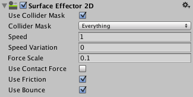

2D 表面效应器 (Surface Effector 2D)
=========

2D 表面效应器沿效应器使用的碰撞体表面施加切力，从而尝试匹配沿表面的指定速度。功能类似于传送带。

用于效应器的碰撞体通常会设置为非触发器，因此其他碰撞体可与表面接触。

属性
----------

|**_属性：_** |**_功能：_** |
|:---|:---|
|__Use Collider Mask__ |是否应该使用“Collider Mask”属性？如果不应该，则所有碰撞体都默认采用全局碰撞矩阵。|
|__Collider Mask__ |此遮罩用于选择允许与效应器进行交互的特定层。 |
|__Speed__ |沿表面保持的速度。 |
|__Speed Variation__ |速度的随机增加值（0 与 Speed Variation 值之间的任何数值）将应用于速度。如果在此处输入负数，则会随机_减速_。|
|__Force Scale__ |允许缩放效应器尝试沿表面达到指定速度时施加的力。如果为 0，表示不施力，相当于禁用。如果为 1，表示施加全力。此属性相当于为满足指定速度而修改目标对象的速度，值越低就越慢，值越高越快。但是应慎重，因为施加全力会很容易抵消施加在目标对象上的任何其他力，例如跳跃或其他移动作用力。因此，建议设置小于 1 的值。 |
|__Use Contact Force__ |是否应在表面和目标碰撞体之间的触点施力？使用触点作用力可以使目标对象旋转，而不使用触点作用力则不会这样。 |
|__Use Friction__ |接触表面时是否应使用摩擦？ |
|__Use Bounce__ |接触表面时是否应使用弹性？ |
