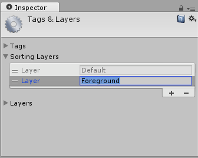
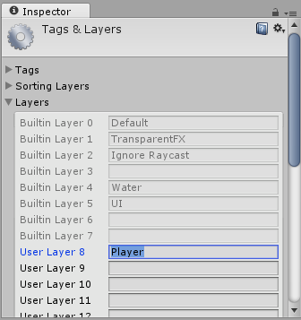

# Tags and Layers

__Tags and Layers Manager__ 可用于设置 __Tags__、__Sorting Layers__ 和 __Layers__。要查看 Tags and Layers Manager，请选择 __Edit__ > __Project Settings__ > __Tags and Layers__。

##详细信息

__Tags__：这些是标记值，可用于标识项目中的对象（有关更多详细信息，请参阅[标签](Tags.html)文档）。要添加新标签，请单击列表右下角的加号按钮 (+)，然后命名新标签。

请注意，一旦命名了标签，就无法重命名。要删除标签，请单击标签，然后单击列表右下角的减号 (-) 按钮。

__Sorting Layers__：与 2D 系统中的[精灵](Sprites.html)图形结合使用，“sorting”（排序）是指不同精灵的覆盖顺序。

要添加和删除排序图层 (Sorting Layers)，请使用列表右下角的加号和减号 (+/-) 按钮。要更改其顺序，请拖动每个图层项左侧的控制柄。

__Layers__：在整个 Unity Editor 中使用这些图层可以创建具有共同特定特征的对象组（有关更多详细信息，请参阅[图层](Layers.html)文档）。用户图层主要用于限制射线投射或渲染等操作，以便它们仅应用于相关的对象组。在 Tags and Layers Manager 中，前八个__内置图层 (Builtin Layers)__ 是 Unity 使用的默认图层，因此无法编辑它们。但是，可以在 8 到 31 中自定义__用户图层 (User Layers)__。

要自定义 8 到 31 的__用户图层__，请在要使用的每个图层的文本字段中输入自定义名称。请注意，无法增加图层数量，但与标签不同，可以重命名图层。
