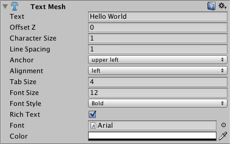

文本网格
=========

__文本网格 (Text Mesh)__ 可生成显示文本字符串的 3D 几何体。

 

可通过 __Component &gt; Mesh &gt; Text Mesh__ 创建新的文本网格。

属性
----------

|**_属性：_** |**_功能：_** |
|:---|:---|
|__Text__ |要渲染的文本 |
|__Offset Z__ |文本在绘制时应从 transform.position.z 偏移多远 |
|__Character Size__ |每个字符的大小（此设置会缩放整个文本。） |
|__Line Spacing__ |文本的行间距。 |
|__Anchor__ |文本的哪个点共享变换位置。 |
|__Alignment__ |如何对齐文本行（选项包括 Left、Right、Center）。 |
|__Tab Size__ |为制表符“&amp;#92;t”字符插入的空格数。这是“空格键”字符偏移的倍数。 |
|__Font Size__ |字体的大小。此设置可覆盖动态字体的大小。|
|__Font Style__ |字体的渲染样式。字体需要标记为动态。|
|__Rich Text__ |选择此项后将在渲染文本时启用标签处理。|
|__Font__ |渲染文本时使用的 [TrueType 字体](class-Font.html)。 |
|__Color__ |渲染文本时使用的全局颜色。 |

详细信息
-------

文本网格可用于渲染道路标志、涂鸦等。文本网格将文本放置在 3D 场景中。要为 GUI 制作通用的 2D 文本，请改用 [GUI 文本 (GUI Text)](class-GUIText.html) 组件。

请按照以下步骤使用自定义字体创建文本网格：

1.将 TrueType 字体（**.ttf** 文件）从资源管理器 (Windows) 或 Finder (OS X) 拖入 __Project 视图__中，从而导入该字体。
1.在 Project 视图中选择导入的字体。
1.选择 __GameObject &gt; Create Other &gt; 3D Text__。
您现在已经使用自定义的 TrueType 字体创建了文本网格。接下来可使用 __Scene 视图__的__变换__控件来缩放和移动该文本。

**注意：**如果要更改文本网格的字体，需要设置该组件的字体属性，并将字体材质的纹理设置为正确的字体纹理。为此，可使用字体资源的折叠三角形来定位此纹理。如果忘记设置纹理，网格中的文本将显示为块状且未对齐。

提示
-----

* 可从 [1001freefonts.com](http://www.1001freefonts.com/fonts/afonts.htm) 下载免费的 TrueType 字体（可下载 Windows 字体，因为其中包含 TrueType 字体）。
* 如果要编写 __Text__ 属性的脚本，可通过在字符串中插入转义字符“&amp;#92;n”添加换行。
* 文本网格可使用简单的标记进行样式设置。请参阅[带样式的文本](StyledText.html)页面以了解更多详细信息。
* Unity 中的字体在渲染时首先将字体字形渲染到纹理贴图中。如果字体大小设置得太小，这些字体纹理将显示为块状。由于文本网格资源是使用四边形渲染的，因此如果文本网格和字体纹理的大小不同，则文本网格可能看起来是错误的。
