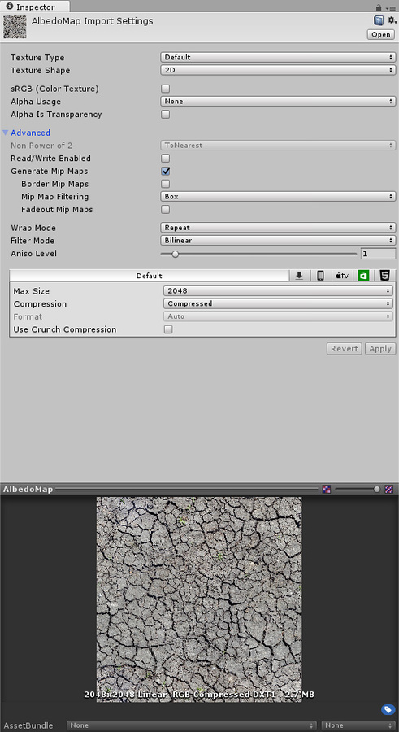

# 纹理

纹理是覆盖或包裹游戏对象以赋予它们视觉效果的图像或电影文件。本页面将详细介绍用于管理纹理的属性。

Unity 会将 3D 项目的 _Assets_ 文件夹中的所有图像或电影文件识别为纹理（在 2D 项目中保存为精灵）。只要图像满足下面指定的大小要求，就会将其导入并进行优化以用于游戏（但用于游戏对象的着色器会有特定的纹理要求）。此范围包括多层 Photoshop 或 TIFF 文件，这些文件在导入时会自动展平，这样就不会在游戏中造成大小损失。这种展平操作发生在 Unity 内部，而不是 PSD 文件本身内部，并且是可选操作，因此您可以继续保存和导入图层不变的 PSD 文件。

## 属性

Inspector 窗口分为两部分：上面的__纹理导入器 (Texture Importer)__ 和下面的__预览 (Preview)__。

## 纹理导入器

纹理导入器定义如何将图像从项目的 _Assets_ 文件夹导入 Unity Editor。要访问纹理导入器，请在 Project 窗口中选择图像文件。纹理导入器将在 Inspector 窗口中打开。

请注意，默认情况下会隐藏一些不太常用的属性。在 Inspector 窗口中单击 __Advanced__ 即可查看这些属性。

纹理导入器中的第一个属性是 __Texture Type__。使用此属性可选择要从源图像文件创建的纹理类型。请参阅有关[纹理类型](TextureTypes.html)的文档以了解每种类型的更多相关信息。

| **属性：** | **功能：** |
|:---|:---| 
| __Texture Type__| 使用此属性可定义纹理的用途。纹理导入器中的其他属性将根据此处的选择而变化。 |
|&nbsp;&nbsp;&nbsp;&nbsp;Default | 这是用于所有纹理的最常用设置。此选项可用于访问大多数纹理导入属性。 |
|&nbsp;&nbsp;&nbsp;&nbsp;Normal Map | 选择此选项可将颜色通道转换为适合实时法线贴图的格式。请参阅[导入纹理](ImportingTextures.html)以了解有关法线贴图的更多信息。
|&nbsp;&nbsp;&nbsp;&nbsp;Editor GUI | 如果要在任何 HUD 或 GUI 控件上使用纹理，请选择此选项。 |
|&nbsp;&nbsp;&nbsp;&nbsp;Sprite (2D and UI) | 如果要在 2D 游戏中使用该纹理作为[精灵](Sprites.html)，请选择此选项。 
|&nbsp;&nbsp;&nbsp;&nbsp;Cursor | 如果要将纹理用作自定义游标，请选择此选项。 |
|&nbsp;&nbsp;&nbsp;&nbsp;Cookie | 选择此选项可通过基本参数来设置纹理，从而将其用于场景[光源](class-Light.html)的[剪影](Cookies.html)。 |
|&nbsp;&nbsp;&nbsp;&nbsp;Lightmap | Select this if you are using the Texture as a [Lightmap](class-LightmapParameters.html). This option enables encoding into a specific format (RGBM or dLDR, depending on the platform) and a post-processing step on Texture data (a push-pull dilation pass).  |
|&nbsp;&nbsp;&nbsp;&nbsp;Single Channel | 如果在纹理中只需要一个通道，请选择此选项。 |

纹理导入器中的第二个属性是 __Texture Shape__。使用此属性可选择和定义纹理的形状和结构。

| **属性：** | **功能：** |
|:---|:---|:---| 
| __Texture Shape__  | 使用此属性可定义纹理的形状。默认情况下，该值设置为 2D。|
|&nbsp;&nbsp;&nbsp;&nbsp;2D | 这是用于所有纹理的最常用设置；它将图像文件定义为 2D 纹理。这些设置用于将纹理映射到 3D 网格和 GUI 元素以及其他项目元素。 |
|&nbsp;&nbsp;&nbsp;&nbsp;Cube | 此选项将纹理定义为立方体贴图。例如，可将其用于天空盒或反射探针。选择 __Cube__ 会显示不同的贴图选项。 |
| __Mapping__ | 仅当 __Texture Shape__ 设置为 __Cube__ 时，此设置才可用。使用 __Mapping__ 可指定如何将纹理投影到游戏对象上。默认情况下，此设置为 __Auto__。|
|&nbsp;&nbsp;&nbsp;&nbsp;Auto | Unity 尝试从纹理信息自动计算布局。 |
|&nbsp;&nbsp;&nbsp;&nbsp;6 Frames Layout (Cubic Environment) | 纹理包含按以下标准立方体贴图布局之一排列的六个图像：交叉或序列 (+x -x +y -y +z -z)。图像可以水平或垂直定向。 |
|&nbsp;&nbsp;&nbsp;&nbsp;Latitude Longitude (Cylindrical) | 将纹理映射到 2D 纬度/经度表示形式。 |
|&nbsp;&nbsp;&nbsp;&nbsp;Mirrored Ball (Sphere Mapped) | 将纹理映射到类似球体的立方体贴图。 |
| __Convolution Type__ | 选择要用于此纹理的预卷积（即过滤）类型。预卷积的结果将存储在 Mip 中。默认情况下，此设置为 __None__。 |
|&nbsp;&nbsp;&nbsp;&nbsp;None | 纹理没有预卷积（无过滤）。 |
|&nbsp;&nbsp;&nbsp;&nbsp;Specular (Glossy Reflection) | 选择此选项可将立方体贴图用作反射探针。纹理 Mipmap 使用引擎 BRDF 进行预卷积（过滤）。（请参阅 Wikipedia 的[双向反射分布函数 (Bidirectional reflectance distribution function)](https://en.wikipedia.org/wiki/Bidirectional_reflectance_distribution_function) 页面以了解更多信息。） |
|&nbsp;&nbsp;&nbsp;&nbsp;Diffuse (Irradiance) | 对纹理进行卷积（过滤）以表示辐照度。如果将立方体贴图用作光照探针，则此选项非常有用。 |
| __Fixup Edge Seams__  | 仅在选择 __None__ 或 __Diffuse__ 卷积（过滤）的情况下，此选项才可用。在低端平台上使用此选项作为解决过滤限制（例如在面之间错误过滤的立方体贴图）的解决方法。 |

## 特定于平台的覆盖 (Platform-specific overrides)

纹理检视面板窗口有一个__特定于平台的覆盖 (Platform-specific overrides)__ 面板。

在为不同平台进行构建时，您需要考虑每个目标平台的分辨率、文件大小与相关内存大小要求、像素尺寸和纹理质量。可使用__特定于平台的覆盖 (Platform-specific overrides)__ 面板设置默认选项（使用 __Default__），然后使用面板顶部的按钮针对特定平台覆盖这些选项的设置。

| **属性：** | **功能：** |
|:---|:---| 
| __Max Size__ | 导入的纹理的最大尺寸（以像素为单位）。美术师通常喜欢使用尺寸较大的纹理；使用 __Max Size__ 可将纹理缩小到合适的尺寸大小。 |
| __Compression__ | 选择纹理的压缩类型。此参数有助于系统为纹理选择正确的压缩格式。根据平台和压缩格式的可用性，不同的设置最终可能采用相同的内部格式（例如，__Low Quality Compression__ 对移动平台有影响，但对桌面平台无影响）。 |
|&nbsp;&nbsp;&nbsp;&nbsp;None | 不压缩纹理。 |
|&nbsp;&nbsp;&nbsp;&nbsp;Low Quality | 以低质量格式压缩纹理。与 __Normal Quality__ 相比，这会降低内存使用量。|
|&nbsp;&nbsp;&nbsp;&nbsp;Normal Quality | 以标准格式压缩纹理。 |
|&nbsp;&nbsp;&nbsp;&nbsp;High Quality | 以高质量格式压缩纹理。与 __Normal Quality__ 相比，这会提高内存使用量。 |
| __Format__ | 这会绕过自动系统来指定用于纹理的内部表示。可用格式的列表取决于平台和纹理类型。请参阅[特定于平台的覆盖的纹理格式](class-TextureImporterOverride.html)相关文档以了解更多信息。 **注意：**即使未覆盖平台，此选项也会显示自动系统选择的格式。Format 属性仅在覆盖特定平台时可用，而不是作为默认设置。 |
| __Use crunch compression__ | 如果适用，使用 Crunch 压缩。Crunch 是一种基于 DXT 或 ETC 纹理压缩的有损压缩格式。在运行时，纹理在 CPU 上解压缩为 DXT 或 ETC，然后上传到 GPU 上。Crunch 压缩有助于纹理在磁盘上使用尽可能少的空间并方便下载。Crunch 纹理可能需要很长时间进行压缩，但在运行时的解压缩速度非常快。|
| __Compressor Quality__ | 使用 Crunch 纹理压缩时，可使用滑动条调整质量。压缩质量越高意味着纹理越大，压缩时间越长。 

---

*  2017-09-18  Page amended with limited [editorial review](DocumentationEditorialReview.html)

* 在 [2017.3](https://docs.unity3d.com/2017.3/Documentation/Manual/30_search.html?q=newin20173) 版中更新了 Crunch 压缩格式 NewIn20173

