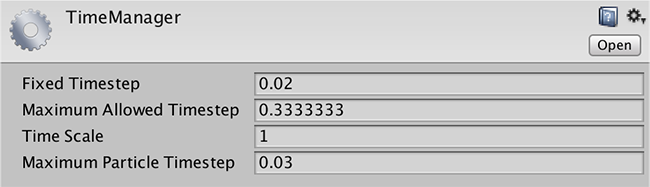

#Time Manager

__Time Manager__（菜单：__Edit &gt; Project Settings &gt; Time__）可用于设置多个属性以控制游戏中的时序。

 

##属性

|**_属性：_** |**_功能：_** |
|:---|:---|
|__Fixed Timestep__ |独立于帧率的时间间隔，确定了执行物理计算和 __FixedUpdate()__ 事件的时间间隔。 |
|__Maximum Allowed Timestep__ |帧率较低时允许最坏情形的时间间隔（独立于帧率）。执行物理计算和 __FixedUpdate()__ 事件的时间长度将不会超过指定值。 |
|__Time Scale__ |时间进展的速度。更改此值可模拟子弹时间效果。值 1 意味着实时。值 0.5 意味着半速；值 2 表示速度翻倍。 |
|__Maximum Particle Timestep__ | 独立于帧率的时间间隔，用于控制粒子模拟的精度。当帧时间超过此值时，将在一帧中执行粒子更新的多次迭代，使每个步骤的持续时间不超过此值。例如，以 30fps（0.03 秒/帧）运行的游戏能够以 60fps（步长 0.0167 秒）运行粒子更新，从而实现更准确的模拟，但代价是性能降低。 |

##详细信息

Time Manager 用于设置全局属性，但在游戏过程中通过脚本设置这些属性通常很有用（例如，将 _Time Scale_ 设置为零是暂停游戏的有效方法）。有关如何在 Unity 中管理时间的完整详细信息，请参阅[时间和帧率管理](TimeFrameManagement.html)页面。

---

 2017-05-18  Page published with limited [editorial review](DocumentationEditorialReview.html)

在 [2017.1](https://docs.unity3d.com/2017.1/Documentation/Manual/30_search.html?q=newin20171) 版中添加了 __Maximum Particle Timestep__ NewIn20171
