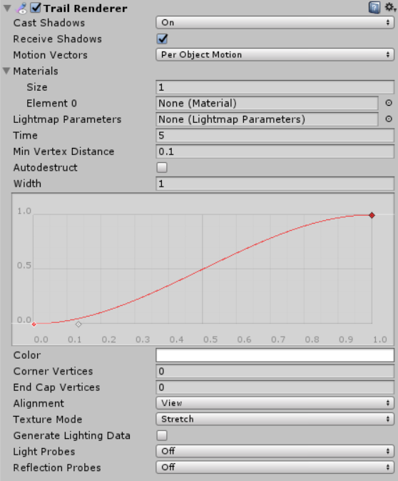
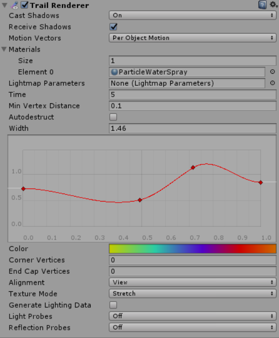
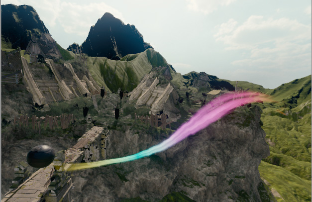

#轨迹渲染器 (Trail Renderer)

__轨迹渲染器__用于在场景中移动的游戏对象后面生成轨迹。

 

##属性

|**_属性：_** |**_功能：_** |
|:---|:---|
|__Cast Shadows__ |确定轨迹是否投射阴影，是应从轨迹的一侧还是两侧投射阴影，或轨迹是否应仅投射阴影而不以其他方式进行绘制。请参阅脚本 API 参考文档中的 [Renderer.shadowCastingMode](../ScriptReference/Renderer-shadowCastingMode.html) 以了解更多信息。 |
|__Receive Shadows__ |如果启用此属性，轨迹将接受阴影。 |
|__Motion Vectors__ |选择要用于此轨迹渲染器的运动矢量 (Motion Vector) 类型。请参阅脚本 API 参考文档中的 [Renderer.motionVectorGenerationMode](../ScriptReference/Renderer-motionVectorGenerationMode.html) 以了解更多信息。 |
|__Materials__ |这些属性描述了用于渲染轨迹的材质数组。粒子着色器最适合轨迹。|
|__Lightmap Parameters__ |Reference a [Lightmap Parameters](class-LightmapParameters.html) Asset here to enable the trail to interact with the global illumination system.|
|__Time__ |定义轨迹的长度（以秒为单位）。 |
|__Min Vertex Distance__ |轨迹锚点之间的最小距离（请参阅下面的**最小顶点分隔距离**）。 |
|__AutoDestruct__ |启用此属性可在游戏对象空闲 __Time__ 指定的秒数后销毁该游戏对象。 |
|__Width__ |定义宽度值和曲线以控制轨迹在其开始和结束之间的各个点处的宽度。该曲线从轨迹的开头到结尾应用，并在每个顶点处采样。曲线的总宽度由宽度值控制。 |
|__Color__ |定义一个渐变来控制轨迹沿其长度的颜色。 |
|__Corner Vertices__ |此属性指示在绘制轨迹中的角时使用多少个额外顶点。增加此值可使轨迹的角显得更圆。 |
|__End Cap Vertices__ |此属性指示使用多少个额外顶点在轨迹上创建端盖。增加此值可使轨迹的端盖显得更圆。 |
|__Alignment__ |设置为 __View__ 可使轨迹面向摄像机，或设置为 __Local__ 根据轨迹的变换组件的方向对齐。 |
|__Texture Mode__ |控制如何将纹理应用于轨迹。使用 __Stretch__ 可沿着轨迹的整个长度应用纹理贴图，或使用 __Wrap__ 使纹理沿着轨迹的长度重复。应使用材质 (Material) 中的 __Tiling__ 参数来控制重复率。 |
| __Generate Lighting Data__| 如果启用此属性（选中复选框），则在构建轨迹几何体时包含法线和切线。这样允许它使用具有场景光照的材质，例如通过标准着色器，或通过使用自定义着色器。 |
|__Light Probes__ |基于探针的光照插值模式。|
|__Reflection Probes__ |如果启用此属性，并且场景中存在反射探针，则会为此轨迹渲染器拾取反射纹理，并将此纹理设置为内置的着色器 uniform 变量。|

##详细信息

轨迹渲染器在移动的游戏对象后面渲染一条多边形轨迹。此组件可用于强调移动对象的运动感，或突出移动对象的路径或位置。飞弹背后的轨迹为飞弹的飞行轨道增添了视觉清晰度；来自飞机机翼尖端的凝结尾迹是现实生活中出现的轨迹效果的一个例子。

轨迹渲染器应该是附加的游戏对象上使用的唯一渲染器。最好创建一个空游戏对象，然后将轨迹渲染器作为唯一的渲染器附加到该游戏对象。然后，即可将该轨迹渲染器设置为您希望它跟踪的任何游戏对象的子级。

###材质

轨迹渲染器组件应使用具有粒子着色器的材质。用于材质的纹理应为方形尺寸（例如 256x256 或 512x512）。对于数组中的每种材质，该轨迹将被绘制一次。

###最小顶点分隔距离

__Min Vertex Distance__ 值决定了包含轨迹的对象在该轨迹的一段达到稳固之前必须行进多远。像 0.1 这样较小的值会更频繁地创建轨迹段，从而形成更平滑的轨迹。像 1.5 这样较大的值会创建在外观上更有锯齿状的轨迹段。使用较小值/更平滑的轨迹时会有轻微的性能折衷，因此请尝试使用尽可能大的值来实现您尝试创建的效果。另外，当顶点非常靠近并且轨迹会在短距离内显著改变方向时，较宽的轨迹可能出现视觉瑕疵。

###提示

* 将粒子材质与轨迹渲染器结合使用。
* 轨迹渲染器必须布置在一系列帧上；它们不能立即出现。
* 类似于其他粒子系统，轨迹渲染器会通过旋转来面向摄像机。
* Unity 在每个顶点处从颜色渐变 (Color Gradient) 中采样颜色。在每个顶点之间，Unity 对颜色应用线性插值。向线渲染器添加更多顶点可能会更接近详细的颜色渐变。

##轨迹渲染器示例设置

  

---------
*  2017-05-31  Page amended with [editorial review](DocumentationEditorialReview.html)

* 在 Unity [2017.1](../Manual/30_search.html?q=newin20171) 中添加了属性 NewIn20171
