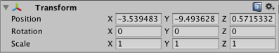

#变换组件 (Transform)

__Transform__ 组件确定每个对象在场景中的 __Position__、__Rotation__ 和 __Scale__ 属性的值。每个游戏对象都有一个变换组件。

 

##属性

|**_属性：_** |**_功能：_** |
|:---|:---|
|__Position__ |变换组件在 X、Y 和 Z 坐标的位置。 |
|__Rotation__ |变换组件围绕 X、Y 和 Z 轴的旋转（以度为测量单位）。 |
|__Scale__ |变换组件沿着 X、Y 和 Z 轴的缩放。值“1”表示原始大小（对象导入时的大小）。 |

变换组件的位置、旋转和缩放值是相对于变换组件的父项测量的。如果变换组件没有父项，则按照世界空间来测量属性。
