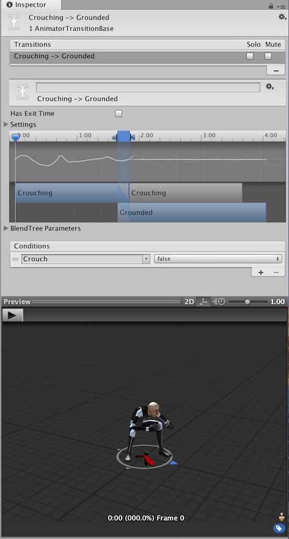

# 动画过渡

动画过渡允许[状态机](StateMachineBasics.html)从一个动画状态切换或混合到另一动画状态。过渡不仅定义状态之间的混合应该耗费多长时间，而且还定义它们应该在什么条件下激活。您可以设置仅在特定条件成立时才发生过渡。要设置这些条件，请在 Animator Controller 中指定参数值。

例如，您的角色可能具有“巡逻”状态和“睡眠”状态。您可以将巡逻和睡眠之间的过渡设置为仅在“alertness”参数值低于某个水平时才会发生。

要为过渡命名，请在字段中输入名称，如下所示：

 

状态的 Inspector 窗口会显示该状态使用的过渡，如下所示：

 

在任何给定时间只能有一个激活的过渡。但是，当前激活的过渡可能会被另一个过渡中断（如果已将设置配置为允许此行为，请参阅以下的[过渡中断](#TransitionInterruption)）。

### 过渡属性

要查看某个过渡的属性，请单击 Animator 窗口中连接两个状态的过渡线。这些属性将显示在 Inspector 窗口中。

 

使用以下属性可调整过渡及其在当前状态和下一状态之间如何混合。

| **属性**| **功能** |
|:---|:---| 
| __Has Exit Time__|  __Exit Time__ 是一种不依赖参数的特殊过渡。但是，它依赖状态的标准化时间。选中此选项可在 __Exit Time__ 指定的具体时间进行过渡。 |
| __Settings__| 包含详细过渡设置的折叠菜单（如下所示）。 |
| __Exit Time__| 如果选中 __Has Exit Time__，此值表示过渡可以生效的确切时间。该时间以标准化时间表示（例如，退出时间为 0.75 表示，在已播放 75% 动画的第一帧上，__Exit Time__ 条件为 true）。在下一帧上，该条件为 false。  对于循环动画，每个循环都会评估退出时间小于 1 的过渡，因此可使用此选项在每个循环的动画中以适当时机对过渡进行计时。  对 __Exit Time__ 大于 1 的过渡仅评估一次，因此此类过渡可用于在固定循环次数后的特定时间退出。例如，过渡的退出时间为 3.5 的情况下，在三个半循环后对该过渡评估一次。 |
| __Fixed Duration__| 如果选中 __Fixed Duration__ 复选框，则以秒为单位解读过渡时间。如果未选中 __Fixed Duration__ 复选框，则过渡时间解读为源状态的标准化时间的一部分。 |
| __Transition Duration__| 相对于当前状态持续时间的过渡持续时间，以标准化时间或秒为单位（具体取决于 __Fixed Duration__ 模式）。此时间在过渡图中显示为两个蓝色标记之间的部分。|
| __Transition Offset__| 过渡到的目标状态的起始播放的时间偏移。例如，值为 0.5 表示目标状态在其时间轴的 50% 处开始播放。 |
| __Interruption Source__| 此选项用于控制该过渡可能中断的情况（请参阅下文的[过渡中断](#TransitionInterruption)）。 |
| __Ordered Interruption__| 确定当前过渡是否可在不考虑顺序的情况下被其他过渡中断（请参阅下文的[过渡中断](#TransitionInterruption)）。|
| __Conditions__| 一个过渡可以具有单个条件、多个条件或根本没有条件。如果过渡没有条件，Unity Editor 只会考虑 __Exit Time__，并在达到退出时间时发生过渡。如果过渡有一个或多个条件，则必须满足所有条件才能触发过渡。  一个条件包含：  - 一个事件参数（在条件中考虑其值）。 - 条件谓词（需要时填写，例如，浮点数的“小于”或“大于”）。 - 一个参数值（需要时填写）。  如果为该过渡选择 __Has Exit Time__ 并有一个或多个条件，请注意 Unity Editor 在 __Exit Time__ 之后考虑条件是否为 true。这样可确保在动画的特定部分中进行过渡。 |

 

### 过渡中断

使用 __Interruption Source__ 和 __Ordered Interruption__ 属性可控制如何中断过渡。

在概念上，中断顺序就像这些过渡已排队，然后解析为一个有效过渡从第一个过渡插入到最后一个过渡。

#### Interruption Source 属性

[AnyState](class-State.html) 中的过渡始终首先添加在队列中，然后其他过渡根据 __Interruption Source__ 的值排队：

| **值**| **功能** |
|:---|:---| 
| __None__| 不再添加任何过渡。 |
| __Current State__| 将当前状态的过渡排队。 |
| __Next State__| 使下一状态的过渡进行排队。 |
| __Current State then Next State__| 将当前状态的过渡排序，然后将下一状态的过渡排序。 |
| __Next State then Current State__| 将下一状态的过渡排队，然后将当前状态的过渡排队。 |

**注意**：这意味着，即使在 __Interruption Source__ 设置为 __None__ 的情况下，过渡也可以被其中一个 [AnyState](class-State.html) 过渡中断。

#### Ordered Interruption 属性

__Ordered Interruption__ 属性将更改队列的解析方式。

根据该属性的值，对队列的解析将在以下列出的不同时间结束。

| **值**| **结束时间** |
|:---|:---| 
| __选中__| 已找到有效过渡或当前过渡。 |
| __取消选中__| 已找到有效过渡。 |

只有 [AnyState](class-State.html) 过渡才能被自身中断。

要了解有关过渡中断的更多信息，请参阅 Unity 博客文章[状态机过渡中断 (State Machine Transition Interruptions)](https://blogs.unity3d.com/2016/07/13/wait-ive-changed-my-mind-state-machine-transition-interruptions/)。

### 过渡图

要手动调整以上列出的设置，可直接在字段中输入数字或使用过渡图。在操作视图元素时，过渡图会修改上述值。

请根据以下说明更改图形视图中的过渡属性：

* 拖动 __Duration "out"__ 标记可更改过渡的__持续时间 (Duration)__。
* 拖动 __Duration "in"__ 标记可更改过渡的持续时间以及__退出时间 (Exit Time)__。
* 拖动目标状态可调整__过渡偏移 (Transition Offset)__。
* 拖动预览播放游标可在 Inspector 底部的预览窗口中快速预览动画混合（效果）。

### 混合树状态之间的过渡

如果属于此过渡的当前状态或下一状态是[混合树](class-BlendTree.html)状态，则混合树参数将出现在 Inspector 中。通过调整这些值可预览在混合树值设置为不同配置时的过渡表现情况。
如果混合树包含不同长度的剪辑，您应该测试在显示短剪辑和长剪辑时的过渡表现。调整这些值不会影响过渡在运行时的行为方式；它们仅用于帮助您预览不同条件下的过渡表现情况。

 

###条件

一个过渡可以具有单个条件、多个条件或根本没有条件。如果过渡没有条件，Unity Editor 只会考虑 __Exit Time__，并在达到退出时间时发生过渡。如果过渡有一个或多个条件，则必须满足所有条件才能触发过渡。

一个条件包含：

* 一个事件参数（在条件中考虑其值）。
* 条件谓词（需要时填写，例如，浮点数的小于或大于）。
* 一个参数值（需要时填写）。

如果为该过渡启用 __Has Exit Time__ 并有一个或多个条件，仅在状态的退出时间之后才会检查这些条件。这样可确保仅在动画的特定部分中进行过渡。
