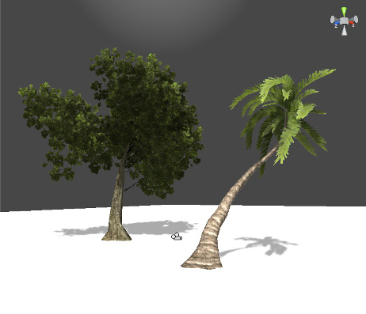

#Tree Editor（树编辑器）

Unity 提供名称为 __Tree Editor__ 的工具用于在编辑器内直接设计树。对于创建具有不同树类型和变体的高度细节化森林和丛林非常有用。

本手册的这一部分将说明如何使用 Tree Editor。请使用本页面左侧的导航栏查看这一部分的主题。

 

## SpeedTree

可以使用 IDV, Inc. 提供的 [SpeedTree Modeler](https://store.speedtree.com/) 来创建具有高级视觉效果（例如，平滑的 LOD 过渡、快速公告牌以及自然风动画）的树。请参阅有关 [SpeedTree](SpeedTree.html) 的 Unity 文档以了解更多信息。
