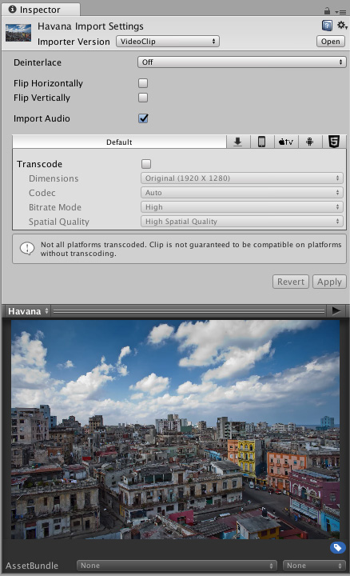
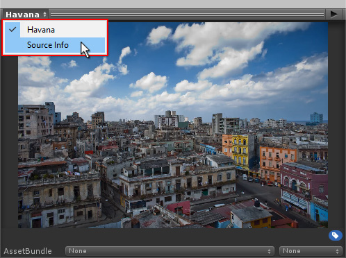
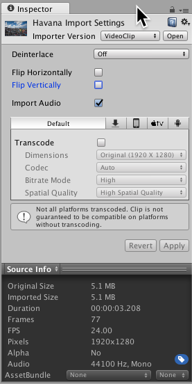
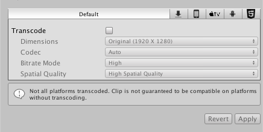

# 视频剪辑

视频剪辑是导入的视频文件，可由[视频播放器 (Video Player) 组件](class-VideoPlayer.html)用于播放视频内容（如果视频有声音，同时播放附带的音频内容）。视频文件的典型文件扩展名包括 .mp4、.mov、.webm 和 .wmv。

选择视频剪辑时，检视面板 (Inspector) 会显示视频剪辑导入器 (Video Clip Importer)，其中包括选项、预览和源详细信息。单击预览窗口右上角的 __Play__ 按钮即可播放视频剪辑及其第一个音频轨道。

要查看视频剪辑的源信息，请导航到 Inspector 窗口底部的预览面板，单击左上角的视频剪辑名称，然后选择 __Source Info__。

 

特定于平台的选项使转码过程适应每个目标平台，允许每个平台选择作为默认选项。

如果禁用转码，将按原样使用视频文件，这意味着必须手动验证与目标平台的兼容性（请参阅有关视频文件兼容性的文档以了解更多信息）。但是，选择不转码可以节省时间并且避免了转换过程中的质量损失。

## 视频剪辑导入器属性

| **_属性_** | | | **_功能_** |
|:---|:---|:---|:---|
| __Importer Version__ ||| 选择要使用的导入器版本。|
|||__VideoClip__ | 生成适合用于[视频播放器组件](class-VideoPlayer]的视频剪辑。 |
||| __MovieTexture__（旧版） | 生成旧版[电影纹理](class-MovieTexture.html)。 |
| __Keep Alpha__ ||| 保留 [Alpha 通道](VideoTransparency.html)并在转码期间将其编码，因此即使目标平台本身不支持带有 Alpha 的视频，也可以使用它。  仅对具有 Alpha 通道的源显示此属性。 |
| __Deinterlace__ ||| 控制隔行扫描源在转码期间如何解除隔行扫描。例如，可以选择更改隔行扫描设置决定视频的编码方式或为了美观。隔行扫描视频在每帧中有两个时间样本：一个在奇数行中，另一个在偶数行中。 |
||| __Off__ | 源文件没有隔行扫描，并且没有要执行的处理（这是默认设置）。 |
||| __Even__ | 采用每个帧的偶数行，将其插入以创建缺失内容。丢弃奇数行。 |
||| __Odd__ | 采用每个帧的奇数行，将其插入以创建缺失内容。丢弃偶数行。 |
| __Flip Horizontally__ ||| 如果选中此复选框，则在转码期间将源文件内容沿水平轴翻转实现倒播。 |
| __Flip Vertically__ ||| 如果选中此复选框，则在转码期间将源内容沿垂直轴翻转以使其左右互换。 |
| __Import Audio__ ||| 如果选中此复选框，则会在转码期间导入音频轨道。  仅对具有音频轨道的源显示此属性。 |
| __Transcode__ ||| 通过勾选复选框启用该属性时，源将转码为与目标平台兼容的格式。  如果禁用，则使用原始内容，绕过可能漫长的转码过程。  **注意：**请验证源格式是否与每个目标平台兼容（请参阅有关视频文件兼容性的文档以了解更多信息）。 |
|| __Dimensions__ || 控制源文件内容的大小调整方式。|
||| __Original__ | 保持原始大小。|
||| __Three Quarter Res__ | 将源的大小调整为其原始宽度和高度的四分之三。|
||| __Half Res__ | 将源的大小调整为其原始宽度和高度的一半。|
||| __Quarter Res__ | 将源的大小调整为其原始宽度和高度的四分之一。|
||| __Square (1024 X 1024)__ | 将源大小调整为 1024 x 1024 正方形图像。宽高比可控。|
||| __Square (512 X 512)__ | 将源大小调整为 512 x 512 正方形图像。宽高比可控。|
||| __Square (256 X 256)__ | 将源大小调整为 256 x 256 正方形图像。宽高比可控。|
||| __Custom__ | 将源大小调整为自定义分辨率。宽高比可控。 |
|| __Width__ || 所生成图像的宽度。  仅当 Dimensions 字段设置为 Custom 时，此属性才可见。 |
|| __Height__ || 所生成图像的高度。  仅当 Dimensions 字段设置为 Custom 时，此属性才可见。 |
|| __Aspect Ratio__ || 调整图像大小时使用的宽高比控件。  仅当 Dimensions 字段设置为 Original 以外的选项时，此属性才可见。|
||| __No Scaling__ | 根据需要添加黑色区域以保留原始内容的宽高比。|
||| __Stretch__ | 拉伸原始内容以填充目标分辨率，而不留下黑色区域。 |
|| __Codec__ || 用于将视频轨道编码的编解码器。 |
||| __Auto__ | 为目标平台选择最合适的视频编码解码器。|
||| __H264__ | MPEG-4 AVC 视频编解码器，受到大多数平台上的硬件支持。|
||| __VP8__ | VP8 视频编解码器，受到大多数平台上的软件支持，并受到 Android 和 WebGL 等几个平台上的硬件支持。 |
|| __Bitrate Mode__ || 相对于所选编码解码器的基线配置文件的低、中或高比特率。 |
|| __Spatial Quality__ || 此设置决定视频图像在转码过程中是否压缩大小，缩小意味着它们占用的存储空间更少。但是，调整图像大小也会导致在播放期间出现模糊。|
||| __Low Spatial Quality__ | 在转码期间图像大小显著减小（通常为原始尺寸的四分之一），然后在播放时扩展回原始大小。这是调整大小的最大量，意味着它可以节省最多的存储空间，但在播放时会产生最大的模糊度。|
||| __Medium Spatial Quality__ | 在转码期间图像大小适度减小（通常为原始尺寸的一半），然后在播放时扩展回原始大小。虽然有一定的大小调整，但是图像将比使用 Low Spatial Quality 选项的图像更清晰，所需存储空间有所减少。|
||| __High Spatial Quality__ | 如果选择此选项，则不会调整大小。这意味着在转码期间图像大小不会减小，因此将保持视频的原始视觉清晰度。 |

---

* 2017-06-15 Page published with limited [editorial review](DocumentationEditorialReview.html)

* Unity 5.6 中的新功能
