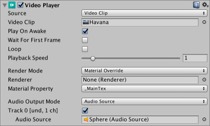

# 视频播放器 (Video Player) 组件

使用视频播放器[组件](Components.html)可将[视频文件](Video.html)附加到[游戏对象](GameObjects.html)，然后在运行时在游戏对象的[纹理](Textures.html)上播放。

以下截屏显示了一个连接到球形游戏对象的视频播放器组件。

默认情况下，视频播放器组件的__材质属性 (Material Property)__ 设置为 ___MainTex__，这意味着视频播放器组件附加到具有渲染器的游戏对象时，它会自动将自身分配给该渲染器上的纹理（因为这是该游戏对象的主纹理）。此处，游戏对象有一个网格渲染器 (Mesh Renderer) 组件，因此视频播放器会自动将其分配给 Renderer 字段，这意味着视频剪辑会在网格渲染器的纹理上播放。

还可设置要播放视频的特定目标，包括：

* [摄像机](class-Camera.html)平面

* [渲染纹理](class-RenderTexture.html)

* [材质](Materials.html)纹理参数

* 组件中的任何[纹理](class-TextureImporter.html)字段

## VideoPlayer 组件参考

| **_属性_** | | | **_功能_** |
|:---|:---|:---|:---|
| __Source__     ||| 选择视频源类型。 |
|| __Video Clip__ || 将[视频剪辑](class-VideoClip.html)分配给视频编辑器。 |
||| __Video Clip__  | 使用此字段来定义分配给视频播放器组件的视频剪辑。将视频文件拖放到此字段中，或单击该字段右侧的圆圈，然后从资源列表中选择文件（如果该文件位于 Project 文件夹中）。 |
|| __URL__ || 从 URL（例如 http:// 或 file://）分配视频。Unity 在运行时从此 URL 读取视频。  |
||| __URL__ | 输入要分配给视频播放器的视频的 URL。 |
||| __Browse...__ | 单击此项可快速浏览本地文件系统并打开以 file:// 开头的 URL。 |
| __Play On Awake__ ||| 勾选 __Play On Awake__ 复选框可在场景启动时播放视频。如果希望在运行时的另一个点触发视频播放，请取消勾选此复选框。此情况下可使用 `Play()` 命令通过脚本触发视频播放。 |
| __Wait For First Frame__ ||| 如果勾选 __Wait For First Frame__ 复选框，Unity 将在游戏开始前等待源视频的第一帧准备好显示。如果取消勾选此复选框，可能会丢弃前几帧以使视频时间与游戏的其余部分保持同步。 |
| __Loop__ ||| 勾选 __Loop__ 复选框可使视频播放器组件在源视频到达结尾时循环播放视频。如果未勾选此复选框，视频到达结尾时将停止播放。  |
| __Playback Speed__ ||| 此滑动条和数字字段表示播放速度的乘数，为 0 到 10 之间的值。默认情况下，该字段设置为 1（正常速度）。如果该字段设置为 2，则视频以其正常速度的两倍进行播放。 |
| __Render Mode__ ||| 使用下拉选单来定义视频的渲染方式。 |
|| __Camera Far Plane__ ||  在摄像机的[远平面](class-Camera.html)上渲染视频。 |
|| __Camera Near Plane__ || 在摄像机的[近平面](class-Camera.html)上渲染视频。 |
||| __Camera__ | 定义接收视频的[摄像机](class-Camera.html)。 |
||| __Alpha__ | 添加到源视频的全局透明度级别。此属性允许透过平面看到平面背后的元素。请参阅[视频透明度支持](VideoTransparency.html)文档以了解有关 Alpha 通道的更多信息。 |
|| __Render Texture__ || 将视频渲染到[渲染纹理](class-RenderTexture.html)中。 |
||| __Target Texture__ | 定义视频播放器组件用于渲染图像的渲染纹理。 |
|| __Material Override__ || 通过游戏对象渲染器的[材质](../ScriptReference/Material.html)将视频渲染到游戏对象的选定纹理属性中。 |
||| __Renderer__ | 视频播放器组件用于渲染图像的[渲染器](../ScriptReference/Renderer.html)。设置为 __None__ 时，使用与视频播放器组件位于同一游戏对象上的__渲染器__。 |
||| __Material Property__ | 接受视频播放器组件图像的[材质纹理属性](../ScriptReference/Material.SetTexture.html)的名称。 |
|| __API Only__ || 将视频渲染到 [VideoPlayer.texture](../ScriptReference/Video.VideoPlayer-texture.html) 脚本 API 属性中。必须使用脚本将纹理分配给其预期目标。 |
| __Aspect Ratio__ ||| 在使用相应的__渲染模式 (Render Mode)__时，用于填充__摄像机近平面 (Camera Near Plane)__、__摄像机远平面 (Camera Far Plane)__ 或__渲染纹理 (Render Texture)__ 的图像的宽高比。 |
|| __No Scaling__ || 不使用缩放。视频在目标矩形内居中。 |
|| __Fit Vertically__ || 对源进行缩放以垂直适应目标矩形，在必要时裁剪左侧和右侧或在每侧留下黑色区域。此情况下保留源宽高比。 |
|| __Fit Horizontally__ || 对源进行缩放以水平适应目标矩形，在必要时裁剪顶部和底部区域或在顶部和底部留下黑色区域。此情况下保留源宽高比。 |
|| __Fit Inside__ || 对源进行缩放以适合目标矩形而不必裁剪。根据需要，在左侧和右侧或上方和下方留下黑色区域。此情况下保留源宽高比。 |
|| __Fit Outside__ || 对源进行缩放以适应目标矩形，而不必在左侧和右侧或上方和下方留下黑色区域，可根据需要进行裁剪。此情况下保留源宽高比。 |
|| __Stretch__ || 在水平和垂直方向均进行缩放以适应目标矩形。不会保留源宽高比。 |
| __Audio Output Mode__ ||| 定义如何输出源的音频轨道。 |
|| __None__ || 不播放音频。 |
|| __Audio Source__ || 音频样本发送到选定[音频源](class-AudioSource.html)，允许应用 Unity 的音频处理。 |
|| __Direct__ || 音频样本绕过 Unity 的音频处理，直接发送到音频输出硬件。 |
| __Controlled Tracks__ ||| 视频中的音频轨道数量。  仅在 __Source__ 为 __URL__ 时显示。__Source__ 为 __Video Clip__ 时，通过检查视频文件来确定轨道数。 |
| __Track Enabled__ ||| 勾选相关复选框进行启用后，关联的音频轨道将用于播放。必须在播放前设置此项。  复选框左侧的文本提供有关音频轨道的信息，具体而言就是音频轨道编号、语言和通道数。  例如，在以上截屏中，文本为 Track 0 [und.1 ch]。这表示它是第一个音频轨道 (Track 0)，语言未定义 (und.)，并且该音频轨道有一个声道 (1 ch)，表示它是单声道音频轨道。  当源为 URL 时，此信息仅在播放期间可用。  仅当源是具有一个或多个音频轨道的视频剪辑或源为 URL（允许您指示在播放期间预计来自 URL 的音频轨道数）时，才显示此属性。 |
|| __Audio Source__ || 用于播放音频轨道的[音频源](class-AudioSource.html)。目标音频源也可以播放音频剪辑。  音频源的播放控件（脚本 API 中的 `Play On Awake` 和 `Play()`）不适用于视频源的音频轨道。  仅当 __Audio Output Mode__ 设置为 __Audio Source__ 时，才显示此属性。 |
|| __Mute__ || 将关联的音频轨道静音。在 __Audio Source__ 模式中，将使用音频源的控件。  仅当 __Audio Output Mode__ 设置为 __Direct__ 时，才显示此属性。 |
|| __Volume__ || 关联音频轨道的音量。在 __Audio Source__ 模式中，将使用音频源的音量。  仅当 __Audio Output Mode__ 设置为 __Direct__ 时，才显示此属性。 |

---

* 2017-06-15 Page published with limited [editorial review](DocumentationEditorialReview.html)

* Unity 5.6 中的新功能
