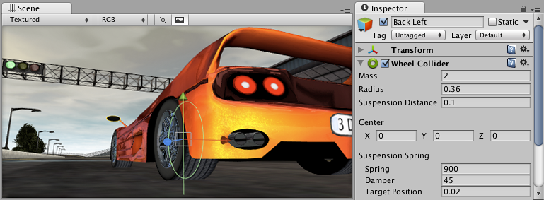
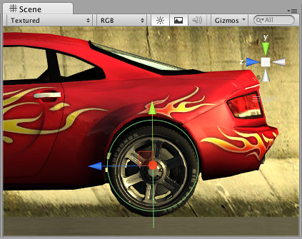
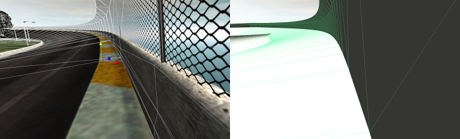

车轮碰撞体
==============

__车轮碰撞体 (Wheel Collider)__ 是一种用于地面交通工具的特殊碰撞体。此碰撞体内置了碰撞检测、车轮物理组件和基于打滑的轮胎摩擦模型。此碰撞体可以用于除车轮以外的其他对象，但专门设计用于有轮的交通工具。

 

有关使用车轮碰撞体的指南，请参阅 [Unity 车轮碰撞体教程](WheelColliderTutorial.html)。

属性
----------

|**_属性：_** |**_功能：_** |
|:---|:---|
|__Mass__ |车轮的质量。 |
|__Radius__ |车轮的半径。 |
|__Wheel Damping Rate__ |这是应用于车轮的阻尼值。 |
|__Suspension Distance__ |车轮悬架的最大延伸距离（在局部空间中测量）。悬架始终向下延伸穿过局部 Y 轴。 |
|__Force App Point Distance__ |此参数定义车轮上的受力点。此距离应该是距车轮底部静止位置的距离（沿悬架行程方向），以米为单位。当 ``forceAppPointDistance = 0`` 时，受力点位于静止的车轮底部。较好的车辆会使受力点略低于车辆质心。 |
|__Center__ |车轮在对象局部空间中的中心位置。 |
|__Suspension Spring__ |悬架尝试通过增加弹簧力和阻尼力来到达__目标位置 (Target Position)__。 |
|&amp;#160;&amp;#160;&amp;#160;&amp;#160;&amp;#160;&amp;#160;&amp;#160;&amp;#160;__Spring__ |弹簧力尝试到达__目标位置__。值越大，悬架达到__目标位置__就越快。 |
|&amp;#160;&amp;#160;&amp;#160;&amp;#160;&amp;#160;&amp;#160;&amp;#160;&amp;#160;__Damper__ |抑制悬架速度。值越大，__悬架弹簧__移动就越慢。 |
|&amp;#160;&amp;#160;&amp;#160;&amp;#160;&amp;#160;&amp;#160;&amp;#160;&amp;#160;__Target Position__ |悬架沿悬架距离 (Suspension Distance) 的静止距离。1 对应于完全展开的悬架，0 对应于完全压缩的悬架。默认值为 0.5，与常规汽车的悬架行为匹配。 |
|__Forward/Sideways Friction__ |车轮向前和侧向滚动时轮胎摩擦的特性。请参阅下面的_车轮摩擦曲线_部分。 |

详细信息
-------

通过从__中心 (Center)__ 向下穿过局部 Y 轴进行射线投射来执行车轮的碰撞检测。车轮具有__半径 (Radius)__，并且根据__悬架距离 (Suspension Distance)__ 向下延伸。通过脚本使用不同属性来控制车辆，这些属性包括：__motorTorque__、__brakeTorque__ 和 __steerAngle__。有关更多信息，请参阅[车轮碰撞体脚本参考](../ScriptReference/WheelCollider.html)。

车轮碰撞体使用基于打滑的摩擦模型计算摩擦力（独立于物理引擎的其余部分）。这样可以实现更逼真的行为，但也会导致车轮碰撞体忽略标准[物理材质](class-PhysicMaterial.html)设置。

###车轮碰撞体设置

不必通过转动或滚动 WheelCollider 对象来控制汽车；附加了 WheelCollider 的对象应始终相对于汽车本身固定。但是，可能希望转动并滚动图形化的车轮表示。最好的方法是为车轮碰撞体和可见车轮设置单独的对象：

请注意，在播放模式下，WheelCollider 位置的辅助图标图形不会更新：

###碰撞几何体

因为赛车可以达到很高的速度，所以正确设置赛道碰撞几何体非常重要。具体而言，[碰撞网格](class-MeshCollider.html)不应具有构成可见模型（例如栅栏杆）的微小凹凸痕迹。通常，用于赛道的碰撞网格与可见网格分开制作，使碰撞网格尽可能平滑。此外不应有薄型对象；如果有薄型轨道边界，请在碰撞网格中使其加宽（如果汽车绝不会到达该处，应完全移除另一侧）。

###车轮摩擦曲线

下文中显示的_车轮摩擦曲线_可以描述轮胎摩擦。车轮的前进（滚动）方向和侧向方向有单独的曲线。在这两个方向上，首先确定轮胎打滑的程度（基于轮胎橡胶和道路之间的速度差异）。然后，将该打滑值用于计算施加在接触点上的轮胎力。

曲线以轮胎打滑的度量值作为输入，并以力作为输出。曲线由包含两部分的样条图近似模拟。第一部分从 _(0 , 0)_ 到 _(__ExtremumSlip__ , __ExtremumValue__)_，目标点处曲线的正切值为零。第二部分从 _(__ExtremumSlip__ , __ExtremumValue__)_ 到 _(__AsymptoteSlip__ , __AsymptoteValue__)_，目标点处曲线的正切值再次为零：

根据真实轮胎的特性，在低打滑条件下，轮胎可能会施加很大的力，因为橡胶会通过拉伸来补偿打滑。随后，当打滑变得非常高时，随着轮胎开始滑动或旋转，力会减小。因此，轮胎摩擦曲线的形状与上图相似。

|**_属性：_** |**_功能：_** |
|:---|:---|
|__Extremum Slip/Value__ |曲线的极值点。 |
|__Asymptote Slip/Value__ |曲线的渐近点。 |
|__Stiffness__ |__Extremum Value__ 和 __Asymptote Value__ 的乘数（默认值为 1）。改变摩擦力的刚度。将此值设置为零将完全禁用车轮的所有摩擦力。通常在运行时修改刚度以使用脚本来模拟各种地面材质。 |

提示
-----

* 可能希望在 [Time Manager](class-TimeManager.html) 中降低物理时间步长长度以获得更稳定的汽车物理特性，特别是在高速赛车的情况下。
* 为防止汽车太容易翻转，可以通过脚本稍微降低其[刚体](class-Rigidbody.html)质心，并施加取决于汽车速度的“下压”力。
