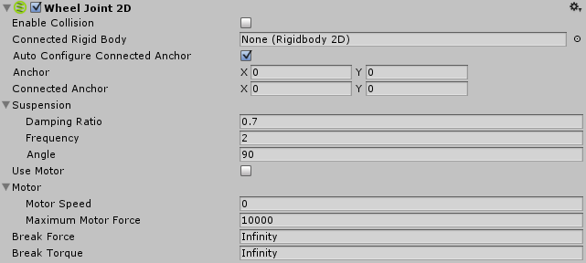

# 2D 车轮关节 (Wheel Joint 2D)

使用 __2D 车轮关节__可模拟滚动的车轮，使对象可通过车轮而移动。可对关节施加电机动力。车轮使用悬架“弹簧”来保持与车身主体的距离。

 

##属性

|**_属性：_** |**_功能：_** |
|:---|:---|
|__Enable Collision__ |连接的两个对象能否相互碰撞？选中此复选框表示“能”。|
|__Connected Rigid Body__ |在此处指定该关节连接到的另一个对象。如果将此属性保留为 __None__，此关节的另一端将固定到空间中由 __Connected Anchor__ 设置所定义的点。选择字段右侧的圆圈可查看要连接到的对象的列表。|
|__Auto Configure Connected Anchor__ | 选中此框可为该关节连接到的另一个对象自动设置锚点位置。（选中此框将无需填写 __Connected Anchor__ 字段。） |    

|__Anchor__ |The place (in terms of X, Y co-ordinates on the __RigidBody__) where the end point of the joint connects to *this* object. |
|__Connected Anchor__ |The place (in terms of X, Y co-ordinates on the __RigidBody__) where the end point of the joint connects to *the other* object. | 

|__Damping Ratio__ | The degree to which you want to suppress spring oscillation in the suspension: In the range 0 to 1, the higher the value, the less movement. |
|__Frequency__ |The frequency at which the spring in the suspension oscillates while the objects are approaching the separation distance you want (measured in cycles per second): In the range 0 to 1,000,000 - the higher the value, the stiffer the suspension spring. |
|__Angle__ |The world movement angle for the suspension. |
|__Use Motor__ |Apply a motor force to the wheel? Check the box for yes.|
|__Motor__ | |
|__Motor Speed__ |Target speed (degrees per second) for the motor to reach. |
|__Maximum Motor Force__ |Maximum force applied to the object to attain the desired speed. |

|__Break Force__ |Specify the force level needed to break and so delete the joint. __Infinity__ means it is unbreakable. |
|__Break Torque__ |Specify the torque level needed to break and so delete the joint. __Infinity__ means it is unbreakable. |

##详细信息
（另请参阅 [2D 关节](Joints2D.html)中的*详情和提示*以了解所有 2D 关节的有用背景信息。）

使用此关节可模拟车轮和悬架。此关节的目的是在可延伸到无穷远的一条线上保持两点的位置，同时使两点重叠。这两个点可以是两个 __2D 刚体__组件，或一个 __2D 刚体__组件和世界中的一个固定位置。（将 __Connected Rigidbody__ 设置为 None，即可连接到世界中的固定位置）。

2D 车轮关节的行为就像 [2D 滑动关节](class-SliderJoint2D.html)（不包括其电机或限制约束）和 [2D 铰链关节](class-HingeJoint2D.html)（不包括其限制约束）的组合。

此关节对两个连接的刚体对象施加线性力，使这些对象保持在这条线上，使用角度电机来旋转这条线上的对象，并使用弹簧来模拟车轮悬架。

设置 __Maximum Motor Speed__ 和 __Maximum Motor Force__（在此关节中为扭矩）可控制电机角速度并使两个刚体对象旋转。

可以设置车轮悬架的刚度和运动：

几乎不动的僵硬悬架…

* 高（1,000,000 为最高）__Frequency__ == 僵硬悬架。

* 高（1 为最高）__Damping Ratio__ == 几乎不动的悬架。

移动的松弛悬架…

* 低 __Frequency__ == 松弛悬架。

* 低 __Damping Ratio__== 移动的悬架。

此关节同时有两个约束：

* 与两个刚体对象上两个锚点之间的一条指定线保持相对线性距离为零。
* 保持两个刚体对象上的两个锚点之间的角速度。（通过 __Maximum Motor Speed__ 选项设置速度，并通过 __Maximum Motor Force__ 设置最大扭矩。）

**例如：**

使用此关节构建的物理对象就好像是通过旋转枢轴相连一样但不能远离指定线。例如：

* 在模拟车轮时，用电机驱动这些车轮，并用一条线定义允许的悬架移动。

##提示

**2D 车轮关节的行为不同于车轮碰撞体：**

与用于 3D 物理的[车轮碰撞体](class-WheelCollider.html)不同，2D 车轮关节将单独的__刚体__对象用于车轮，使车轮在受力时旋转。（相比之下，车轮碰撞体使用射线投射来模拟悬架，并且车轮的旋转纯粹是一种图形效果）。车轮对象一般为 [2D 圆形碰撞体](class-CircleCollider2D.html)，并通过 [2D 物理材质](class-PhysicsMaterial2D.html)在游戏运行过程中提供适当牵引量。

**要模拟汽车或其他车辆，请执行以下操作：**

在 Inspector 中，将 __Motor Speed__ 属性设置为零，然后根据玩家的输入通过脚本修改此属性。通过更改 __Maximum Motor Force__ 的值，可以模拟换档和加力的效果。

**零频率：**

__Frequency__ 为零是特殊情况：这种情况下会产生最大刚度的弹簧。
