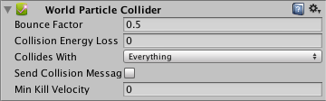
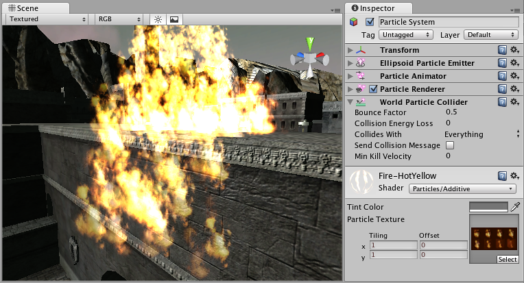

世界粒子碰撞体 (World Particle Collider)（旧版）
================================

__世界粒子碰撞体__用于将粒子与场景中的其他__碰撞体__碰撞。

 

属性
----------

|**_属性：_** |**_功能：_** |
|:---|:---|
|__Bounce Factor__ |粒子碰撞其他物体后可加速或减速。此系数与__粒子动画器 (Particle Animator)__ 的 __Damping__ 属性相似。 |
|__Collision Energy Loss__ |粒子碰撞时应失去的能量（以秒为单位）。如果能量低于 0，表示粒子被杀死。 |
|__Min Kill Velocity__ |如果碰撞导致粒子的 __Velocity__ 下降到 __Min Kill Velocity__ 以下，则会淘汰该粒子。 |
|__Collides with__ |粒子将碰撞哪些[层](Layers.html)。 |
|__Send Collision Message__ |如果启用此属性，则每个粒子都会发出一条可通过脚本捕获的碰撞消息。 |

详细信息
-------

要创建带有粒子碰撞体的粒子系统，请执行以下操作：

1.使用 __GameObject &gt; Create General &gt; Particle System__ 创建粒子系统
1.使用 __Component &gt; Particles &gt; World Particle Collider__ 添加粒子碰撞体

###消息

如果启用 __Send Collision Message__，则任何发生碰撞的粒子都会向粒子的__游戏对象__和粒子碰撞的游戏对象发送 __OnParticleCollision()__ 消息。

提示
-----

* __Send Collision Message__ 可用于模拟子弹并对撞击处造成伤害。
* 粒子碰撞检测 (Particle Collision Detection) 在用于大量粒子时速度很慢。请谨慎使用粒子碰撞检测。
* 消息发送会带来很大的开销，不应用于普通的粒子系统。

