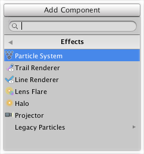

视觉效果参考
========================

视觉效果可应用于摄像机、游戏对象、光源和游戏的其他元素。本部分提供有关 Unity Editor 中的可用视觉效果的信息。

要访问 Unity Editor 中可用的视觉效果，请在 Hierarchy 窗口中选择要应用效果的相关项，然后在 Inspector 窗口中选择 __Add Component > Effects__。

有关每个组件的更多详细信息，请参阅本部分的其余内容：

* 粒子系统（请参阅：图形参考文档中的[粒子系统](http://docs.unity3d.com/Manual/class-ParticleSystem.html)）
* [轨迹渲染器 (Trail Renderer)](http://docs.unity3d.com/Manual/class-TrailRenderer.html)
* [线渲染器 (Line Renderer)](http://docs.unity3d.com/Manual/class-LineRenderer.html)
* [镜头光晕 (Lens Flare)](http://docs.unity3d.com/Manual/class-LensFlare.html)
* [光环 (Halo)](http://docs.unity3d.com/Manual/class-Halo.html)
* [投影器 (Projector)](http://docs.unity3d.com/Manual/class-Projector.html)
* 旧版粒子（请参阅：图形参考文档中的[旧版粒子](http://docs.unity3d.com/Manual/comp-ParticlesLegacy.html)）
