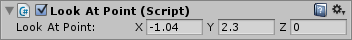

自定义编辑器
==============

提高游戏创建速度的关键是为常用组件创建自定义编辑器。举例来说，我们将使用下面这个非常简单的脚本；该脚本总是让对象注视一个点。将此脚本添加到项目中，并将其放置到场景中的立方体游戏对象上。应将该脚本命名为“LookAtPoint”

````
//C# 示例 (LookAtPoint.cs)
using UnityEngine;
public class LookAtPoint : MonoBehaviour
{
    public Vector3 lookAtPoint = Vector3.zero;

    void Update()
    {
        transform.LookAt(lookAtPoint);
    }
}
````

````
//JS 示例 (LookAtPoint.js)
# pragma strict
var lookAtPoint = Vector3.zero;
function Update()
{
    transform.LookAt(lookAtPoint);
}
````

此脚本将使对象保持朝向世界空间中的点。目前，此脚本仅在**播放模式**下（即，游戏在运行时）激活。编写编辑器脚本时，在**编辑模式**期间执行某些脚本通常也很有用（此时未运行游戏）。可以向脚本中添加 ExecuteInEditMode 属性来达到此目的：

````
//C# 示例 (LookAtPoint.cs)
using UnityEngine;
[ExecuteInEditMode]
public class LookAtPoint : MonoBehaviour
{
    public Vector3 lookAtPoint = Vector3.zero;

    void Update()
    {
        transform.LookAt(lookAtPoint);
    }
}
````

````
//JS 示例 (LookAtPoint.js)
# pragma strict
@script ExecuteInEditMode()
var lookAtPoint = Vector3.zero;
function Update()
{
    transform.LookAt(lookAtPoint);
}
````

现在，如果在编辑器中移动具有此脚本的对象，或者在 Inspector 中更改“Look At Point”的值（即使在未处于播放模式时），对象会相应更新其方向，以便仍然注视世界空间中的目标点。

###创建自定义编辑器

上文演示了如何在编辑时运行简单脚本；但仅凭此还不足以创建自己的编辑器工具。下一步需要为我们刚创建的脚本创建__自定义编辑器__。

在 Unity 中创建脚本时，默认情况下，此脚本继承自 MonoBehaviour，因此可作为放在游戏对象上的**组件**。放置在游戏对象上时，Inspector 会显示一个默认界面，用于查看和编辑可以显示的所有公共变量 - 例如整数、浮点数、字符串、Vector3 等。

以下是默认 Inspector 查找上述脚本的方式：


**自定义编辑器是一个单独脚本，可将此默认布局*替换*为您选择的任何编辑器控件。**

为了开始为 LookAtPoint 脚本创建自定义编辑器，应创建同名（但是附加“Editor”）的另一脚本。所以，在我们的示例中，应该是：“LookAtPointEditor”。

````
//c# 示例 (LookAtPointEditor.cs)
using UnityEngine;
using UnityEditor;
​
[CustomEditor(typeof(LookAtPoint))]
[CanEditMultipleObjects]
public class LookAtPointEditor : Editor 
{
    SerializedProperty lookAtPoint;
    
    void OnEnable()
    {
        lookAtPoint = serializedObject.FindProperty("lookAtPoint");
    }
​
    public override void OnInspectorGUI()
    {
        serializedObject.Update();
        EditorGUILayout.PropertyField(lookAtPoint);
        serializedObject.ApplyModifiedProperties();
    }
}
````

````
//JS 示例 (LookAtPointEditor.js)
# pragma strict
@CustomEditor(LookAtPoint)
@CanEditMultipleObjects
class LookAtPointEditor extends Editor {

    var lookAtPoint : SerializedProperty;

    function OnEnable()
    {
        lookAtPoint = serializedObject.FindProperty("lookAtPoint");
    }

    function OnInspectorGUI()
    {
        serializedObject.Update();
        EditorGUILayout.PropertyField(lookAtPoint);
        serializedObject.ApplyModifiedProperties();
    }
}
````

此类必须派生自 **Editor**。**CustomEditor** 属性告知 Unity 应该作为哪个组件的编辑器。**CanEditMultipleObjects** 属性告诉 Unity 您可以使用此编辑器来选择多个对象并同时更改所有对象。

只要 Unity 在 Inspector 中显示编辑器，就执行 OnInspectorGUI 中的代码。可以在此处插入任何 GUI 代码 - 原理就像游戏的 OnGUI 一样，不过是在 Inspector 内运行。编辑器会定义可用于访问所检查对象的目标属性。以下就是我们的自定义 Inspector 的模样：

 

这不是很有趣，因为目前为止，我们所做的不过是重新创建 Vector3 字段，跟默认 Inspector 的外观完全一样，所以结果看起来非常相似（但是现在不存在“Script”字段，因为我们没有添加任何 Inspector 代码来显示该字段）。

但是，现在可以在编辑器脚本中控制 Inspector 的显示方式，可以使用所喜欢的任何代码来布局 Inspector 字段，允许用户调整值，甚至显示图形或其他可视元素。实际上，在 Unity Editor 中看到的所有 Inspector（包括更复杂的 Inspector，例如地形系统和动画导入设置）都是使用同一 API 生成的。在创建自己的自定义编辑器时可以访问此 API。

下面是一个简单示例，用于扩展编辑器脚本以显示一条消息，指示目标点在游戏对象之上还是之下：


````
//c# 示例 (LookAtPointEditor.cs)
using UnityEngine;
using UnityEditor;

[CustomEditor(typeof(LookAtPoint))]
[CanEditMultipleObjects]
public class LookAtPointEditor : Editor
{
    SerializedProperty lookAtPoint;

    void OnEnable()
    {
        lookAtPoint = serializedObject.FindProperty("lookAtPoint");
    }

    public override void OnInspectorGUI()
    {
        serializedObject.Update();
        EditorGUILayout.PropertyField(lookAtPoint);
        serializedObject.ApplyModifiedProperties();
        if (lookAtPoint.vector3Value.y > (target as LookAtPoint).transform.position.y)
        {
            EditorGUILayout.LabelField("(Above this object)");
        }
        if (lookAtPoint.vector3Value.y < (target as LookAtPoint).transform.position.y)
        {
            EditorGUILayout.LabelField("(Below this object)");
        }
    }
}
````

````
//JS 示例 (LookAtPointEditor.js)
# pragma strict
@CustomEditor(LookAtPoint)
@CanEditMultipleObjects
class LookAtPointEditor extends Editor {

    var lookAtPoint : SerializedProperty;

    function OnEnable()
    {
        lookAtPoint = serializedObject.FindProperty("lookAtPoint");
    }

    function OnInspectorGUI()
    {
        serializedObject.Update();
        EditorGUILayout.PropertyField(lookAtPoint);
        serializedObject.ApplyModifiedProperties();
        if (lookAtPoint.vector3Value.y > (target as LookAtPoint).transform.position.y)
        {
            EditorGUILayout.LabelField("(Above this object)");
        }
        if (lookAtPoint.vector3Value.y < (target as LookAtPoint).transform.position.y)
        {
            EditorGUILayout.LabelField("(Below this object)");
        }
    }
}
````

现在我们向 Inspector 添加一个新元素，目的是打印一条消息来显示目标点在游戏对象之上还是之下。

 

这里只是浅显描述了凭借编辑器脚本可以完成的操作。可以全面访问所有 IMGUI 命令来绘制任何类型的界面，包括使用编辑器窗口中的摄像机来渲染场景。
 

###Scene 视图添加
可以通过在自定义编辑器中实现 OnSceneGUI 来向 Scene 视图添加额外代码。

OnSceneGUI 的运行方式很像 OnInspectorGUI - 只不过在 Scene 视图中运行而已。为了方便在 Scene 视图中创建自己的编辑控件，可以使用在 [Handles](../ScriptReference/Handles.html) 类中定义的函数。其中的所有函数都是为 3D 模式的 Scene 视图设计的。

````
//C# 示例 (LookAtPointEditor.cs)
using UnityEngine;
using UnityEditor;

[CustomEditor(typeof(LookAtPoint))]
[CanEditMultipleObjects]
public class LookAtPointEditor : Editor
{
    SerializedProperty lookAtPoint;

    void OnEnable()
    {
        lookAtPoint = serializedObject.FindProperty("lookAtPoint");
    }

    public override void OnInspectorGUI()
    {
        serializedObject.Update();
        EditorGUILayout.PropertyField(lookAtPoint);
        if (lookAtPoint.vector3Value.y > (target as LookAtPoint).transform.position.y)
        {
            EditorGUILayout.LabelField("(Above this object)");
        }
        if (lookAtPoint.vector3Value.y < (target as LookAtPoint).transform.position.y)
        {
            EditorGUILayout.LabelField("(Below this object)");
        }
        
            
        serializedObject.ApplyModifiedProperties();
    }

    public void OnSceneGUI()
    {
        var t = (target as LookAtPoint);

        EditorGUI.BeginChangeCheck();
        Vector3 pos = Handles.PositionHandle(t.lookAtPoint, Quaternion.identity);
        if (EditorGUI.EndChangeCheck())
        {
            Undo.RecordObject(target, "Move point");
            t.lookAtPoint = pos;
            t.Update();
        }
    }
}
````


````
//JS 示例 (LookAtPointEditor.js)
# pragma strict
@CustomEditor(LookAtPointJS)
@CanEditMultipleObjects
class LookAtPointEditorJS extends Editor {

    var lookAtPoint : SerializedProperty;

    function OnEnable()
    {
        lookAtPoint = serializedObject.FindProperty("lookAtPoint");
    }

    function OnInspectorGUI()
    {
        serializedObject.Update();
        EditorGUILayout.PropertyField(lookAtPoint);
        serializedObject.ApplyModifiedProperties();
        if (lookAtPoint.vector3Value.y > (target as LookAtPointJS).transform.position.y)
        {
            EditorGUILayout.LabelField("(Above this object)");
        }
        if (lookAtPoint.vector3Value.y < (target as LookAtPointJS).transform.position.y)
        {
            EditorGUILayout.LabelField("(Below this object)");
        }
    }


    function OnSceneGUI()
    {
        var t : LookAtPointJS = (target as LookAtPointJS);

        EditorGUI.BeginChangeCheck();
        var pos = Handles.PositionHandle(t.lookAtPoint, Quaternion.identity);
        if (EditorGUI.EndChangeCheck())
        {
            Undo.RecordObject(target, "Move point");
            t.lookAtPoint = pos;
            t.Update();
        }
    }
}

````

如果要放置 2D GUI 对象（GUI、EditorGUI 等等），需要将这些对象包裹在 Handles.BeginGUI() 和 Handles.EndGUI() 的调用中。
