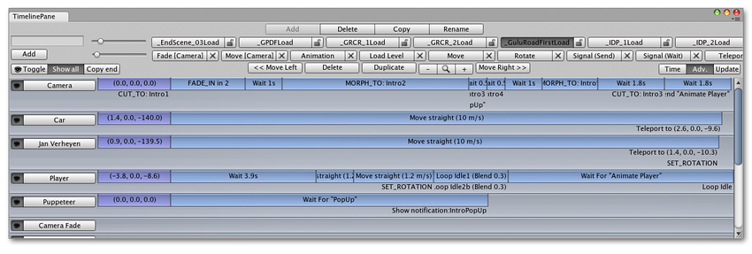
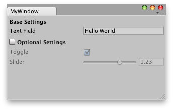

编辑器窗口
==============


可以在该应用程序中创建任意数量的自定义窗口。这些窗口的行为与 Inspector、Scene 视图或任何其他内置视图类似。这是为游戏的子系统添加用户界面的好方法。




创建自定义编辑器窗口涉及以下简单步骤：

* 创建一个派生自 EditorWindow 的脚本。
* 使用代码触发窗口自行显示。
* 实现工具的 GUI 代码。

###派生自 EditorWindow
为了创建编辑器窗口，必须将脚本存储在称为“Editor”的文件夹中。在派生自 EditorWindow 的此脚本内创建一个类。然后在内部 OnGUI 函数中编写 GUI 控件。


```
using UnityEngine;
using UnityEditor;
using System.Collections;

public class Example : EditorWindow

    {
	    void OnGUI () {
		    // The actual window code goes here
	       }
    }
```

_MyWindow.js - 放在项目中称为“Editor”的文件夹内。_

###显示窗口
要在屏幕上显示窗口，请创建一个菜单项来显示该窗口。为此，需要创建一个由 __MenuItem__ 属性
激活的函数。

在 Unity 中，默认情况下会保持窗口状态（因此再次选择该菜单项将显示现有窗口）。这是使用 [EditorWindow.GetWindow](../ScriptReference/EditorWindow.GetWindow.html) 函数实现的，如下所示：

```
using UnityEngine;
using UnityEditor;
using System.Collections;

class MyWindow : EditorWindow {
	[MenuItem ("Window/My Window")]

	public static void  ShowWindow () {
		EditorWindow.GetWindow(typeof(MyWindow));
	}
	
	void OnGUI () {
		// The actual window code goes here
	}
}
```

_显示 MyWindow_

此代码将创建一个标准、可停靠的编辑器窗口。该窗口可以在调用之间保存自己的位置，可以用在自定义布局中等等。为了更好地控制创建的内容，可以使用 [GetWindowWithRect](../ScriptReference/EditorWindow.GetWindowWithRect.html)

###实现窗口的 GUI

应通过实现 OnGUI 函数来渲染窗口的实际内容。可以使用与游戏内 GUI 相同的 UnityGUI 类（__GUI__ 和 __GUILayout__）。此外，我们提供了一些额外 GUI 控件，这些控件位于仅用于编辑器的 __EditorGUI__ 和 __EditorGUILayout__ 类中。这些类将添加到普通类中已有的控件，因此您可以随意混合和搭配。

以下 C# 代码显示了将 GUI 元素添加到自定义 EditorWindow 的方式：


```
using UnityEditor;
using UnityEngine;

public class MyWindow : EditorWindow
{
	string myString = "Hello World";
	bool groupEnabled;
	bool myBool = true;
	float myFloat = 1.23f;
	
	// Add menu item named "My Window" to the Window menu
	[MenuItem("Window/My Window")]
	public static void ShowWindow()
	{
		//Show existing window instance. If one doesn't exist, make one.
		EditorWindow.GetWindow(typeof(MyWindow));
	}
	
	void OnGUI()
	{
		GUILayout.Label ("Base Settings", EditorStyles.boldLabel);
		myString = EditorGUILayout.TextField ("Text Field", myString);
        
		groupEnabled = EditorGUILayout.BeginToggleGroup ("Optional Settings", groupEnabled);
			myBool = EditorGUILayout.Toggle ("Toggle", myBool);
			myFloat = EditorGUILayout.Slider ("Slider", myFloat, -3, 3);
		EditorGUILayout.EndToggleGroup ();
	}
}
```

此示例将生成一个如下所示的窗口：




有关更多信息，请查看 [EditorWindow 页面](../ScriptReference/EditorWindow.html)上的示例和文档。
