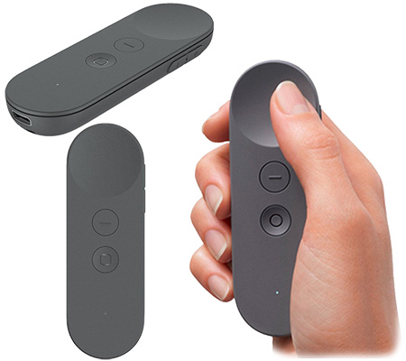

# Google VR 控制器和输入设备

目前，Daydream 唯一官方自有输入设备为 Daydream 控制器。Google Cardboard 应用程序可使用各种第三方控制器来获取输入。

## Daydream 控制器

Daydream 控制器允许 3 个自由度，提供旋转和位置信息，具有双轴触摸/点击控制器以及 2 个额外按钮。

有关如何从此设备获取输入的信息，请参阅 [Google Daydream 控制器文档](https://developers.google.com/vr/android/reference/com/google/vr/sdk/controller/package-summary)。

---
* 2018-03-27 Page published with [editorial review](DocumentationEditorialReview.html)

* 在 2017.3 版中更新了有关 Unity XR API 的 Google VR 文档
