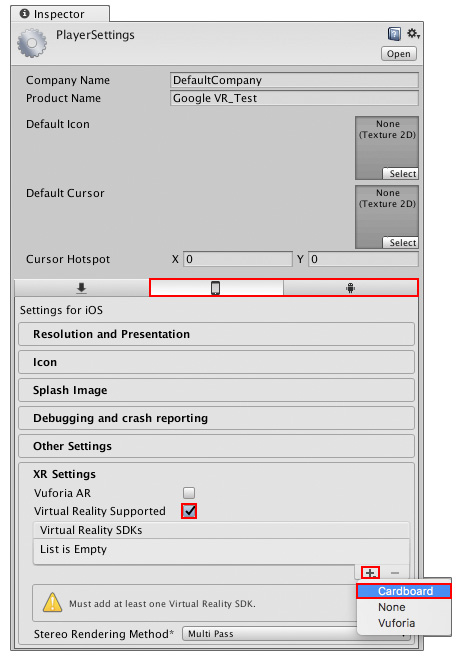
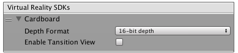
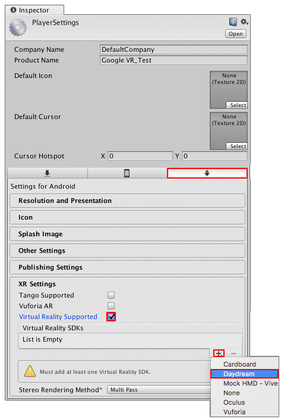
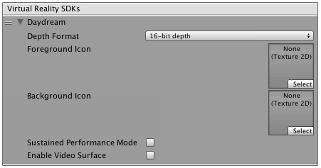

# Google VR 快速入门指南

本部分将帮助您快速开始使用 Unity 开发 Google VR 应用程序。有关开发 Google VR 内容的大量其他说明，请访问 [Google VR 开发者网站](https://developers.google.com/vr/)。

根据以下指南安装 Unity 和 Google VR SDK：

1.请参阅[下载和安装 Unity](InstallingUnity.html) 来安装 Unity Editor。

    i ) 目标平台为 Android 时，请确保通过 __Unity 安装程序__安装 Unity Android 支持包。

    ii ) 目标平台为 iOS 时，请确保通过 __Unity 安装程序__安装 Unity iOS 支持包，并有一台 macOS 机器可编译应用程序并将其部署到设备。

2.根据目标平台，遵循[关于 VR 的 Google 开发者站点](https://developers.google.com/vr/)的说明进行操作。

## 官方 Google VR 指南
Google 提供了使用 Unity 开发适用于 Android 和 iOS 平台的 Google VR 应用程序的入门指南。具体指南的链接如下：

* [适用于 Android 的 Google VR SDK for Unity](https://developers.google.com/vr/unity/get-started) 入门指南。

* [适用于 iOS 的 Google VR SDK for Unity](https://developers.google.com/vr/unity/get-started-ios) 入门指南。

## Unity 平台配置设置

本部分将提供配置 Unity 项目以构建 Google VR 应用程序的分步操作指南。

请按照后续部分中的步骤操作，确保 Unity 项目能针对目标 Google VR 设备实现成功构建。

### 面向 Cardboard（Android 和 iOS）

Unity 提供了许多特定于平台的构建选项，确保能将应用程序构建到 Cardboard 支持的设备。

要访问这些设置，请在 Unity Editor 中打开 __Player Settings__（菜单：__Edit__ > __Project Settings__ > __Player__），然后根据要构建的目标设备单击 iPhone 或 Android 图标。导航到 __XR Settings__，并确保选中 __Virtual Reality Supported__。接下来，导航到 __Virtual Reality SDKs__ 列表，并单击加号 __(+)__ 按钮。选择 __Cardboard__ 将其添加到列表中。

将 __Cardboard__ 添加到 __Virtual Reality SDKs__ 列表中后，单击旁边的折叠箭头可查看更多 __Cardboard__ 设置。

下表列出了 __Cardboard__ 设置中的可用属性及其功能描述。

| __属性__| __描述 __  |
|:---|:---| 
| __Depth Format__| 使用此下拉选单可设置 Z 缓冲区深度。Unity 使用此设置来对可见数据进行排序，并确定实际渲染到屏幕的内容。 |
| __Enable Transition View__| 过渡视图是 Google VR 提供的视图，用于通知用户必须将其设备放入与 Cardboard 兼容的查看器中。通过启用此功能，可为用户提供一些时间来将其设备插入查看器。默认处于禁用状态。 |

Cardboard 的最低平台版本要求为 Android 5.0 (Lollipop)（SDK API 级别 21）。

要确保 Unity 使用正确的 APK，并仅在升级到最新版 Android 的设备上运行，必须更改 __Minimum API Level__。

要进行此操作，请选择 __Player Settings__ 并导航到 __Other Settings__。在 __Identification__ 下，使用 __Minimum API Level__ 下拉选单将其设置为列表中的最新 API。

仅在目标为 Cardboard 时，才应将 __Target API Level__ 设置为 API 级别 21 或更高级别。如果目标为 Daydream，则需要 24 或更高级别。默认情况下，此属性使用已安装的最高级别。有关 Android API 级别的更多信息，请参阅 [Android PlayerSettings](class-PlayerSettingsAndroid.html) 的文档。

现在已经准备好为 Cardboard 创建 Unity 内容了。请遵循与常规 Android 或 iOS 开发相同的工作流程（有关更多信息，请参阅 [Android 开发](android.html)或 [iOS 开发](iphone.html)文档）。确保在支持 Cardboard 的设备上构建和运行游戏（菜单：__File__ > __Build & Run__）。

### __面向 Daydream（仅限 Android）__

Unity 提供了许多特定于平台的构建选项，确保能将应用程序构建到 Daydream 支持的设备。

要访问这些设置，请打开 __Player Settings__（菜单：__Edit__ > __Project Settings__ > __Player__），然后导航到 Android 部分（单击下图中标记的 Android 图标）。导航到 __XR Settings__，并确保勾选 __Virtual Reality Supported__ 复选框。接下来，导航到 __Virtual Reality SDKs__ 列表，并单击加号 (+) 按钮。选择 __Daydream__ 将其添加到列表中。

将 __Daydream__ 添加到 __Virtual Reality SDKs__ 列表中后，单击旁边的折叠箭头可查看更多 Daydream 设置。

下表列出了 Daydream 设置中的可用属性及其功能描述。

| __属性__| __描述 __ |
|:---|:---| 
| __Depth Format__| 使用此下拉选单可设置 Z 缓冲区深度。此设置用于对可见数据进行排序，并确定实际渲染到屏幕的内容。 |
| __Foreground Icon__| 设置要在 Google VR Play 商店中显示的前景图标。 |
| __Background Icon__| 设置要在 Google VR Play 商店中显示的背景图标。 |
| __Use Sustained Performance Mode__| 启用 __Sustained Performance Mode__ 可获得更长时间的 XR 体验。此设置会降低性能以延长电池续航时间。 |
| __Enable Video Surface__| 启用 Asynchronous Video Reprojection。请参阅 [Asynchronous Video Reprojection](VRDevices-GoogleVRVideoAsyncReprojection.html) 文档以了解更多信息。 |
| __Enable Protected Memory__| 使用 Asynchronous Video Reprojection 时，为受 DRM 保护的内容启用内存保护。仅当选择了 __Enable Video Surface__ 的情况下才会显示此选项。想了解更多相关信息，请参阅 [Asynchronous Video Reprojection](VRDevices-GoogleVRVideoAsyncReprojection.html) |

目标仅为 Daydream 时的最低平台版本要求为 Android 7.0 (Nougat)（SDK API 级别 24）。如果目标为 Cardboard 以及 Daydream，则支持的最低 API 级别为 21。

要确保 Unity 使用正确的 APK，并仅在升级到最新版 Android 的设备上运行，必须更改 __Minimum API Level__。

要进行此操作，请在 Player Settings 中导航到 __Other Settings__。在 __Identification__ 下，使用 __Minimum API Level__ 下拉选单将其设置为列表中的最新 API。

如果目标是 Daydream，则 __Target API Level__ 应设置为 API 级别 24。默认情况下，此属性使用已安装的最高级别。有关 Android API 级别的更多信息，请参阅 [Android PlayerSettings](class-PlayerSettingsAndroid.html) 的文档。

现在已经准备好为 Daydream 创建 Unity 内容了。请遵循与常规 Android 开发相同的工作流程（有关更多信息，请参阅 [Android 开发](android.html)文档）。确保在支持 Daydream 的设备上构建和运行游戏（菜单：__File__ > __Build & Run__）。

---
* 2018-03-27 Page published with [editorial review](DocumentationEditorialReview.html)

* 在 2017.3 版中更新了有关 Unity XR API 的 Google VR 文档
