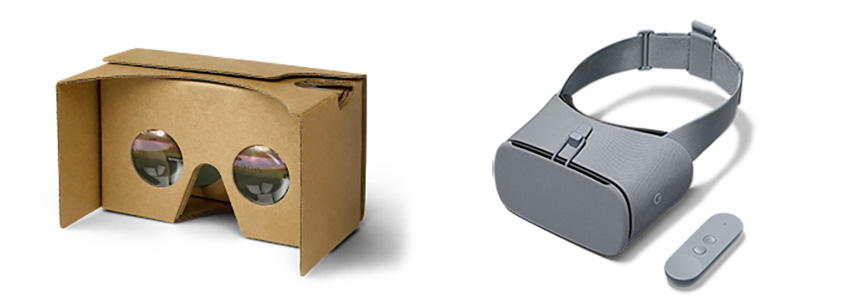

# Google VR 硬件和软件要求

 

本部分将概述使用 Google VR SDK 的最低以及建议的硬件和软件要求。

以下是支持 Google VR SDK 的设备的最低平台要求，以及一些重要注意事项：

* 必须安装 Android API SDK 版本 21（也称为“Lollipop”）。

* 要开发 Google VR 应用程序，必须拥有支持 Cardboard 或 Daydream 的手机。

* 请参阅 Google 关于 [Daydream 硬件](https://developers.google.com/vr/concepts/dev-kit-setup)的文档，了解如何设置 Android 手机来进行 Daydream 开发。

## __最低硬件和软件要求__

本部分将概述使用 Google VR SDK 进行开发的最低硬件和软件要求。

| 设备| 硬件 | 软件 |
|:---|:---|:---| 
| Cardboard| - 运行 Android 4.1 或更高版本并配备陀螺仪的设备。 - 运行 iOS 8 或更高版本并配备陀螺仪的设备。 - 与 Cardboard 兼容的查看设备。 | - Unity Cardboard 集成需要 Android Lollipop 或更高版本。 - 装有 Google Cardboard 应用程序的 iOS 设备。
| Daydream| - 与 Daydream 兼容的设备。请参阅 [Google Daydream 硬件 (Google Daydream Hardware)](https://developers.google.com/vr/daydream/hardware) 页面查看与 Daydream 兼容的设备列表。 |  |

## __建议硬件和软件要求__

本部分将概述使用 Google VR SDK 进行开发的建议硬件和软件要求。

| 设备| 硬件 | 软件 |
|:---|:---|:---| 
| Cardboard| - 对于 Android，请参阅 Cardboard 查看器随附的文档以获取兼容设备的完整列表。 - 对于 iOS，任何 iPhone 5 系列或更高版本的手机。 - 与 Cardboard 兼容的查看设备。 | - Android 5.0 或更高版本。 - iOS 8 或更高版本，并装有 Google Cardboard 应用程序。 |
| Daydream| - 任何与 Daydream 规范兼容的设备。请参阅 [Google Daydream 硬件 (Google Daydream Hardware)](https://developers.google.com/vr/daydream/hardware) 页面查看与 Daydream 兼容的设备列表。 | Android 7 或更高版本。 |

有关 Google VR 开发的详细信息，请参阅主要的[关于 VR 的 Google 开发者站点](https://developers.google.com/vr/)。该站点包含大量链接，通过链接即可访问 SDK、教学资料以及有关 API 和应用商店发布操作的文档。

---
* 2018-03-27 Page published with [editorial review](DocumentationEditorialReview.html)

* 在 2017.3 版中更新了有关 Unity XR API 的 Google VR 文档
