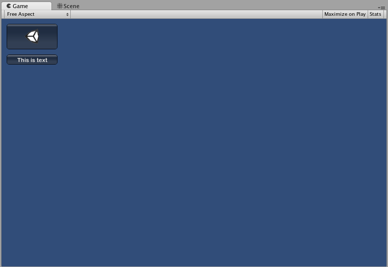

IMGUI 基础知识
==========
本部分将介绍使用 Unity 的即时模式 GUI 系统 (IMGUI) 来编写__控件__脚本的必要条件。

使用 IMGUI 创建控件
-----------------------------

Unity 的 IMGUI 控件使用一个名为 __OnGUI()__ 的特殊函数。只要启用包含脚本，就会在每帧调用 __OnGUI()__ 函数，就像 __Update()__ 函数一样。

IMGUI 控件本身结构非常简单。此结构如以下示例中所示。


````
/* 示例关卡加载程序 */


// JavaScript
function OnGUI () {
	// 创建背景框
	GUI.Box (Rect (10,10,100,90), "Loader Menu");

	// 创建第一个按钮。如果按下此按钮，则会执行 Application.Loadlevel (1)
	if (GUI.Button (Rect (20,40,80,20), "Level 1")) {
		Application.LoadLevel (1);
	}

	// 创建第二个按钮。
	if (GUI.Button (Rect (20,70,80,20),"Level 2")) {
		Application.LoadLevel (2);
	}
}


//C#
using UnityEngine;
using System.Collections;

public class GUITest : MonoBehaviour {
			
	void OnGUI () {
		// 创建背景框
		GUI.Box(new Rect(10,10,100,90), "Loader Menu");
	
		// 创建第一个按钮。如果按下此按钮，则会执行 Application.Loadlevel (1)
		if(GUI.Button(new Rect(20,40,80,20), "Level 1")) {
			Application.LoadLevel(1);
		}
	
		// 创建第二个按钮。
		if(GUI.Button(new Rect(20,70,80,20),"Level 2")) {
			Application.LoadLevel(2);
		}
	}
}


````

此示例是一个可运行的完整关卡加载程序。如果复制/粘贴此脚本并将其附加到__游戏对象__，则在进入__播放模式__时，将显示以下菜单：


让我们仔细研究一下示例代码：

第一个 GUI 行 __GUI.Box (Rect (10,10,100,90), "Loader Menu");__ 将显示一个标题文本为 "Loader Menu" 的 __Box__ 控件。该语句遵循典型的 GUI 控件声明模式（我们接下来马上探讨此主题）。

下一个 GUI 行是 __Button__ 控件声明。请注意，该声明与 Box 控件声明略有不同。具体而言，整个 Button 声明都位于 __if__ 语句内。当游戏运行并单击 Button 时，此 __if__ 语句返回 true，并执行 __if__ 代码块中的所有代码。

由于每帧都会调用 __OnGUI()__ 代码，因此无需显式创建和销毁 GUI 控件。声明控件的行与创建控件的行是同一行。如果需要在特定时间显示控件，可以使用任何类型的脚本逻辑来执行此操作。


````
/* 闪烁按钮示例 */


// JavaScript
function OnGUI () {
	if (Time.time % 2 < 1) {
		if (GUI.Button (Rect (10,10,200,20), "Meet the flashing button")) {
			print ("You clicked me!");
		}
	}
}


// C#
using UnityEngine;
using System.Collections;

public class GUITest : MonoBehaviour {
			
	void OnGUI () {
		if (Time.time % 2 < 1) {
			if (GUI.Button (new Rect (10,10,200,20), "Meet the flashing button")) {
				print ("You clicked me!");
			}
		}
	}
}


````

此处，每隔一秒才调用一次 __GUI.Button()__，因此按钮会出现再消失。当然，用户只能在按钮可见时单击按钮。

如您所见，可使用任何所需的逻辑来控制 GUI 控件的显示和运行时间。现在我们将探讨每个控件的声明的细节。


控件剖析
--------------------


声明 GUI 控件时，需要三段关键信息：

__Type__ (__Position__, __Content__)

可以看到，此结构是一个带有两个参数的函数。我们现在将探讨此结构的细节。


###Type

__Type__ 是指 __Control Type（控件类型）__；通过调用 Unity 的 [GUI 类](../ScriptReference/GUI.html)或 [GUILayout 类](../ScriptReference/GUILayout.html)中的函数来声明该类型（在本指南的[布局模式](gui-Layout.html)部分对此进行了详细讨论）。例如，__GUI.Label()__ 将创建非交互式标签。本指南稍后的[控件](gui-Controls.html)部分将介绍所有不同的控件类型。


###Position

__Position__ 是所有 __GUI__ 控件函数中的第一个参数。此参数本身随附一个 __Rect()__ 函数。__Rect()__ 定义四个属性：__最左侧位置__、__最顶部位置__、__总宽度__、__总高度__。所有这些值都以__整数__提供，对应于像素值。所有 UnityGUI 控件均在__屏幕空间 (Screen Space)__ 中工作，此空间表示已发布的播放器的分辨率（以像素为单位）。

坐标系基于左上角。__Rect(10, 20, 300, 100)__ 定义一个从坐标 10,20 开始到坐标 310,120 结束的矩形。值得再次强调的是，__Rect()__ 中的第二对值是总宽度和高度，而不是控件结束的坐标。这就是为什么上面提到的例子结束于 310,120 而不是 300,100。

可使用 __Screen.width__ 和 __Screen.height__ 属性来获取播放器中可用的屏幕空间的总尺寸。以下示例可能有助于解释如何完成此操作：


````
/* Screen.width 和 Screen.height 示例 */


// JavaScript
function OnGUI () {
	GUI.Box (Rect (0,0,100,50), "Top-left");
	GUI.Box (Rect (Screen.width - 100,0,100,50), "Top-right");
	GUI.Box (Rect (0,Screen.height - 50,100,50), "Bottom-left");
	GUI.Box (Rect (Screen.width - 100,Screen.height - 50,100,50), "Bottom-right");
}


// C#
using UnityEngine;
using System.Collections;

public class GUITest : MonoBehaviour {
			
	void OnGUI(){
		GUI.Box (new Rect (0,0,100,50), "Top-left");
		GUI.Box (new Rect (Screen.width - 100,0,100,50), "Top-right");
		GUI.Box (new Rect (0,Screen.height - 50,100,50), "Bottom-left");
		GUI.Box (new Rect (Screen.width - 100,Screen.height - 50,100,50), "Bottom-right");
	}

}


````


###Content

GUI 控件的第二个参数是要与控件一起显示的实际内容。通常会希望在控件上显示一些文本或图像。要显示文本，请将字符串作为 Content 参数传递，如下所示：


````
/* 字符串内容示例 */


// JavaScript
function OnGUI () {
	GUI.Label (Rect (0,0,100,50), "This is the text string for a Label Control");
}


// C#
using UnityEngine;
using System.Collections;

public class GUITest : MonoBehaviour {
			
	void OnGUI () {
		GUI.Label (new Rect (0,0,100,50), "This is the text string for a Label Control");
	}

}


````

要显示图像，请声明 __Texture2D__ 公共变量，并将变量名称作为 Content 参数传递，如下所示：


````
/* Texture2D 内容示例 */


// JavaScript
var controlTexture : Texture2D;

function OnGUI () {
	GUI.Label (Rect (0,0,100,50), controlTexture);
}


// C#
public Texture2D controlTexture;
  ...

void OnGUI () {
	GUI.Label (new Rect (0,0,100,50), controlTexture);
}


````

以下是更接近真实情况的示例：


````
/* 按钮内容示例 */


// JavaScript
var icon : Texture2D;

function OnGUI () {
	if (GUI.Button (Rect (10,10, 100, 50), icon)) {
		print ("you clicked the icon");
	}

	if (GUI.Button (Rect (10,70, 100, 20), "This is text")) {
		print ("you clicked the text button");
	}
}


// C#
using UnityEngine;
using System.Collections;

public class GUITest : MonoBehaviour {
				
	public Texture2D icon;
	
	void OnGUI () {
		if (GUI.Button (new Rect (10,10, 100, 50), icon)) {
			print ("you clicked the icon");
		}
	
		if (GUI.Button (new Rect (10,70, 100, 20), "This is text")) {
			print ("you clicked the text button");
		}
	}

}


````




此外还可通过第三个选项在 GUI 控件中一起显示图像和文本。为此，可提供 __GUIContent__ 对象作为 Content 参数，并定义要在 GUIContent 中显示的字符串和图像。


````
/* 使用 GUIContent 来显示图像和字符串 */


// JavaScript
var icon : Texture2D;

function OnGUI () {
	GUI.Box (Rect (10,10,100,50), GUIContent("This is text", icon));
}


// C#
using UnityEngine;
using System.Collections;

public class GUITest : MonoBehaviour {
				
	public Texture2D icon;

	void OnGUI () {
		GUI.Box (new Rect (10,10,100,50), new GUIContent("This is text", icon));
	}

}


````

此外，还可在 GUIContent 中定义__工具提示 (Tooltip)__，当鼠标悬停在 GUI 上时将工具提示显示在 GUI 中的其他位置。


````
/* 使用 GUIContent 来显示工具提示 */


// JavaScript
function OnGUI () {
	// 此行将 "This is the tooltip" 传入 GUI.tooltip
	GUI.Button (Rect (10,10,100,20), GUIContent ("Click me", "This is the tooltip"));
	// 此行读取并显示 GUI.tooltip 的内容
	GUI.Label (Rect (10,40,100,20), GUI.tooltip);
}


// C#
using UnityEngine;
using System.Collections;

public class GUITest : MonoBehaviour {
					
	void OnGUI () {
		// 此行将 "This is the tooltip" 传入 GUI.tooltip
		GUI.Button (new Rect (10,10,100,20), new GUIContent ("Click me", "This is the tooltip"));
		
		// 此行读取并显示 GUI.tooltip 的内容
		GUI.Label (new Rect (10,40,100,20), GUI.tooltip);
	}

}


````


如果够大胆的话，也可以使用 GUIContent 来显示字符串、图标和工具提示！


````
/* 使用 GUIContent 来显示图像、字符串和工具提示 */


// JavaScript
var icon : Texture2D;

function OnGUI () {
	GUI.Button (Rect (10,10,100,20), GUIContent ("Click me", icon, "This is the tooltip"));
	GUI.Label (Rect (10,40,100,20), GUI.tooltip);
}


// C#
using UnityEngine;
using System.Collections;

public class GUITest : MonoBehaviour {
					
	public Texture2D icon;
	
	void OnGUI () {
		GUI.Button (new Rect (10,10,100,20), new GUIContent ("Click me", icon, "This is the tooltip"));
		GUI.Label (new Rect (10,40,100,20), GUI.tooltip);
	}

}


````

[GUIContent 构造函数](../ScriptReference/GUIContent-ctor.html)的脚本参考页面提供了一些用法示例。
