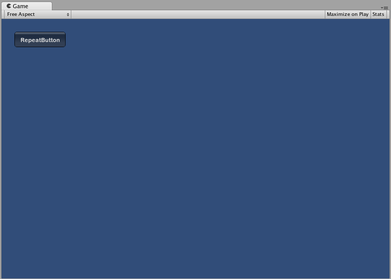
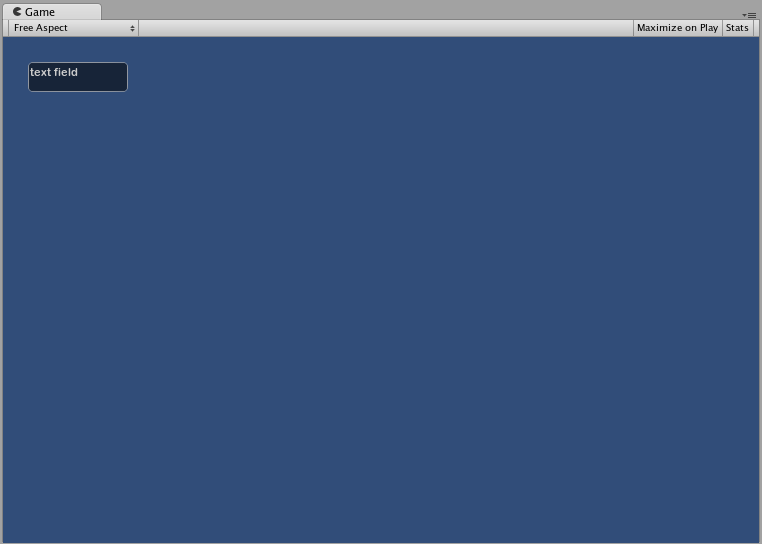
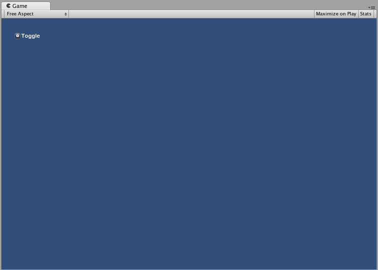
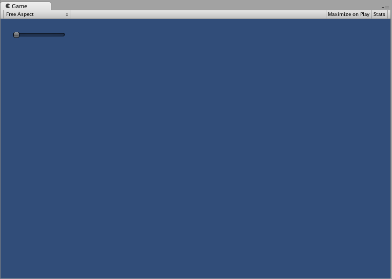
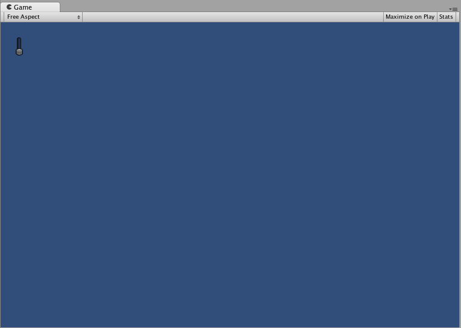

控件
========

IMGUI 控件类型
-------------
可以创建许多不同的 IMGUI __控件__。本部分列出了所有可用的显示控件和交互式控件。此外还有其他影响控件布局的 IMGUI 函数；在本指南的[布局](gui-Layout.html)部分介绍了这些函数。


###[Label](../ScriptReference/GUI.Label.html)

__Label__ 为非交互式控件。此控件仅用于显示目的。不能单击，也不能以其他方式进行移动。此控件最适合于纯粹显示信息之用。


````
/* GUI.Label 示例 */


// JavaScript
function OnGUI () {
	GUI.Label (Rect (25, 25, 100, 30), "Label");
}


// C#
using UnityEngine;
using System.Collections;

public class GUITest : MonoBehaviour {
					
	void OnGUI () {
		GUI.Label (new Rect (25, 25, 100, 30), "Label");
	}

}


````


###[Button](../ScriptReference/GUI.Button.html)

__Button__ 是典型的交互式按钮。点击按钮时，无论鼠标按下多久，都只会响应一次。松开鼠标按键后会立即响应。

####基本用法
在 UnityGUI 中，点击 Button 时将返回 __true__。要在点击 Button 时执行某些代码，应将 GUI.Button 函数包裹在 __if__ 语句中。__if__ 语句内部是点击 Button 时将执行的代码。


````
/* GUI.Button 示例 */


// JavaScript
function OnGUI () {
	if (GUI.Button (Rect (25, 25, 100, 30), "Button")) {
		// 点击 Button 时执行此代码
	}
}


// C#
using UnityEngine;
using System.Collections;

public class GUITest : MonoBehaviour {
					
	void OnGUI () {
		if (GUI.Button (new Rect (25, 25, 100, 30), "Button")) {
			// 点击 Button 时执行此代码
		}
	}

}


````


###[RepeatButton](../ScriptReference/GUI.RepeatButton.html)

__RepeatButton__ 是常规 __Button__ 的变体。区别在于，__RepeatButton__ 将响应鼠标按键保持按下状态的每一帧。由此可以创建单击并保持功能。

####基本用法
在 UnityGUI 中，点击 RepeatButton 的每一帧都将返回 __true__。要在 Button 保持点击状态时执行某些代码，应将 GUI.RepeatButton 函数包裹在 __if__ 语句中。__if__ 语句内部是 RepeatButton 保持点击状态时将执行的代码。


````
/* GUI.RepeatButton 示例 */


// JavaScript
function OnGUI () {
	if (GUI.RepeatButton (Rect (25, 25, 100, 30), "RepeatButton")) {
		// RepeatButton 保持点击状态时的每一帧都将执行此代码
	}
}


// C#
using UnityEngine;
using System.Collections;

public class GUITest : MonoBehaviour {
					
	void OnGUI () {
		if (GUI.RepeatButton (new Rect (25, 25, 100, 30), "RepeatButton")) {
			// RepeatButton 保持点击状态时的每一帧都将执行此代码
		}
	}

}


````





###[TextField](../ScriptReference/GUI.TextField.html)

__TextField__ 控件是一个包含文本字符串的交互式可编辑单行字段。

####基本用法
TextField 将始终显示一个字符串。必须提供要在 TextField 中显示的字符串。对字符串进行编辑时，TextField 函数将返回已编辑的字符串。


````
/* GUI.TextField 示例 */


// JavaScript
var textFieldString = "text field";

function OnGUI () {
	textFieldString = GUI.TextField (Rect (25, 25, 100, 30), textFieldString);
}


// C#
using UnityEngine;
using System.Collections;

public class GUITest : MonoBehaviour {
					
	private string textFieldString = "text field";
	
	void OnGUI () {
		textFieldString = GUI.TextField (new Rect (25, 25, 100, 30), textFieldString);
	}

}


````





###[TextArea](../ScriptReference/GUI.TextArea.html)

__TextArea__ 控件是一个包含文本字符串的交互式可编辑多行区域。

####基本用法
TextArea 将始终显示一个字符串。必须提供要在 TextArea 中显示的字符串。对字符串进行编辑时，TextArea 函数将返回已编辑的字符串。


````
/* GUI.TextArea 示例 */


// JavaScript
var textAreaString = "text area";

function OnGUI () {
	textAreaString = GUI.TextArea (Rect (25, 25, 100, 30), textAreaString);
}


// C#
using UnityEngine;
using System.Collections;

public class GUITest : MonoBehaviour {
					
	private string textAreaString = "text area";
	
	void OnGUI () {
		textAreaString = GUI.TextArea (new Rect (25, 25, 100, 30), textAreaString);
	}

}


````


###[Toggle](../ScriptReference/GUI.Toggle.html)

__Toggle__ 控件创建具有持久开/关状态的复选框。用户可通过点击该复选框来更改状态。

####基本用法
Toggle 开/关状态由 true/false 布尔值表示。必须提供布尔值作为参数来使 Toggle 表示实际状态。如果点击，则 Toggle 函数将返回一个新的布尔值。为了捕获此交互性，必须指定布尔值来接受 Toggle 函数的返回值。


````
/* GUI.Toggle 示例 */


// JavaScript
var toggleBool = true;

function OnGUI () {
	toggleBool = GUI.Toggle (Rect (25, 25, 100, 30), toggleBool, "Toggle");
}


// C#
using UnityEngine;
using System.Collections;

public class GUITest : MonoBehaviour {
					
	private bool toggleBool = true;
	
	void OnGUI () {
		toggleBool = GUI.Toggle (new Rect (25, 25, 100, 30), toggleBool, "Toggle");
	}

}


````





###[Toolbar](../ScriptReference/GUI.Toolbar.html)

__Toolbar__ 控件本质上是一行 __Button__。在 Toolbar 上，一次只能有一个 Button 处于激活状态，并且此 Button 将一直保持激活状态，直到点击其他 Button。此行为模拟典型 Toolbar 的行为。在 Toolbar 上可以定义任意数量的 Button。

####基本用法
Toolbar 中处于激活状态的 Button 通过整数加以跟踪。必须在函数中提供整数作为参数。要使 Toolbar 具有交互性，必须将整数分配给函数的返回值。提供的内容数组中的元素数将决定 Toolbar 中显示的 Button 数。


````
/* GUI.Toolbar 示例 */


// JavaScript
var toolbarInt = 0;
var toolbarStrings : String[] = ["Toolbar1", "Toolbar2", "Toolbar3"];

function OnGUI () {
	toolbarInt = GUI.Toolbar (Rect (25, 25, 250, 30), toolbarInt, toolbarStrings);
}


// C#
using UnityEngine;
using System.Collections;

public class GUITest : MonoBehaviour {
					
	private int toolbarInt = 0;
	private string[] toolbarStrings = {"Toolbar1", "Toolbar2", "Toolbar3"};
	
	void OnGUI () {
		toolbarInt = GUI.Toolbar (new Rect (25, 25, 250, 30), toolbarInt, toolbarStrings);
	}

}


````


###[SelectionGrid](../ScriptReference/GUI.SelectionGrid.html)

__SelectionGrid__ 控件是一种多行 __Toolbar__。您可以决定网格中的列数和行数。一次只能激活一个 Button。

####基本用法
SelectionGrid 中处于激活状态的 Button 通过整数加以跟踪。必须在函数中提供整数作为参数。要使 SelectionGrid 具有交互性，必须将整数分配给函数的返回值。提供的内容数组中的元素数将决定 SelectionGrid 中显示的 Button 数。还可以通过函数参数指定列数。


````
/* GUI.SelectionGrid 示例 */


// JavaScript
var selectionGridInt : int = 0;
var selectionStrings : String[] = ["Grid 1", "Grid 2", "Grid 3", "Grid 4"];

function OnGUI () {
	selectionGridInt = GUI.SelectionGrid (Rect (25, 25, 100, 30), selectionGridInt, selectionStrings, 2);

}


// C#
using UnityEngine;
using System.Collections;

public class GUITest : MonoBehaviour {
					
	private int selectionGridInt = 0;
	private string[] selectionStrings = {"Grid 1", "Grid 2", "Grid 3", "Grid 4"};
	
	void OnGUI () {
		selectionGridInt = GUI.SelectionGrid (new Rect (25, 25, 300, 60), selectionGridInt, selectionStrings, 2);
	
	}

}


````


###[HorizontalSlider](../ScriptReference/GUI.HorizontalSlider.html)

__HorizontalSlider__ 控件是一个典型的水平滑钮，可拖动该滑钮来更改介于预定最小值和最大值之间的值。

####基本用法
滑钮的位置存储为浮点数。要显示滑钮的位置，请将该浮点数作为函数中的参数之一。此外还有两个值用于确定最小值和最大值。如果希望滑钮可调，请将滑动条值浮点数指定为 Slider 函数的返回值。


````
/* Horizontal Slider 示例 */


// JavaScript
var hSliderValue : float = 0.0;

function OnGUI () {
	hSliderValue = GUI.HorizontalSlider (Rect (25, 25, 100, 30), hSliderValue, 0.0, 10.0);
}


// C#
using UnityEngine;
using System.Collections;

public class GUITest : MonoBehaviour {
					
	private float hSliderValue = 0.0f;
	
	void OnGUI () {
		hSliderValue = GUI.HorizontalSlider (new Rect (25, 25, 100, 30), hSliderValue, 0.0f, 10.0f);
	}

}


````





###[VerticalSlider](../ScriptReference/GUI.VerticalSlider.html)

__VerticalSlider__ 控件是一个典型的垂直滑钮，可拖动该滑钮来更改介于预定最小值和最大值之间的值。

####基本用法
滑钮的位置存储为浮点数。要显示滑钮的位置，请将该浮点数作为函数中的参数之一。此外还有两个值用于确定最小值和最大值。如果希望滑钮可调，请将滑动条值浮点数指定为 Slider 函数的返回值。


````
/* Vertical Slider 示例 */


// JavaScript
var vSliderValue : float = 0.0;

function OnGUI () {
	vSliderValue = GUI.VerticalSlider (Rect (25, 25, 100, 30), vSliderValue, 10.0, 0.0);
}


// C#
using UnityEngine;
using System.Collections;

public class GUITest : MonoBehaviour {
					
	private float vSliderValue = 0.0f;
	
	void OnGUI () {
		vSliderValue = GUI.VerticalSlider (new Rect (25, 25, 100, 30), vSliderValue, 10.0f, 0.0f);
	}

}


````





###[HorizontalScrollbar](../ScriptReference/GUI.HorizontalScrollbar.html)

__HorizontalScrollbar__ 控件类似于 __Slider__ 控件，但在视觉上类似于 Web 浏览器或文字处理程序的滚动元素。此控件用于导航 __ScrollView__ 控件。

####基本用法
Horizontal Scrollbar 的实现方式与 Horizontal Slider 相同，但有一个例外：还有一个参数用于控制滚动条滑钮本身的宽度。


````
/* Horizontal Scrollbar 示例 */


// JavaScript
var hScrollbarValue : float;

function OnGUI () {
	hScrollbarValue = GUI.HorizontalScrollbar (Rect (25, 25, 100, 30), hScrollbarValue, 1.0, 0.0, 10.0);
}


// C#
using UnityEngine;
using System.Collections;

public class GUITest : MonoBehaviour {
					
	private float hScrollbarValue;
	
	void OnGUI () {
		hScrollbarValue = GUI.HorizontalScrollbar (new Rect (25, 25, 100, 30), hScrollbarValue, 1.0f, 0.0f, 10.0f);
	}

}


````


###[VerticalScrollbar](../ScriptReference/GUI.VerticalScrollbar.html)

__VerticalScrollbar__ 控件类似于 __Slider__ 控件，但在视觉上类似于 Web 浏览器或文字处理程序的滚动元素。此控件用于导航 __ScrollView__ 控件。

####基本用法
Vertical Scrollbar 的实现方式与 Vertical Slider 相同，但有一个例外：还有一个参数用于控制滚动条滑钮本身的高度。


````
/* Vertical Scrollbar 示例 */


// JavaScript
var vScrollbarValue : float;

function OnGUI () {
	vScrollbarValue = GUI. VerticalScrollbar (Rect (25, 25, 100, 30), vScrollbarValue, 1.0, 10.0, 0.0);
}


// C#
using UnityEngine;
using System.Collections;

public class GUITest : MonoBehaviour {
					
	private float vScrollbarValue;
	
	void OnGUI () {
		vScrollbarValue = GUI. VerticalScrollbar (new Rect (25, 25, 100, 30), vScrollbarValue, 1.0f, 10.0f, 0.0f);
	}

}


````


###[ScrollView](../ScriptReference/GUI.BeginScrollView.html)

__ScrollView__ 控件可显示一个包含更大控件集合的可视区域。

####基本用法
ScrollView 需要两个 __Rect__ 作为参数。第一个 __Rect__ 定义 ScrollView 可视区域在屏幕上的位置和大小。第二个 __Rect__ 定义可视区域内包含的空间大小。如果可视区域内的空间大于可视区域，则会根据需要显示滚动条。还必须分配并提供 2D 矢量，该矢量用于存储显示的可视区域的位置。


````
/* ScrollView 示例 */


// JavaScript
var scrollViewVector : Vector2 = Vector2.zero;
var innerText : String = "I am inside the ScrollView";

function OnGUI () {
	// 开始 ScrollView
	scrollViewVector = GUI.BeginScrollView (Rect (25, 25, 100, 100), scrollViewVector, Rect (0, 0, 400, 400));

	// 在 ScrollView 中放入一些内容
	innerText = GUI.TextArea (Rect (0, 0, 400, 400), innerText);

	// 结束 ScrollView
	GUI.EndScrollView();
}


// C#
using UnityEngine;
using System.Collections;

public class GUITest : MonoBehaviour {
					
	private Vector2 scrollViewVector = Vector2.zero;
	private string innerText = "I am inside the ScrollView";
	
	void OnGUI () {
		// 开始 ScrollView
		scrollViewVector = GUI.BeginScrollView (new Rect (25, 25, 100, 100), scrollViewVector, new Rect (0, 0, 400, 400));
	
		// 在 ScrollView 中放入一些内容
		innerText = GUI.TextArea (new Rect (0, 0, 400, 400), innerText);
	
		// 结束 ScrollView
		GUI.EndScrollView();
	}

}


````


###[Window](../ScriptReference/GUI.Window.html)

__Window__ 是可拖动的控件容器。点击时，Window 可获得和失去焦点。因此，实现方式与其他控件略有不同。每个 Window 都有一个 __id__ 编号，并且其内容在一个单独的函数内声明，该函数在 Window 获得焦点时调用。

####基本用法
Window 是唯一需要额外函数才能正常工作的控件。必须为 Window 提供 __id__ 编号和要执行的函数名称。在 Window 函数中，可以创建实际行为或包含的控件。


````
/* Window 示例 */


// JavaScript
var windowRect : Rect = Rect (20, 20, 120, 50);

function OnGUI () {
	windowRect = GUI.Window (0, windowRect, WindowFunction, "My Window");
}

function WindowFunction (windowID : int) {
	// 在此处绘制窗口内的任何控件
}


// C#
using UnityEngine;
using System.Collections;

public class GUITest : MonoBehaviour {
					
	private Rect windowRect = new Rect (20, 20, 120, 50);
	
	void OnGUI () {
		windowRect = GUI.Window (0, windowRect, WindowFunction, "My Window");
	}
	
	void WindowFunction (int windowID) {
		// 在此处绘制窗口内的任何控件
	}

}


````


###[GUI.changed](../ScriptReference/GUI-changed.html)

要检测用户是否在 GUI 中执行了任何操作（点击按钮、拖动滑动条等），应从脚本中读取 __GUI.changed__ 值。当用户执行了操作时，结果将获得 true，因此可以轻松验证用户输入。

常见的情况是 Toolbar，这种情况下会希望根据 Toolbar 中已点击的 Button 来更改特定值。通常不希望在每次的调用 __OnGUI()__ 中都分配该值，而只在点击其中一个 Button 时才分配该值。


````
/* GUI.changed 示例 */


// JavaScript
private var selectedToolbar : int = 0;
private var toolbarStrings = ["One", "Two"];

function OnGUI () {
	// 确定哪个按钮处于激活状态，是否在此帧进行了点击
	selectedToolbar = GUI.Toolbar (Rect (50, 10, Screen.width - 100, 30), selectedToolbar, toolbarStrings);

	// 如果用户在此帧点击了新的工具栏按钮，我们将处理他们的输入
	if (GUI.changed)
	{
		print ("The toolbar was clicked");

		if (selectedToolbar == 0)
		{
			print ("First button was clicked");
		}
		else
		{
			print ("Second button was clicked");
		}
	}
}


// C#
using UnityEngine;
using System.Collections;

public class GUITest : MonoBehaviour {
					
	private int selectedToolbar = 0;
	private string[] toolbarStrings = {"One", "Two"};
	
	void OnGUI () {
		// 确定哪个按钮处于激活状态，是否在此帧进行了点击
		selectedToolbar = GUI.Toolbar (new Rect (50, 10, Screen.width - 100, 30), selectedToolbar, toolbarStrings);
	
		// 如果用户在此帧点击了新的工具栏按钮，我们将处理他们的输入
		if (GUI.changed)
		{
			Debug.Log("The toolbar was clicked");
	
			if (0 == selectedToolbar)
			{
				Debug.Log("First button was clicked");
			}
			else
			{
				Debug.Log("Second button was clicked");
			}
		}
	}

}


````

如果用户操作了前面放置的任何 GUI 控件，__GUI.changed__ 将返回 true。
