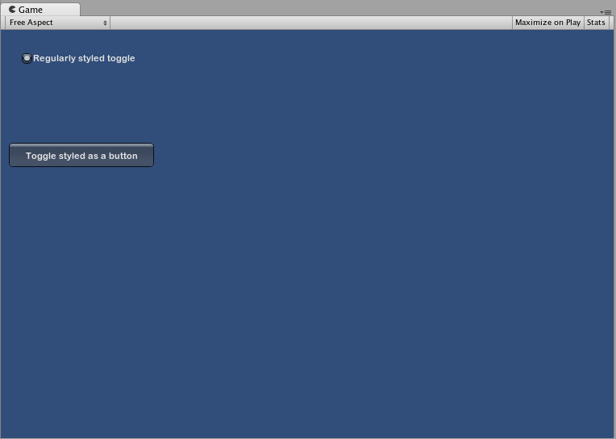
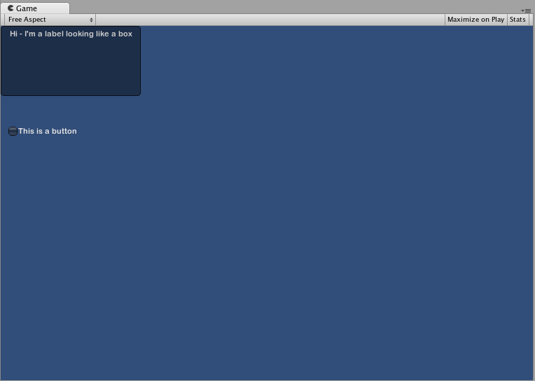

自定义
=============


自定义 IMGUI 控件
-----------------------------

虽然 Unity 的 IMGUI 系统主要用于创建开发者工具和调试界面，但仍可以通过多种方式进行自定义并设置样式。在 Unity 的 IMGUI 系统中，可微调控件的外观，为控件添加大量细节。控件外观由 __GUIStyle__ 决定。默认情况下，如果创建控件时未定义 GUIStyle，则会应用 Unity 的默认 GUIStyle。此样式是 Unity 的内部样式，可在已发布的游戏中将此样式用于快速原型设计，或者如果选择不对控件进行样式设置，则会采用此样式。

当有大量不同的 GUIStyle 可供使用时，可在单个 __GUISkin__ 中定义这些样式。GUISkin 只不过是 GUIStyle 的集合。


###样式如何改变 GUI 控件的外观

GUIStyle 旨在模仿 Web 浏览器的层叠样式表 (CSS)。不过，许多不同的 CSS 方法经过了改编，包括对用于样式设置的各个状态属性进行划分，在内容和外观之间进行分离，等等。

控件定义内容，而样式定义外观。通过这种机制可以创建外观像普通__按钮 (Button)__ 但功能为__开关 (Toggle)__ 的组合控件。





###皮肤和样式之间的区别

如前文所述，GUISkin 是 GUIStyle 的集合。样式定义了 GUI 控件的外观。如果要使用样式，则不必使用皮肤。


 
_Inspector 中显示的单个 GUISkin - 注意其包含多个 GUIStyle_


使用样式
-------------------


所有 GUI 控件函数都有可选的最后一个参数：用于显示控件的 GUIStyle。如果忽略此参数，则会使用 Unity 的默认 GUIStyle。函数内部会将控件类型的名称作为字符串应用，因此 __GUI.Button()__ 使用“button”样式，__GUI.Toggle()__ 使用“toggle”样式，等等。若要覆盖控件的默认 GUIStyle，可将其指定为最后一个参数。


````
/* 将默认控件样式覆盖为 UnityGUI 默认样式中的其他样式 */


// JavaScript
function OnGUI () {
	// 创建使用 "box" GUIStyle 的标签。
	GUI.Label (Rect (0,0,200,100), "Hi - I'm a label looking like a box", "box");

	// 创建使用 "toggle" GUIStyle 的按钮
	GUI.Button (Rect (10,140,180,20), "This is a button", "toggle");
}


// C#
using UnityEngine;
using System.Collections;

public class GUITest : MonoBehaviour {
					
	void OnGUI () {
		// 创建使用 "box" GUIStyle 的标签。
		GUI.Label (new Rect (0,0,200,100), "Hi - I'm a label looking like a box", "box");
	
		// 创建使用 "toggle" GUIStyle 的按钮
		GUI.Button (new Rect (10,140,180,20), "This is a button", "toggle");
	}

}


````





###创建公共变量 GUIStyle


声明 GUIStyle 公共变量时，样式的所有元素都将显示在 __Inspector__ 中。在该面板中可以编辑所有不同的值。


````
/* 将默认控件样式覆盖为自定义的控件样式 */


// JavaScript
var customButton : GUIStyle;

function OnGUI () {
	// 创建按钮。将上面定义的 GUIStyle 作为要使用的样式传入
	GUI.Button (Rect (10,10,150,20), "I am a Custom Button", customButton);
}


// C#
using UnityEngine;
using System.Collections;

public class GUITest : MonoBehaviour {
					
	public GUIStyle customButton;
	
	void OnGUI () {
		// 创建按钮。将上面定义的 GUIStyle 作为要使用的样式传入
		GUI.Button (new Rect (10,10,150,20), "I am a Custom Button", customButton);
	}
	
}


````


###更改不同的样式元素

声明 GUIStyle 后，可在 Inspector 中修改该样式。可以定义大量状态，并应用于任何类型的控件。


必须先为控件状态分配 __Background__ 颜色，然后再应用指定的 __Text Color__。

有关各个 GUIStyle 的更多信息，请阅读 [GUIStyle 组件参考页面](class-GUIStyle.html)。


使用皮肤
------------------


对于较复杂的 GUI 系统，将一系列样式集中保存在一个位置是很有意义的。这就是 GUISkin 的作用。GUISkin 包含多种不同的样式，基本上能为所有 GUI 控件提供完整的外观修改。


###创建新的 GUISkin

要创建 GUISkin，请从菜单栏中选择 __Assets &gt; Create &gt; GUI Skin__。随后将在 Project 文件夹中创建一个 GUI Skin。选择该 GUI Skin 即可在 Inspector 中查看其定义的所有 GUIStyle。


###将皮肤应用于 GUI

要使用已创建的皮肤，请将其分配给 __OnGUI()__ 函数中的 __GUI.skin__。


````
/* 创建一个属性来引用要使用的皮肤 */


// JavaScript
var mySkin : GUISkin;

function OnGUI () {
	// 将该皮肤指定为当前使用的皮肤。
	GUI.skin = mySkin;

	// 创建按钮。此时将从分配给 mySkin 的皮肤获得默认的 "button" 样式。
	GUI.Button (Rect (10,10,150,20), "Skinned Button");
}


// C#
using UnityEngine;
using System.Collections;

public class GUITest : MonoBehaviour {
					
	public GUISkin mySkin;
	
	void OnGUI () {
		// 将该皮肤指定为当前使用的皮肤。
		GUI.skin = mySkin;
	
		// 创建按钮。此时将从分配给 mySkin 的皮肤获得默认的 "button" 样式。
		GUI.Button (new Rect (10,10,150,20), "Skinned Button");
	}
		
}


````

通过单个 __OnGUI()__ 调用即可按需多次切换皮肤。


````
/* 在同一个 OnGUI() 调用切换皮肤的示例 */


// JavaScript
var mySkin : GUISkin;

var toggle = true;

function OnGUI () {
	// 将该皮肤指定为当前使用的皮肤。
	GUI.skin = mySkin;

	// 创建开关。此时将从分配给 mySkin 的皮肤获得 "button" 样式。
	toggle = GUI.Toggle (Rect (10,10,150,20), toggle, "Skinned Button", "button");

	// 将当前皮肤指定为 Unity 的默认值。
	GUI.skin = null;

	// 创建按钮。此时将从内置皮肤获得默认的 "button" 样式。
	GUI.Button (Rect (10,35,150,20), "Built-in Button");
}


// C#
using UnityEngine;
using System.Collections;

public class GUITest : MonoBehaviour {
					
	public GUISkin mySkin;
	private bool toggle = true;
	
	void OnGUI () {
		// 将该皮肤指定为当前使用的皮肤。
		GUI.skin = mySkin;
	
		// 创建开关。此时将从分配给 mySkin 的皮肤获得 "button" 样式。
		toggle = GUI.Toggle (new Rect (10,10,150,20), toggle, "Skinned Button", "button");
	
		// 将当前皮肤指定为 Unity 的默认值。
		GUI.skin = null;
	
		// 创建按钮。此时将从内置皮肤获得默认的 "button" 样式。
		GUI.Button (new Rect (10,35,150,20), "Built-in Button");
	}
		
}


````

###更改 GUI 字体大小

此示例将展示如何通过代码来动态更改字体大小。

首先在 Unity 中创建一个新项目。然后创建一个名为 Fontsize.cs 的 C# 脚本，并将以下代码粘贴到其中：

````
// C# 示例
using UnityEngine;
	
using System.Collections;
	
public class Fontsize : MonoBehaviour
{
	void OnGUI ()
	{
	    //将 GUIStyle 样式设置为标签
		GUIStyle style = GUI.skin.GetStyle ("label");
		
		//将样式字体大小设置为随时间增大和减小
		style.fontSize = (int)(20.0f + 10.0f * Mathf.Sin (Time.time));
		
		//创建一个标签并使用当前设置来显示
		GUI.Label (new Rect (10, 10, 200, 80), "Hello World!");
	}
		
}
````
保存脚本并将其附加到空游戏对象，然后单击播放以查看字体的大小随时间循环增大和减小的行为。此时可能会注意到字体不能平滑地改变大小，这是因为字体大小不是无限数量的。

此特定示例要求加载默认字体 (Arial) 并将其标记为动态。无法更改未标记为动态的任何字体的大小。
