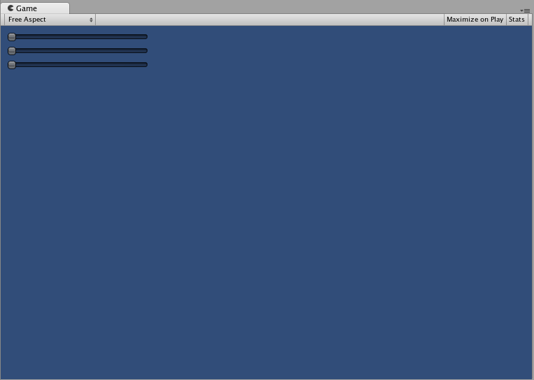
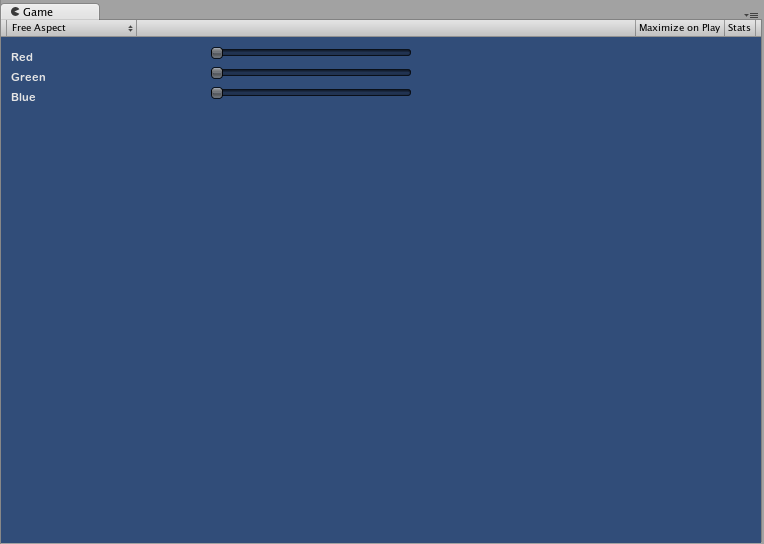

扩展 IMGUI
==================


可借助多种方法利用和扩展 IMGUI 系统，从而满足您的需求。您可以混合并创建控件，并充分控制 GUI 用户输入的处理方式。


复合控件
-----------------


GUI 中可能存在两种类型的控件总是一起出现的情况。例如，假设正在创建具有多个水平滑动条 (Horizontal Slider) 的“角色创建 (Character Creation)”屏幕。所有这些滑动条 (Slider) 都需要一个标签 (Label) 来进行标识，让玩家知道自己正在调整什么。在这种情况下，可将每个 __GUI.Label()__ 调用与 __GUI.HorizontalSlider()__ 调用进行搭配，或者可创建一个同时包含 Label 和 Slider 的__复合控件__。


````
/* Label 和 Slider 复合控件 */


// JavaScript
var mySlider : float = 1.0;

function OnGUI () {
	mySlider = LabelSlider (Rect (10, 100, 100, 20), mySlider, 5.0, "Label text here");
}

function LabelSlider (screenRect : Rect, sliderValue : float, sliderMaxValue : float, labelText : String) : float {
	GUI.Label (screenRect, labelText);
	screenRect.x += screenRect.width; // <- 将 Slider 推到 Label 的末尾
	sliderValue = GUI.HorizontalSlider (screenRect, sliderValue, 0.0, sliderMaxValue);
	return sliderValue;
}


// C#
using UnityEngine;
using System.Collections;

public class GUITest : MonoBehaviour {
		
	private float mySlider = 1.0f;
	
	void OnGUI () {
		mySlider = LabelSlider (new Rect (10, 100, 100, 20), mySlider, 5.0f, "Label text here");
	}
	
	float LabelSlider (Rect screenRect, float sliderValue, float sliderMaxValue, string labelText) {
		GUI.Label (screenRect, labelText);
	
		// <- 将 Slider 推到 Label 的末尾
		screenRect.x += screenRect.width; 
	
		sliderValue = GUI.HorizontalSlider (screenRect, sliderValue, 0.0f, sliderMaxValue);
		return sliderValue;
	}

}


````

在此示例中，调用 __LabelSlider()__ 并传递正确的参数将提供与水平滑动条 (Horizontal Slider) 配对的标签 (Label)。创建复合控件时，必须记住需要在函数末尾返回正确的值以使其具有交互性。


###静态复合控件

通过使用__静态__函数，可以创建自成一体的完整复合控件集合。这样，就不必在需要使用函数的同一脚本中声明该函数。


````
/* 此脚本名为 CompoundControls */


// JavaScript
static function LabelSlider (screenRect : Rect, sliderValue : float, sliderMaxValue : float, labelText : String) : float {
	GUI.Label (screenRect, labelText);
	screenRect.x += screenRect.width; // <- 将 Slider 推到 Label 的末尾
	sliderValue = GUI.HorizontalSlider (screenRect, sliderValue, 0.0, sliderMaxValue);
	return sliderValue;
}


// C#
using UnityEngine;
using System.Collections;

public class CompoundControls : MonoBehaviour {		
	
	public static float LabelSlider (Rect screenRect, float sliderValue, float sliderMaxValue, string labelText) {
		GUI.Label (screenRect, labelText);
	
		// <- 将 Slider 推到 Label 的末尾
		screenRect.x += screenRect.width; 
	
		sliderValue = GUI.HorizontalSlider (screenRect, sliderValue, 0.0f, sliderMaxValue);
		return sliderValue;
	}

}


````

通过将以上示例保存在名为 __CompoundControls__ 的脚本中，只需输入 __CompoundControls.LabelSlider()__ 并提供参数，即可从任何其他脚本调用 __LabelSlider()__ 函数。

###精心设计的复合控件

可使用复合控件实现出色的创造性。可按任何喜欢的方式对复合控件进行排列和分组。以下示例将创建可重复使用的 RGB Slider。


````
/* RGB Slider 复合控件 */


// JavaScript
var myColor : Color;

function OnGUI () {
	myColor = RGBSlider (Rect (10,10,200,10), myColor);
}

function RGBSlider (screenRect : Rect, rgb : Color) : Color {
	rgb.r = GUI.HorizontalSlider (screenRect, rgb.r, 0.0, 1.0);
	screenRect.y += 20; // <- 将下一个控件向下移动一点以避免重叠
	rgb.g = GUI.HorizontalSlider (screenRect, rgb.g, 0.0, 1.0);
	screenRect.y += 20; // <- 将下一个控件向下移动一点以避免重叠
	rgb.b = GUI.HorizontalSlider (screenRect, rgb.b, 0.0, 1.0);
	return rgb;
}


// C#
using UnityEngine;
using System.Collections;

public class GUITest : MonoBehaviour {
		
	public Color myColor;
	
	void OnGUI () {
		myColor = RGBSlider (new Rect (10,10,200,10), myColor);
	}
	
	Color RGBSlider (Rect screenRect, Color rgb) {
		rgb.r = GUI.HorizontalSlider (screenRect, rgb.r, 0.0f, 1.0f);
	
		// <- 将下一个控件向下移动一点以避免重叠
		screenRect.y += 20; 
		rgb.g = GUI.HorizontalSlider (screenRect, rgb.g, 0.0f, 1.0f);
	
		// <- 将下一个控件向下移动一点以避免重叠
		screenRect.y += 20; 
	
		rgb.b = GUI.HorizontalSlider (screenRect, rgb.b, 0.0f, 1.0f);
		return rgb;
	}
}


````




现在让我们构建一些位于彼此之上的复合控件，从而演示如何在复合控件中使用其他复合控件。为此，我们将创建如上所示的新 RGB Slider，但我们将使用 LabelSlider 来执行此操作。这样我们将始终有一个标签显示哪个滑动条对应哪种颜色。


````
/* RGB Label Slider 复合控件 */


// JavaScript
var myColor : Color;

function OnGUI () {
	myColor = RGBLabelSlider (Rect (10,10,200,20), myColor);
}

function RGBLabelSlider (screenRect : Rect, rgb : Color) : Color {
	rgb.r = CompoundControls.LabelSlider (screenRect, rgb.r, 1.0, "Red");
	screenRect.y += 20; // <- 将下一个控件向下移动一点以避免重叠
	rgb.g = CompoundControls.LabelSlider (screenRect, rgb.g, 1.0, "Green");
	screenRect.y += 20; // <- 将下一个控件向下移动一点以避免重叠
	rgb.b = CompoundControls.LabelSlider (screenRect, rgb.b, 1.0, "Blue");
	return rgb;
}


// C#
using UnityEngine;
using System.Collections;

public class GUITest : MonoBehaviour {
		
	public Color myColor;
	
	void OnGUI () {
		myColor = RGBSlider (new Rect (10,10,200,30), myColor);
	}
	
	Color RGBSlider (Rect screenRect, Color rgb) {
		rgb.r = CompoundControls.LabelSlider (screenRect, rgb.r, 1.0f, "Red");
	
		// <- 将下一个控件向下移动一点以避免重叠
		screenRect.y += 20; 
		rgb.g = CompoundControls.LabelSlider (screenRect, rgb.g, 1.0f, "Green");
	
		// <- 将下一个控件向下移动一点以避免重叠
		screenRect.y += 20; 
	
		rgb.b = CompoundControls.LabelSlider (screenRect, rgb.b, 1.0f, "Blue");
		
		return rgb;
	}	
	
}


````



