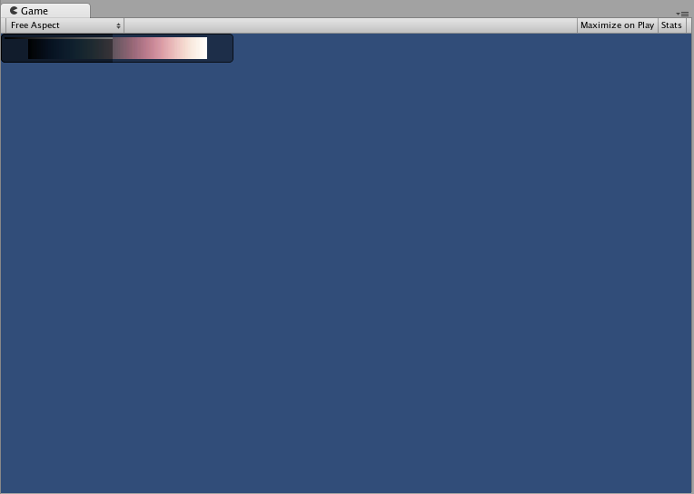

IMGUI 布局模式
============

固定布局与自动布局
--------------------------------

使用 IMGUI 系统时，可使用两种不同的模式来排列和组织 UI：固定布局模式和自动布局模式。到目前为止，本指南中提供的每个 IMGUI 示例都使用了固定布局。要使用自动布局，应在调用控件函数时写入 __GUILayout__ 而不是 __GUI__。不必使用一种布局模式来替代另一种布局模式，可在同一 __OnGUI()__ 函数中同时使用这两种模式。

当有预先设计好的界面可供使用时，采用固定布局比较合理。如果预先不知道需要多少元素，或者不想费心进行每个控件的手动定位，则采用自动布局比较合适。例如，如果要基于保存游戏文件创建大量不同的按钮，但无法准确知道要绘制多少按钮，这种情况下采用自动布局可能会更加合理。具体实际上取决于游戏设计以及所需的界面呈现方式。

使用自动布局时有两个主要的不同之处：

* 使用 __GUILayout__ 而不是 __GUI__
* 自动布局控件不需要 __Rect()__ 函数


````
/* 使用自动布局时的两个主要不同之处 */


// JavaScript
function OnGUI () {
	// 固定布局
	GUI.Button (Rect (25,25,100,30), "I am a Fixed Layout Button");

	// 自动布局
	GUILayout.Button ("I am an Automatic Layout Button");
}


// C#
using UnityEngine;
using System.Collections;

public class GUITest : MonoBehaviour {
	
	void OnGUI () {
		// 固定布局
		GUI.Button (new Rect (25,25,100,30), "I am a Fixed Layout Button");
	
		// 自动布局
		GUILayout.Button ("I am an Automatic Layout Button");
	}

}


````


排列控件
------------------


根据使用的布局模式，可通过不同的挂钩来控制控件的位置以及控件如何组合在一起。在固定布局中，可将不同的控件放入__组__中。在自动布局中，可将不同的控件放入__区域__、__水平组__和__垂直组__中

###固定布局 - 组

组是固定布局模式中的布局规则。使用组可以定义包含多个控件的屏幕区域。为定义组中包含的控件，需要使用 __GUI.BeginGroup()__ 和 __GUI.EndGroup()__ 函数。组内的所有控件将根据组的左上角而不是屏幕的左上角进行定位。因此，如果在运行时重新定位组，则将保持组中所有控件的相对位置。

例如，在屏幕上使多个控件居中非常容易。


````
/* 使用组在屏幕上使多个控件居中 */


// JavaScript
function OnGUI () {
	// 在屏幕中央创建一个组
	GUI.BeginGroup (Rect (Screen.width / 2 - 50, Screen.height / 2 - 50, 100, 100));
	// 现在所有矩形都调整到该组。(0,0) 是该组的左上角。
	
	// 我们将创建一个框形，以便能看到该组在屏幕上的位置。
	GUI.Box (Rect (0,0,100,100), "Group is here");
	GUI.Button (Rect (10,40,80,30), "Click me");
	
	// 结束我们上面开始的组。记住这一点非常重要！
	GUI.EndGroup ();
}


// C#
using UnityEngine;
using System.Collections;

public class GUITest : MonoBehaviour {
	
	void OnGUI () {
		// 在屏幕中央创建一个组
		GUI.BeginGroup (new Rect (Screen.width / 2 - 50, Screen.height / 2 - 50, 100, 100));
		// 现在所有矩形都调整到该组。(0,0) 是该组的左上角。
	
		//我们将创建一个框形，以便能看到该组在屏幕上的位置。
		GUI.Box (new Rect (0,0,100,100),"Group is here");
		GUI.Button (new Rect (10,40,80,30), "Click me");
	
		// 结束我们上面开始的组。记住这一点非常重要！
		GUI.EndGroup ();
	}

}


````


还可以将多个组嵌套在一起。这样做时，每个组的内容都会裁剪到其父项空间。


````
/* 使用多个组裁剪显示的内容 */


// JavaScript
var bgImage : Texture2D; // 256 x 32 的背景图像
var fgImage : Texture2D; // 256 x 32 的前景图像
var playerEnergy = 1.0; // 介于 0.0 和 1.0 之间的浮点数

function OnGUI () {
	// 创建一个组来包含这两个图像
	// 调整前 2 个坐标以将其放在屏幕上的其他位置
	GUI.BeginGroup (Rect (0,0,256,32));

	// 绘制背景图像
	GUI.Box (Rect (0,0,256,32), bgImage);
	
	// 创建将被裁剪的第二个组
	// 我们想要裁剪图像而不是缩放图像，这就是我们需要第二个组的原因
	GUI.BeginGroup (Rect (0,0,playerEnergy * 256, 32));

	// 绘制前景图像
	GUI.Box (Rect (0,0,256,32), fgImage);

	// 结束这两个组
	GUI.EndGroup ();
	GUI.EndGroup ();
}


// C#
using UnityEngine;
using System.Collections;

public class GUITest : MonoBehaviour {
	
	// 256 x 32 的背景图像
	public Texture2D bgImage; 
	
	// 256 x 32 的前景图像
	public Texture2D fgImage; 
	
	// 介于 0.0 和 1.0 之间的浮点数
	public float playerEnergy = 1.0f; 
	
	void OnGUI () {
		// 创建一个组来包含这两个图像
		// 调整前 2 个坐标以将其放在屏幕上的其他位置
		GUI.BeginGroup (new Rect (0,0,256,32));
	
		// 绘制背景图像
		GUI.Box (new Rect (0,0,256,32), bgImage);
	
			// 创建将被裁剪的第二个组
			// 我们想要裁剪图像而不是缩放图像，这就是我们需要第二个组的原因
			GUI.BeginGroup (new Rect (0,0,playerEnergy * 256, 32));
		
			// 绘制前景图像
			GUI.Box (new Rect (0,0,256,32), fgImage);
		
			// 结束这两个组
			GUI.EndGroup ();
		
		GUI.EndGroup ();
	}

}


````





###自动布局 - 区域

区域仅用于自动布局模式。区域定义了有限的屏幕区域来包含 GUILayout 控件，因此在功能上类似于固定布局组。由于自动布局的性质，几乎始终要用到区域。

在自动布局模式下，不需要在控制级别定义绘制控件的屏幕区域。控件将自动放置在包含该控件的区域的最左上角。此区域可能是指屏幕。此外也可以创建手动定位的区域。一个区域内的 GUILayout 控件将放置在该区域的最左上角。


````
/* 未放置在任何区域的按钮以及放置在屏幕中间区域的按钮。*/


// JavaScript
function OnGUI () {
	GUILayout.Button ("I am not inside an Area");
	GUILayout.BeginArea (Rect (Screen.width/2, Screen.height/2, 300, 300));
	GUILayout.Button ("I am completely inside an Area");
	GUILayout.EndArea ();
}


// C#
using UnityEngine;
using System.Collections;

public class GUITest : MonoBehaviour {
	
	void OnGUI () {
		GUILayout.Button ("I am not inside an Area");
		GUILayout.BeginArea (new Rect (Screen.width/2, Screen.height/2, 300, 300));
		GUILayout.Button ("I am completely inside an Area");
		GUILayout.EndArea ();
	}

}


````

请注意，在一个区域内，具有可见元素（如按钮和框形）的控件会将宽度拉伸到该区域的整个长度。


###自动布局 - 水平和垂直组

使用自动布局时，默认情况下控件将从上到下依次出现。在很多情况下，需要更精确控制控件的放置位置以及排列方式。如果使用自动布局模式，则可以选择水平和垂直组。

与其他布局控件一样，可以调用单独的函数来开始或结束这些组。这些函数为 __GUILayout.BeginHoriztontal()__、__GUILayout.EndHorizontal()__、__GUILayout.BeginVertical()__ 和 __GUILayout.EndVertical()__。

水平组内的所有控件都将始终采用水平布局方式。垂直组内的所有控件都将始终采用垂直布局方式。这听起来很简单，但若要将组嵌套在彼此内部，就不那么简单了。通过嵌套的方式可在任何能够想象的配置中排列任意数量的控件。


````
/* 使用嵌套的水平和垂直组 */


// JavaScript
var sliderValue = 1.0;
var maxSliderValue = 10.0;

function OnGUI()
{
	// 将所有控件包裹在指定的 GUI 区域中
	GUILayout.BeginArea (Rect (0,0,200,60));

	// 开始单个水平组
	GUILayout.BeginHorizontal();

	// 正常放置按钮
	if (GUILayout.RepeatButton ("Increase max\nSlider Value"))
	{
		maxSliderValue += 3.0 * Time.deltaTime;
	}

	// 在按钮旁边垂直排列另外两个控件
	GUILayout.BeginVertical();
	GUILayout.Box("Slider Value: " + Mathf.Round(sliderValue));
	sliderValue = GUILayout.HorizontalSlider (sliderValue, 0.0, maxSliderValue);

	// 结束这些组和区域
	GUILayout.EndVertical();
	GUILayout.EndHorizontal();
	GUILayout.EndArea();
}


// C#
using UnityEngine;
using System.Collections;

public class GUITest : MonoBehaviour {
	
	private float sliderValue = 1.0f;
	private float maxSliderValue = 10.0f;
	
	void OnGUI()
	{
		// 将所有控件包裹在指定的 GUI 区域中
		GUILayout.BeginArea (new Rect (0,0,200,60));
	
		// 开始单个水平组
		GUILayout.BeginHorizontal();
	
		// 正常放置按钮
		if (GUILayout.RepeatButton ("Increase max\nSlider Value"))
		{
			maxSliderValue += 3.0f * Time.deltaTime;
		}
	
		// 在按钮旁边垂直排列另外两个控件
		GUILayout.BeginVertical();
		GUILayout.Box("Slider Value: " + Mathf.Round(sliderValue));
		sliderValue = GUILayout.HorizontalSlider (sliderValue, 0.0f, maxSliderValue);
	
		// 结束这些组和区域
		GUILayout.EndVertical();
		GUILayout.EndHorizontal();
		GUILayout.EndArea();
	}

}


````


使用 GUILayoutOption 定义一些控件
----------------------------------------------


可使用 GUILayoutOption 覆盖某些自动布局参数。要执行此操作，可提供相应的选项作为 GUILayout 控件的最终参数。

在上面的区域示例中，是否还记得按钮的宽度扩展到区域宽度的 100%？如果愿意，我们可以覆盖这种行为。


````
/* 使用 GUILayoutOption 覆盖自动布局控件属性 */


//JavaScript
function OnGUI () {
	GUILayout.BeginArea (Rect (100, 50, Screen.width-200, Screen.height-100));
	GUILayout.Button ("I am a regular Automatic Layout Button");
	GUILayout.Button ("My width has been overridden", GUILayout.Width (95));
	GUILayout.EndArea ();
}


// C#
using UnityEngine;
using System.Collections;

public class GUITest : MonoBehaviour {
		
	void OnGUI () {
		GUILayout.BeginArea (new Rect (100, 50, Screen.width-200, Screen.height-100));
		GUILayout.Button ("I am a regular Automatic Layout Button");
		GUILayout.Button ("My width has been overridden", GUILayout.Width (95));
		GUILayout.EndArea ();
	}

}


````

有关可能的 GUILayoutOption 的完整列表，请阅读 [GUILayoutOption 脚本参考页面](../ScriptReference/GUILayoutOption.html)。
