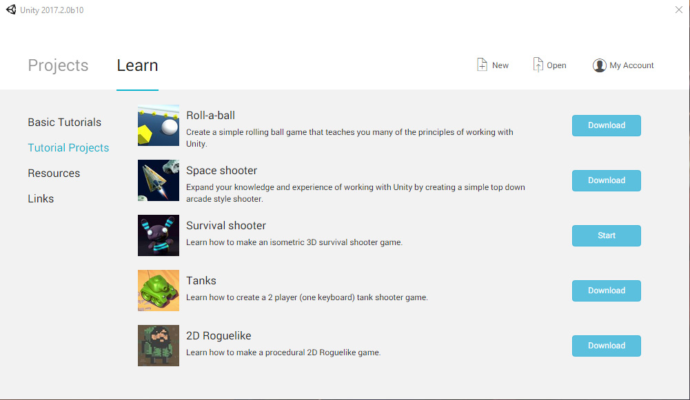
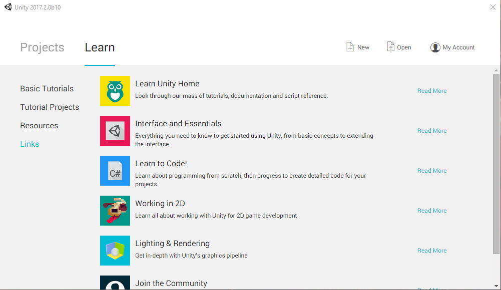

#Learn 选项卡

通过主窗口中的 __Learn__ 选项卡，可访问各种教程和学习资源（包括可直接导入 Unity 的示例项目），从而帮助您快速上手 Unity。

打开 Unity 后，Learn 选项卡显示在主窗口中。也可从 Editor 中导航到 __File__ > __New__ __Project__ 访问主窗口。

Learn 选项卡分为四个部分：

* __Basic Tutorials__
* __Tutorial Projects__
* __Resources__
* __Links__

##Basic Tutorials

__Basic Tutorials__ 部分包含 Editor 内的交互式教程。这些教程将介绍与 Unity 的界面和主要开发工具交互的基础知识。要下载每个教程，请单击 __Download__，然后在下载完成后单击 __Launch__。

## Tutorial Projects

__Tutorial Projects__ 部分列出可导入 Unity 的教程项目。

每个教程都包含一个完整的示例项目，还附带书面和视频指南以及自行完成项目所需的所有资源。

要下载教程项目并将其导入 Unity，请单击相关项目右侧的 __Download__ 按钮。然后，Unity 会为所选的教程项目下载所有必需的资源。下载完成后，单击 __Start__ 按钮即可自动创建并打开一个新项目，其中包含按照本教程学习时所需的所有资源。

要访问视频指南和完整教程，请单击要详细了解的项目右侧的 __Read More__ 按钮。

还可在 [Unity 学习](https://unity3d.com/learn)网站上关注所选项目的视频教程。

## Resources

__Resources__ 部分包含可导入项目的[资源包](AssetPackages.html)的链接。资源包中包含可用于快速构建项目的 3D 模型、粒子效果和预先创建的脚本等资源。

要从 Learn 选项卡下载资源包，请单击要下载的资源包右侧的 __Download__ 按钮。然后，Unity 会自动下载所选资源包中包含的所有资源。

要在项目中使用这些资源，请单击 __Launch__ 按钮。然后，Unity 会自动创建并打开一个项目，其中包含下载的资源。

下载教程或资源时，可单击进度条右侧的 __X__ 按钮取消下载。

## Links

__Links__ 部分包含指向 Unity 学习指南和教程的链接以及指向 Unity 社区主页的链接。

单击链接描述右侧的 __Read More__ 按钮可在新的 Internet 浏览器窗口中打开相关页面。

---

* 2017-05-08  Page amended with limited [editorial review](DocumentationEditorialReview.html)

* 在 [2017.2](https://docs.unity3d.com/2017.2/Documentation/Manual/30_search.html?q=newin20172) 中添加了 Editor 嵌入式教程 NewIn20172

