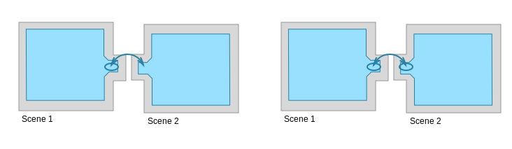
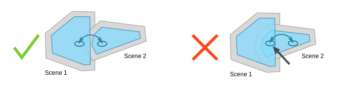

#使用附加加载 (Additive Loading) 加载多个导航网格

默认情况下，不同场景中的导航网格未连接。使用 _Application.LoadLevelAdditive()_ 加载另一个关卡时，需要使用网格外链接 (Off-Mesh Link) 连接不同场景中的导航网格。

 

在此示例中有两个场景：_Scene 1_ 和 _Scene 2_。_Scene 1_ 有一个网格外链接从一个可行走区域开始，并在 _Scene 2_ 中的一个可行走区域上着陆。可根据需要设置多个连接场景的网格外链接。

在创作时，连接场景的网格外链接的另一个端点是未连接的。加载新场景后将重新连接网格外链接。

 

如果多个场景的导航网格在同一区域重叠，则位置选取对象可能是该位置的任意导航网格。此情况适用于使用导航网格 API 的代理、网格外链接和位置选取。应该创建跨越网格外链接的场景，使这些链接仅在一个导航网格上明确开始和结束。重叠的导航网格区域不会自动连接。

###阅读更多信息
- [构建导航网格](nav-BuildingNavMesh.html) – 关于导航网格烘焙的工作流程。
- [创建网格外链接](nav-CreateOffMeshLink.html) - 了解如何手动创建网格外链接。
