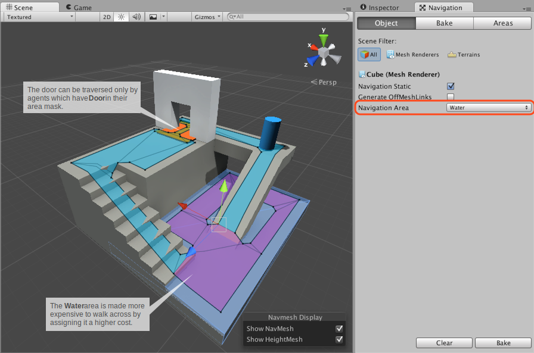
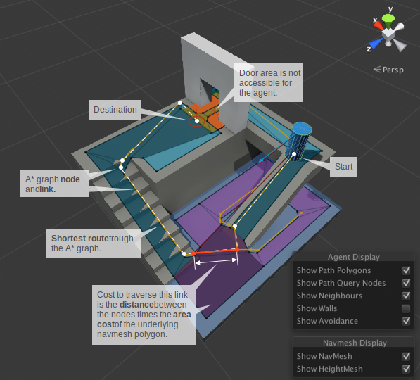

#导航区域和成本

_导航区域 (Navigation Areas)_ 定义了穿越特定区域的难度，在寻路期间将优先选择成本较低的区域。此外，每个导航网格代理 (NavMesh Agent) 都有一个_区域遮罩 (Area Mask)_，可用于指定代理可以移动的区域。

 

在上面的示例中，区域类型用于两种常见用例：

- **Water** 区域：通过分配更高的成本使该区域的行走成本更高，从而应对在浅水上行走速度较慢的情况。
- **Door** 区域：让该区域可由特定角色访问，从而创建人类可以但僵尸不能穿过门的情况。

可将区域类型分配给导航网格烘焙中包含的每个对象，此外，每个网格外链接都有一个属性用于指定区域类型。

##寻路成本

简而言之，通过成本可以控制寻路器 (pathfinder) 在寻路时优先选择的区域。例如，如果将某个区域的成本设置为 3.0，则意味着跨越该区域的行程将是其他替代路线的三倍。

要完全了解成本的作用，让我们来看看寻路器的工作原理。

Unity 使用 A\* 计算导航网格上的最短路径。A\* 适用于具有连接节点的图形。算法从距离路径起点最近的节点开始访问连接节点，直至到达目标。

由于 Unity 导航表示形式为多边形网格，因此寻路器首先要做的是在每个多边形上放置一个点，这便是节点的位置。随后将计算这些节点之间的最短路径。

上图中黄色的点和线显示了节点和链接在导航网格上的分布情况，以及在 A\* 期间遍历这些节点和链接的顺序。

在两个节点之间移动的成本取决于行进距离以及与该链接下的多边形的区域类型相关联的成本，即_距离 * 成本_。实际上，这意味着，如果一个区域的成本为 2.0，则此类多边形的距离将显示为两倍。A\* 算法要求所有成本必须大于 1.0。

成本对最终路径的影响可能难以调整，尤其是对于较长的路径。使用抵达成本的最佳方式是将其视为提示。例如，如果您希望代理不要经常使用网格外链接，可增加这些链接的成本。但是，调整代理偏好在人行道上行走的行为可能存在挑战性。

在某些关卡中，您可能会注意到的另一个现象是寻路器并不总是选择最短的路径。此现象的原因在于节点的放置方式。在以下场合中，该现象可能会很明显：大型开放区域与微小障碍物相邻，从而造成导航网格具有非常大和非常小的多边形。在这种情况下，大型多边形上的节点可能放置在大型多边形的任何位置，从寻路器的角度看起来好像是绕行道。

可在 _Areas_ 选项卡中设置每种_区域类型_的_成本_，也可使用脚本根据每个代理覆盖这些设置。

##区域类型

 

应在 _Navigation 窗口_的 _Areas_ 选项卡中指定区域类型。此处提供了 29 个自定义类型和 3 个内置类型：_Walkable_、_Not Walkable_ 和 _Jump_。

- **Walkable** 是一种可行走的通用区域类型。
- **Not Walkable** 是一种禁止导航的通用区域类型。如果希望将某个对象标记为障碍物，但不将导航网格置于其上，则可使用该类型。
- **Jump** 是分配给所有自动生成的网格外链接的区域类型。

如果不同区域类型的多个对象重叠，则生成的导航网格区域类型通常是索引最高的类型。但有一个例外：_Not Walkable_ 始终优先。如果需要阻挡某个区域，此类型可能会有用。

##区域遮罩 (Area Mask)

 

每个代理都有一个_区域遮罩 (Area Mask)_，用于描述代理在导航时可使用的区域。可在代理属性中设置区域遮罩，也可在运行时使用脚本来操作位掩码。

当您希望只有某些类型的角色才能穿过某个区域时，区域遮罩非常有用。例如，在僵尸逃避游戏中，可使用 _Door_ 区域类型来标记每个门下方的区域，并从僵尸角色的 Area Mask 中取消选中 Door 区域。

###阅读更多信息
- [构建导航网格](nav-BuildingNavMesh.html) – 关于导航网格烘焙的工作流程。
- [NavMeshAgent.areaMask](../ScriptReference/AI.NavMeshAgent-areaMask.html) - 用于为代理设置 areaMask 的脚本 API。
- [NavMeshAgent.SetAreaCost()](../ScriptReference/AI.NavMeshAgent.SetAreaCost.html) - 用于为代理设置区域成本的脚本 API。
