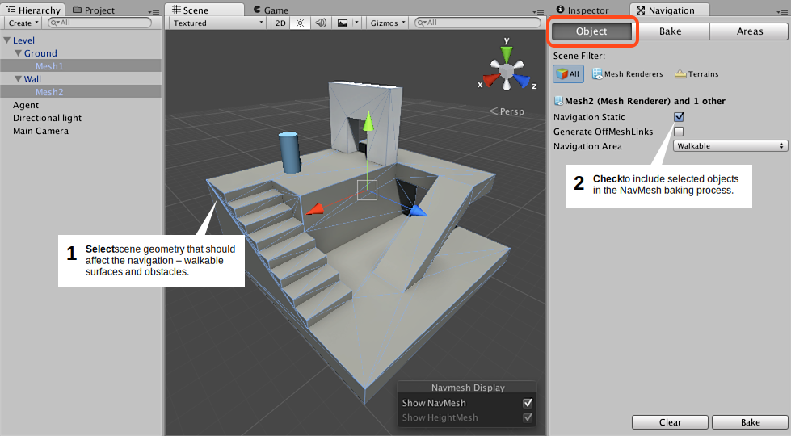
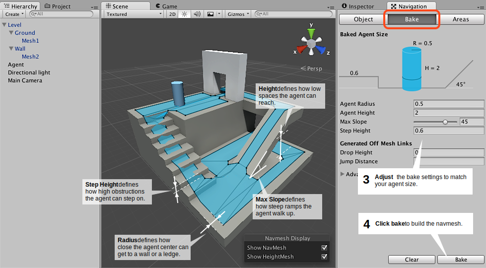

#构建导航网格

从关卡几何体创建导航网格的过程称为导航网格烘焙 (NavMesh Baking)。该过程收集所有标记为 [Navigation Static](StaticObjects.html) 的游戏对象的渲染网格和地形，然后处理它们以创建近似于关卡的可行走表面的导航网格。

在 Unity 中，导航网格生成方式是在 Navigation 窗口（菜单：__Window > Navigation__）中进行处理的。

为场景构建导航网格可以通过 4 个快速步骤完成：

 

 

1.**选择**应影响导航的场景几何体：可行走表面和障碍物。
2.**选中 Navigation Static 复选框**以便在导航网格烘焙过程中包括所选对象。
3.**调整**烘焙设置以匹配代理大小。
    - _Agent Radius_ 定义代理中心与墙壁或窗台的接近程度。
    - _Agent Height_ 定义代理可以达到的空间有多低。
    - _Max Slope_ 定义代理走上坡道的陡峭程度。
    - _Step Height_ 定义代理可以踏上的障碍物的高度。
4.**单击 Bake** 以构建导航网格。

每当 Navigation 窗口打开且可见时，生成的导航网格便会在场景中显示为底层关卡几何体上的蓝色覆盖层。

您可能已经在上面的图片中注意到，生成的导航网格中的可行走区域显示为缩小状态。导航网格表示代理中心可进行移动的区域。从概念上讲，无论将代理视为缩小的导航网格上的点还是全尺寸的导航网格上的圆都无关紧要，因为这两者是等效的。但是，解释为点有助于提高运行时效率，并可让设计人员立即看到代理是否可以挤过间隙而不用担心代理半径问题。

另外要记住的是导航网格是可行走表面的近似形状。例如，在楼梯中就能看出这一点：楼梯表示为平坦表面，但原始表面是有台阶的。这种表示方式是为了使导航网格数据大小保持较小。这种近似表示方式的副作用是，有时您会希望在关卡几何体中留出一些额外的空间，让代理能够通过一个狭窄位置。

 

烘焙完成后，您将在一个与导航网格所属场景同名的文件夹中找到导航网格资源文件。例如，如果在 Assets 文件夹中有一个名为 _First Level_ 的场景，则导航网格将位于 _Assets &gt; First Level &gt; NavMesh.asset_。

###标记烘焙对象的附加工作流程

 

除了如上所述在 Navigation 窗口中将对象标记为 _Navigation Static_ 之外，还可以使用 Inspector 顶部的 _Static_ 菜单。如果刚好没有打开 Navigation 窗口，这会很方便。

###阅读更多信息

- [创建导航网格代理](nav-CreateNavMeshAgent.html) – 了解如何让角色移动。
- [烘焙设置](nav-AdvancedSettings.html) – 导航网格烘焙设置的完整描述。
- [区域和成本](nav-AreasAndCosts.html) – 了解如何使用不同的区域类型。
